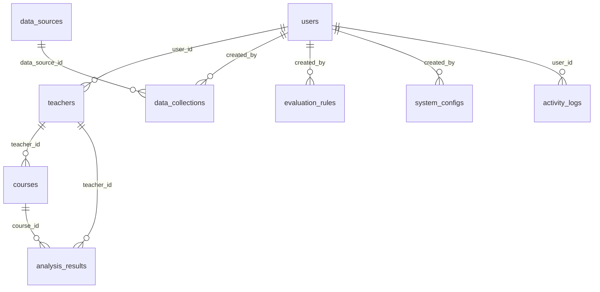

# AI助评系统数据库设计

## 概述

本文档描述了AI助评系统MVP版本的数据库设计，包括表结构、关系、索引和初始化数据。数据库采用PostgreSQL作为主存储引擎，支持AI助评系统的核心业务功能。

## 数据库架构

### 技术选型
- **数据库引擎**: PostgreSQL 15+
- **字符编码**: UTF-8
- **排序规则**: C (二进制排序)
- **时区**: UTC

### 设计原则
1. **简洁性**: 聚焦MVP核心功能，避免过度设计
2. **可扩展性**: 表结构支持未来功能扩展
3. **性能优化**: 合理的索引设计和查询优化
4. **数据完整性**: 外键约束和数据验证
5. **审计追踪**: 完整的创建和更新时间戳

## 数据库表结构

### 核心业务表

#### 1. 用户表 (users)
存储系统用户账号信息，支持管理员和教师两种角色。

**关键字段**:
- `username`: 用户名（登录账号）
- `email`: 邮箱地址
- `password_hash`: 密码哈希值
- `role`: 用户角色（admin/teacher）
- `is_active`: 账户状态

**索引**:
- 唯一索引：`username`, `email`
- 查询索引：`role`, `is_active`, `created_at`

#### 2. 教师表 (teachers)
存储教师详细信息，关联用户账号。

**关键字段**:
- `teacher_code`: 教师编号
- `name`: 教师姓名
- `title`: 职称
- `department`: 所属部门
- `user_id`: 关联的用户账号ID

**关联关系**:
- `users` (user_id) - 一对一关系

#### 3. 课程表 (courses)
存储课程基本信息，支持教师评价。

**关键字段**:
- `course_code`: 课程编号
- `name`: 课程名称
- `teacher_id`: 任课教师ID
- `credits`: 学分
- `status`: 课程状态

**关联关系**:
- `teachers` (teacher_id) - 多对一关系

#### 4. 评价规则表 (evaluation_rules)
存储AI分析的评价规则配置。

**关键字段**:
- `name`: 规则名称
- `code`: 规则编码
- `category`: 规则分类
- `rule_type`: 规则类型
- `weight`: 权重
- `is_active`: 是否激活

**索引**:
- 唯一索引：`code`
- 查询索引：`category`, `is_active`, `priority`

#### 5. 分析结果表 (analysis_results)
存储AI分析的评价结果和建议。

**关键字段**:
- `target_type`: 评价对象类型
- `target_id`: 评价对象ID
- `overall_score`: 总体得分
- `dimension_scores`: 维度评分（JSON）
- `suggestions`: 改进建议（JSON）

**关联关系**:
- `teachers` (teacher_id) - 多对一关系
- `courses` (course_id) - 多对一关系

### 系统支撑表

#### 6. 数据源表 (data_sources)
管理外部数据源连接配置。

**关键字段**:
- `name`: 数据源名称
- `type`: 数据源类型
- `status`: 连接状态
- `config`: 配置信息（JSON）

#### 7. 数据采集记录表 (data_collections)
记录数据采集任务的历史和状态。

**关键字段**:
- `data_source_id`: 数据源ID
- `status`: 采集状态
- `record_count`: 记录数量
- `duration_seconds`: 执行耗时

**关联关系**:
- `data_sources` (data_source_id) - 多对一关系

#### 8. 系统配置表 (system_configs)
存储系统配置参数和设置。

**关键字段**:
- `category`: 配置分类
- `config_key`: 配置键名
- `config_value`: 配置值（JSON）
- `is_public`: 是否公开

**索引**:
- 唯一索引：`category`, `config_key`

#### 9. 活动日志表 (activity_logs)
记录系统用户操作和系统活动。

**关键字段**:
- `activity_type`: 活动类型
- `user_id`: 用户ID
- `status`: 操作状态
- `activity_time`: 活动时间

**关联关系**:
- `users` (user_id) - 多对一关系

## 数据关系图



## 索引策略

### 主要索引
1. **主键索引**: 所有表都有自动创建的主键索引
2. **外键索引**: 所有外键字段都有索引支持
3. **唯一索引**: 用户名、邮箱、规则编码等唯一字段
4. **查询索引**: 常用查询字段（状态、类型、时间等）

### 复合索引
1. `analysis_results(target_type, target_id, analysis_period)`: 目标和时间组合查询
2. `analysis_results(teacher_id, analysis_period)`: 教师时间序列查询
3. `activity_logs(user_id, activity_time DESC)`: 用户活动历史查询

## 初始化数据

### 默认用户
- **管理员**: admin / admin123
- **教师**: teacher / teacher123
- **测试教师**: wang_teacher / wang123, li_teacher / li123 等

### 默认评价规则
1. **教学方法多样性**: 评估教学方法多样性和创新性
2. **教学内容质量**: 评估内容完整性和先进性
3. **学生参与度**: 评估学生课堂参与情况
4. **教学创新能力**: 评估教学创新实践
5. **综合评价规则**: 基于多维度指标的综合评价

### 系统配置
包含系统的所有基础配置，如认证参数、性能设置、日志配置等。

## 数据迁移管理

### 迁移文件命名规范
- 格式：`XXX_描述.sql`
- 示例：`001_create_users_table.sql`
- 按数字顺序执行

### 迁移管理脚本
- `setup_database.sh`: 完整数据库初始化
- `migrate.sh`: 迁移版本管理
- 支持向前迁移和回滚

## 使用说明

### 1. 初始化数据库
```bash
cd database/scripts
./setup_database.sh
```

### 2. 迁移管理
```bash
cd database/scripts
./migrate.sh status    # 查看迁移状态
./migrate.sh up        # 执行待执行的迁移
./migrate.sh down      # 回滚最后一次迁移
./migrate.sh create new_table.sql  # 创建新迁移文件
```

### 3. 自定义配置
- 修改 `database/seeds/001_seed_system_configs.sql` 调整系统配置
- 修改 `database/seeds/002_seed_default_users.sql` 添加测试用户
- 修改 `database/seeds/003_seed_evaluation_rules.sql` 调整评价规则

## 性能优化

### 查询优化
1. 使用复合索引优化常用查询
2. 避免大字段的全表扫描
3. 合理使用分页查询
4. 定期分析和优化慢查询

### 存储优化
1. JSON字段压缩存储
2. 历史数据分区归档
3. 定期更新统计信息
4. 合理设置表空间

## 安全考虑

### 数据保护
1. 敏感数据加密存储
2. 数据访问权限控制
3. 定期数据备份
4. 审计日志记录

### 连接安全
1. 使用SSL连接
2. 限制连接来源
3. 强密码策略
4. 连接数限制

## 维护指南

### 备份策略
- **全量备份**: 每周一次
- **增量备份**: 每日一次
- **备份保留**: 30天

### 监控指标
- 数据库连接数
- 查询响应时间
- 表空间使用率
- 慢查询统计

### 清理策略
- 活动日志保留90天
- 临时数据定期清理
- 统计数据定期汇总

## 版本信息

- **数据库版本**: 1.0.0
- **PostgreSQL版本**: 15+
- **创建时间**: 2025-11-23
- **最后更新**: 2025-11-23

---

**维护人员**: 数据库管理团队
**联系邮箱**: dbadmin@aievaluation.edu.cn