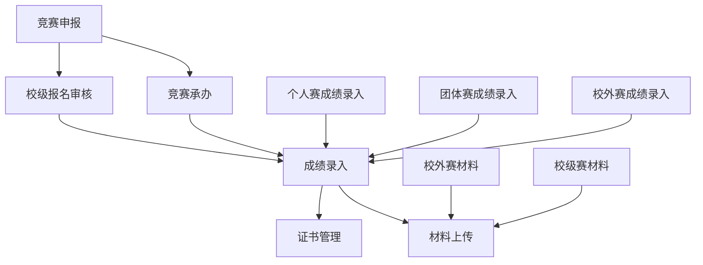

# 竞赛系统数据字典总索引

## 概述

本文档是竞赛系统数据字典的总索引，提供了系统内所有数据表的完整概览和导航。竞赛系统共包含12个数据表，按业务功能分为5个模块。

## 数据表统计

- **总表数量**: 12个
- **主表数量**: 9个
- **子表数量**: 3个
- **字段总数**: 约311个（包含系统字段）

## 模块分类

### 01-竞赛申报模块 (2个表)
负责竞赛项目的申报和承办申请管理

### 02-竞赛报名模块 (1个表)
负责校级竞赛报名审核流程管理

### 03-成绩管理模块 (6个表)
负责各类竞赛成绩录入和管理，包含3个主表和3个子表

### 04-材料管理模块 (3个表)
负责竞赛佐证材料和证书的管理

### 05-基础数据模块 (预留)
用于存储系统基础数据和公共信息

## 详细数据表列表

### 01-竞赛申报模块

| 序号 | 表名 | 原表名 | 字段数 | 类型 | 说明 |
|------|------|--------|--------|------|------|
| 1 | [COMPETITION_APPLICATION](01-竞赛申报/COMPETITION_APPLICATION_竞赛申报参赛.md) | t_approve_data_6586_112770_1729113909046_end | 36 | 主表 | 竞赛申报参赛信息 |
| 2 | [COMPETITION_HOSTING](01-竞赛申报/COMPETITION_HOSTING_竞赛承办申报.md) | t_approve_data_6586_112765_1729113909045_end | 40 | 主表 | 竞赛承办申报信息 |

### 02-竞赛报名模块

| 序号 | 表名 | 原表名 | 字段数 | 类型 | 说明 |
|------|------|--------|--------|------|------|
| 3 | [COMPETITION_REGISTRATION](02-竞赛报名/COMPETITION_REGISTRATION_校级赛报名审核.md) | t_approve_data_6586_115048_1729113971132_end | 26 | 主表 | 校级竞赛报名审核 |

### 03-成绩管理模块

#### 主表 (3个)
| 序号 | 表名 | 原表名 | 字段数 | 类型 | 说明 |
|------|------|--------|--------|------|------|
| 4 | [SCORE_INDIVIDUAL_SCHOOL](03-成绩管理/SCORE_INDIVIDUAL_SCHOOL_个人赛成绩录入校级赛.md) | t_approve_data_6586_118185_1729113909047_end | 19 | 主表 | 校级个人赛成绩录入 |
| 5 | [SCORE_TEAM_SCHOOL](03-成绩管理/SCORE_TEAM_SCHOOL_团体赛成绩录入校级赛.md) | t_approve_data_6586_124117_1729113877063_end | 19 | 主表 | 校级团体赛成绩录入 |
| 6 | [SCORE_EXTERNAL](03-成绩管理/SCORE_EXTERNAL_成绩录入校外赛.md) | t_approve_data_6586_118264_1729113909047_end | 30 | 主表 | 校外竞赛成绩录入 |

#### 子表 (3个)
| 序号 | 表名 | 原表名 | 字段数 | 类型 | 说明 |
|------|------|--------|--------|------|------|
| 7 | [SCORE_STUDENT_INDIVIDUAL](03-成绩管理/SCORE_STUDENT_INDIVIDUAL_个人赛参赛学生信息.md) | t_approve_data_6586_118185_1729113909047_end_17 | 11 | 子表 | 个人赛学生详细信息 |
| 8 | [SCORE_STUDENT_TEAM](03-成绩管理/SCORE_STUDENT_TEAM_团体赛参赛学生信息.md) | t_approve_data_6586_124117_1729113877063_end_17 | 12 | 子表 | 团体赛学生详细信息 |
| 9 | [SCORE_STUDENT_EXTERNAL](03-成绩管理/SCORE_STUDENT_EXTERNAL_校外赛参赛学生信息.md) | t_approve_data_6586_118264_1729113909047_end_47 | 11 | 子表 | 校外赛学生详细信息 |

### 04-材料管理模块

| 序号 | 表名 | 原表名 | 字段数 | 类型 | 说明 |
|------|------|--------|--------|------|------|
| 10 | [MATERIAL_EXTERNAL](04-材料管理/MATERIAL_EXTERNAL_佐证材料上传校外赛.md) | t_approve_data_6586_112771_1729113909046_end | 35 | 主表 | 校外竞赛佐证材料 |
| 11 | [MATERIAL_SCHOOL](04-材料管理/MATERIAL_SCHOOL_佐证材料上传校级赛.md) | t_approve_data_6586_115054_1729113909046_end | 31 | 主表 | 校级竞赛佐证材料 |
| 12 | [CERTIFICATE_MANAGEMENT](04-材料管理/CERTIFICATE_MANAGEMENT_竞赛证书管理.md) | t_approve_data_6586_116532_1729113909047_end | 22 | 主表 | 比赛证书管理 |

## 业务流程关系图

## 数据表关联关系

### 核心实体关系

1. **竞赛项目** (COMPETITION_APPLICATION, COMPETITION_HOSTING)
   - 记录竞赛项目的基本信息和承办信息

2. **参赛学生** (SCORE_STUDENT_INDIVIDUAL, SCORE_STUDENT_TEAM, SCORE_STUDENT_EXTERNAL)
   - 记录参赛学生的详细信息
   - 与成绩录入表构成主从关系

3. **成绩管理** (SCORE_INDIVIDUAL_SCHOOL, SCORE_TEAM_SCHOOL, SCORE_EXTERNAL)
   - 记录竞赛成绩信息
   - 包含学生信息的关联

4. **材料管理** (MATERIAL_EXTERNAL, MATERIAL_SCHOOL, CERTIFICATE_MANAGEMENT)
   - 记录竞赛相关的佐证材料和证书

### 字段映射关系

由于原始表结构中存在大量数字字段名，本数据字典文档对字段进行了标准化命名和映射：

- **赛项信息**: 字段1-10 → competition_year, competition_category, competition_name等
- **学生信息**: 字段11-20 → student_name, student_number, college等
- **成绩信息**: 字段21-30 → score, award_level, certificate等
- **材料信息**: 字段31-40 → attachment, certificate, video等

## 系统字段说明

所有表都包含以下系统字段：

| 字段名 | 类型 | 说明 |
|--------|------|------|
| formUserId | varchar | 表单用户ID |
| formId | varchar | 表单ID |
| formName | varchar | 表单名称 |
| uname | varchar | 用户姓名 |
| uid | varchar | 用户ID |
| inserttime | datetime | 创建时间 |
| updatetime | datetime | 更新时间 |
| aprvStatus | varchar | 审批状态 |
| fid | varchar | 院系ID |

## 数据质量说明

### 现有问题
1. **字段命名**: 大量使用数字字段名，可读性差
2. **重复字段**: 多个表存在功能相似的重复字段
3. **字段描述**: 原始文档中字段描述信息缺失

### 改进措施
1. **标准化命名**: 为每个表建立标准化的字段命名映射
2. **字段说明**: 在数据字典中补充详细的字段说明
3. **结构优化**: 识别并记录可优化的数据结构

## 使用指南

### 1. 查找表结构
- 通过模块分类快速定位相关表
- 使用总索引表了解表的基本信息

### 2. 理解字段含义
- 查看具体表的详细字段说明
- 参考字段映射关系理解数字字段的含义

### 3. 数据关联查询
- 理解主从表关系
- 使用关联字段进行数据查询

### 4. 开发参考
- 使用标准化的字段名进行开发
- 参考业务逻辑说明理解数据流转

## 维护说明

### 文档更新
- 当表结构发生变化时，需要同步更新数据字典
- 定期检查字段映射关系的准确性

### 质量保证
- 定期审查数据字典的完整性和准确性
- 收集使用反馈，持续改进文档质量

---

**文档版本**: 1.0
**创建时间**: 2024年11月23日
**最后更新**: 2024年11月23日
**维护单位**: 数据管理团队

**说明**: 本索引文档提供了竞赛系统数据表的完整导航，建议配合具体的数据字典文档一起使用。