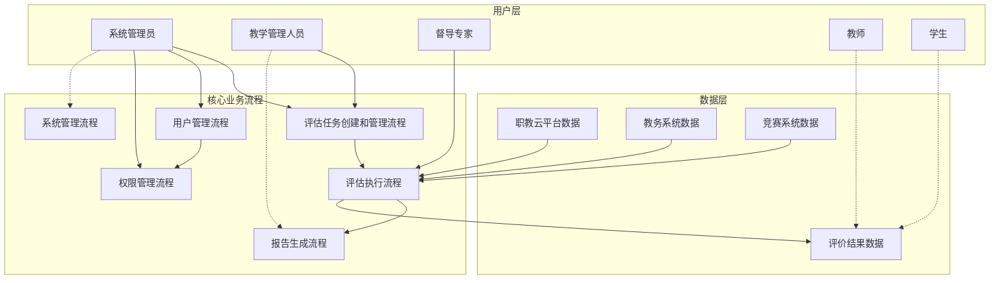
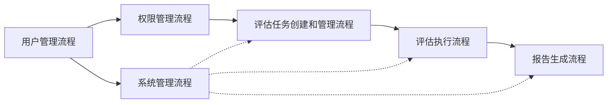

# AI助评应用业务流程总览

## 文档概述

本文档是AI助评应用业务流程的总体概览，提供了系统中所有核心业务流程的导航和索引信息。通过本文档，您可以快速了解系统的整体业务架构，并导航到具体的业务流程详细文档。

## 系统业务架构图

## 核心业务流程清单

| 序号 | 业务流程名称 | 主要负责人 | 核心价值 | 文档链接 |
|------|-------------|------------|----------|----------|
| 1 | 评估任务创建和管理流程 | 系统管理员、教学管理人员 | 建立评价标准，配置评价任务 | [详情](./01-评估任务创建和管理流程.md) |
| 2 | 评估执行流程 | AI分析引擎、督导专家 | 自动化数据分析，生成评价结果 | [详情](./02-评估执行流程.md) |
| 3 | 用户管理流程 | 系统管理员 | 用户身份认证和权限分配 | [详情](./03-用户管理流程.md) |
| 4 | 权限管理流程 | 系统管理员、安全管理员 | 精细化权限控制和安全防护 | [详情](./04-权限管理流程.md) |
| 5 | 报告生成流程 | 教学管理人员、系统管理员 | 多维度报告生成和分发 | [详情](./05-报告生成流程.md) |
| 6 | 系统管理流程 | 系统管理员、运维工程师 | 系统稳定运行和数据质量保障 | [详情](./06-系统管理流程.md) |

## 业务流程关联关系

### 主要流程依赖关系

### 关键节点说明

1. **用户管理**是所有流程的基础，确保用户身份的正确性和合法性
2. **权限管理**为其他流程提供安全访问控制
3. **评估任务创建**是评价工作的起点，确定评价的范围和标准
4. **评估执行**是核心分析过程，产生评价结果
5. **报告生成**将分析结果转化为可理解的业务洞察
6. **系统管理**为整个系统提供稳定运行保障

## 流程参与角色矩阵

| 角色 | 评估任务管理 | 评估执行 | 用户管理 | 权限管理 | 报告生成 | 系统管理 |
|------|-------------|----------|----------|----------|----------|----------|
| 系统管理员 | ✅ 主责 | ❌ | ✅ 主责 | ✅ 主责 | ✅ 协助 | ✅ 主责 |
| 教学管理人员 | ✅ 主责 | ❌ | ✅ 协助 | ❌ | ✅ 主责 | ❌ |
| 督导专家 | ✅ 协助 | ✅ 主责 | ❌ | ❌ | ✅ 协助 | ❌ |
| 教师 | ❌ | ❌ | ✅ 使用者 | ❌ | ✅ 使用者 | ❌ |
| 学生 | ❌ | ❌ | ✅ 使用者 | ❌ | ❌ | ❌ |

## 关键业务指标

### 效率指标
- **评价任务创建时间**: ≤30分钟
- **评估执行周期**: 按周/月/学期自动执行
- **报告生成时间**: ≤15分钟
- **系统响应时间**: ≤3秒

### 质量指标
- **数据完整性**: ≥99.9%
- **评价准确性**: 基于多维度AI分析
- **系统可用性**: ≥99.5%
- **权限控制准确率**: 100%

### 用户满意度指标
- **用户操作成功率**: ≥98%
- **报告有用性评分**: ≥4.0/5.0
- **系统易用性评分**: ≥4.0/5.0

## 业务流程版本管理

| 版本号 | 发布日期 | 主要变更内容 | 变更原因 |
|--------|----------|-------------|----------|
| V1.0 | 2025-11-23 | 初始版本，包含六大核心流程 | 基于业务需求分析 |
| V1.1 | 待定 | 预留版本空间 | 后续优化改进 |

## 文档使用指南

### 如何使用本文档

1. **快速导航**: 通过上方的核心业务流程清单，快速定位到感兴趣的流程
2. **关联理解**: 查看业务流程关联关系图，理解流程间的依赖关系
3. **角色定位**: 根据角色参与矩阵，了解不同角色在各流程中的职责
4. **指标参考**: 查看关键业务指标，了解流程的量化标准

### 文档维护说明

- **更新频率**: 每季度或业务流程发生重大变更时更新
- **维护责任**: 系统分析团队负责文档的准确性和及时性
- **反馈渠道**: 通过系统管理模块提交文档改进建议

## 附录

### 附录A：术语定义
- **AI助评**: 基于人工智能技术的教学质量辅助评价系统
- **评价维度**: 教学活跃度、学生参与度、教学效果、教学创新
- **权重分配**: 不同评价维度在总体评分中的占比
- **督导专家**: 负责教学质量监督和评价的专业人员

### 附录B：相关文档
- [AI助评应用业务需求文档(BRD)](../AI助评应用业务需求文档(BRD).md)
- [AI助评应用功能需求文档(FR)](../AI助评应用功能需求文档(FR).md)
- [AI助评应用软件需求规格说明书(SRS)](../AI助评应用软件需求规格说明书(SRS).md)

### 附录C：联系信息
如有业务流程相关问题，请联系：
- **系统分析团队**: system-analysis@example.com
- **业务咨询**: business@example.com
- **技术支持**: tech-support@example.com

---

**文档版本**: V1.0
**创建日期**: 2025-11-23
**最后更新**: 2025-11-23
**文档状态**: 正式发布