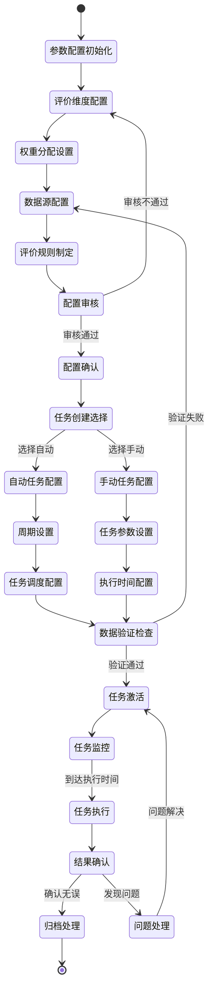

# 评估任务创建和管理流程

## 流程概述

评估任务创建和管理流程是AI助评系统的核心启动流程，负责配置评价参数、创建评价任务、管理任务生命周期。该流程确保评价工作的规范性、周期性和可追溯性，为后续的评估执行提供基础框架。

## 业务目标

- **规范化管理**: 建立标准化的评价任务创建流程
- **灵活配置**: 支持不同类型和周期的评价任务
- **质量控制**: 确保评价参数的科学性和合理性
- **效率提升**: 通过自动化管理减少人工操作

## 参与角色

| 角色 | 主要职责 | 权限级别 |
|------|----------|----------|
| 系统管理员 | 系统配置、任务调度、用户管理 | 全部权限 |
| 教学管理人员 | 评价标准制定、权重配置、任务审核 | 管理权限 |
| 督导专家 | 评价标准审查、专业建议支持 | 专家权限 |

## 流程状态图

## 详细流程步骤

### 第一阶段：评价参数配置

#### 步骤1：参数配置初始化
- **触发条件**: 系统初始化或参数更新需求
- **主要操作**:
  - 加载默认配置参数
  - 检查配置完整性
  - 初始化配置界面
- **输入**: 系统默认参数、历史配置记录
- **输出**: 配置初始化状态
- **异常处理**: 配置加载失败时回滚到上一次有效配置

#### 步骤2：评价维度配置
- **触发条件**: 完成参数配置初始化
- **主要操作**:
  - 设置四大评价维度：教学活跃度、学生参与度、教学效果、教学创新
  - 配置各维度的具体指标
  - 设置维度评价标准
- **业务规则**:
  - 教学活跃度：包含备课、教学、互动、作业等子维度
  - 学生参与度：包含出勤率、互动率、完成率等指标
  - 教学效果：包含成绩分布、学习进度、技能掌握等
  - 教学创新：包含新方法应用、资源创新、模式创新等
- **输入**: 维度定义模板、业务需求
- **输出**: 维度配置结果

#### 步骤3：权重分配设置
- **触发条件**: 完成评价维度配置
- **主要操作**:
  - 设置各维度权重：教学活跃度25%、学生参与度30%、教学效果35%、教学创新10%
  - 支持按课程类型调整权重
  - 权重合理性验证
- **业务规则**:
  - 权重总和必须等于100%
  - 教学效果权重通常最高（30%-40%）
  - 支持院系级别的权重差异化设置
- **约束条件**: 单个维度权重范围5%-50%
- **输入**: 维度权重分配规则
- **输出**: 权重配置结果

#### 步骤4：数据源配置
- **触发条件**: 完成权重分配设置
- **主要操作**:
  - 配置三大数据源：职教云平台（46个数据表）、教务系统（25个数据表）、竞赛系统（12个数据表）
  - 设置数据采集频率和规则
  - 配置数据质量检查标准
- **数据源清单**:
  - 职教云平台：教学活动、学生互动、作业提交、考试安排等
  - 教务系统：课程安排、学生信息、成绩管理、教学计划等
  - 竞赛系统：竞赛参与、获奖情况、技能比赛等
- **输入**: 数据源连接信息、采集规则
- **输出**: 数据源配置结果

#### 步骤5：评价规则制定
- **触发条件**: 完成数据源配置
- **主要操作**:
  - 制定评价计算规则
  - 设置阈值和评分标准
  - 配置异常数据处理规则
- **计算规则示例**:
  - 活跃度评分 = Σ(活动次数 × 权重系数) / 基准值 × 100
  - 参与度评分 = (出勤率 × 0.3 + 互动率 × 0.4 + 完成率 × 0.3) × 100
  - 效果评分 = 基于成绩分布和进步幅度的综合评分
  - 创新评分 = 专家评价 + 新技术应用得分
- **输入**: 评价算法、评分标准
- **输出**: 评价规则配置

### 第二阶段：配置审核与确认

#### 步骤6：配置审核
- **触发条件**: 完成评价规则制定
- **主要操作**:
  - 教学管理人员审核配置合理性
  - 督导专家提供专业建议
  - 系统自动检查配置一致性
- **审核要点**:
  - 权重分配的合理性
  - 数据源的完整性
  - 评价规则的科学性
  - 与教学目标的一致性
- **输入**: 配置方案、审核标准
- **输出**: 审核意见、配置确认状态

#### 步骤7：配置确认
- **触发条件**: 配置审核通过
- **主要操作**:
  - 系统管理员最终确认
  - 配置版本管理
  - 生效时间设定
- **版本控制**:
  - 支持配置版本回滚
  - 记录配置变更历史
  - 提供配置差异对比
- **输入**: 审核通过的配置
- **输出**: 生效配置、版本信息

### 第三阶段：评价任务创建

#### 步骤8：任务创建选择
- **触发条件**: 完成配置确认
- **主要操作**: 选择任务创建方式（自动/手动）
- **任务类型**:
  - **周期性任务**: 按周、月、学期自动执行
  - **专项任务**: 针对特定目的的一次性评价
  - **试点任务**: 小范围验证新评价方法

#### 步骤9：自动任务配置
- **触发条件**: 选择自动任务创建
- **主要操作**:
  - 设置执行周期（周/月/学期）
  - 配置触发时间点
  - 设置任务优先级
- **周期规则**:
  - 周任务：每周一上午8点自动执行
  - 月任务：每月1号上午9点自动执行
  - 学期任务：每学期开学后第3周和结束前2周执行
- **输入**: 周期设置要求
- **输出**: 自动任务调度配置

#### 步骤10：手动任务配置
- **触发条件**: 选择手动任务创建
- **主要操作**:
  - 设置任务参数
  - 选择评价范围（教师/课程/院系）
  - 配置执行时间
- **参数配置**:
  - 评价对象选择
  - 时间范围设定
  - 特殊要求配置
- **输入**: 任务创建请求
- **输出**: 手动任务配置

### 第四阶段：数据验证与任务激活

#### 步骤11：数据验证检查
- **触发条件**: 完成任务配置
- **主要操作**:
  - 检查数据源可用性
  - 验证数据完整性
  - 确认评价条件满足
- **验证标准**:
  - 数据同步延迟≤30分钟
  - 关键字段完整率≥99%
  - 活跃度数据≥5次（最低评价标准）
- **异常处理**: 数据异常时暂停任务，通知数据管理员

#### 步骤12：任务激活
- **触发条件**: 数据验证通过
- **主要操作**:
  - 任务状态设为"待执行"
  - 通知相关责任人
  - 记录激活日志
- **状态管理**:
  - 待执行 → 执行中 → 已完成 → 已归档
  - 支持任务暂停、恢复、取消操作
- **输出**: 激活的评价任务

### 第五阶段：任务监控与管理

#### 步骤13：任务监控
- **触发条件**: 任务激活完成
- **主要操作**:
  - 实时监控任务状态
  - 跟踪执行进度
  - 异常情况告警
- **监控指标**:
  - 任务执行进度
  - 数据处理速度
  - 系统资源使用
  - 异常发生频率

#### 步骤14：任务执行
- **触发条件**: 到达预设执行时间
- **主要操作**:
  - 启动数据采集
  - 执行评价计算
  - 生成初步结果
- **执行控制**:
  - 支持任务暂停和恢复
  - 异常时自动重试机制
  - 超时任务自动终止

#### 步骤15：结果确认
- **触发条件**: 任务执行完成
- **主要操作**:
  - 督导专家确认结果合理性
  - 系统自动质量检查
  - 问题结果标记
- **质量标准**:
  - 评分范围在0-100之间
  - 数据异常率≤1%
  - 结果逻辑一致性

#### 步骤16：归档处理
- **触发条件**: 结果确认无误
- **主要操作**:
  - 任务状态更新为"已完成"
  - 结果数据正式入库
  - 生成执行报告
- **归档内容**:
  - 任务配置信息
  - 执行过程记录
  - 最终评价结果
  - 质量检查报告

#### 步骤17：问题处理
- **触发条件**: 发现结果问题
- **主要操作**:
  - 问题分类和记录
  - 制定解决方案
  - 重新执行或调整
- **问题类型**:
  - 数据质量问题
  - 算法计算错误
  - 配置参数异常
  - 系统技术故障

## 关键业务规则

### 权重分配规则
- 总权重必须等于100%
- 教学效果维度权重不得低于30%
- 单个维度权重不得低于5%或高于50%
- 特殊课程可申请权重调整，需督导专家批准

### 数据质量规则
- 数据完整率必须≥99%
- 数据同步延迟不得超过30分钟
- 关键指标数据不得缺失
- 异常数据比例不得超过1%

### 任务执行规则
- 周期性任务严格按照预定时间执行
- 手动任务需提前2小时创建
- 任务执行超时自动终止
- 执行失败最多重试3次

## 异常处理机制

### 数据异常处理
1. **轻微异常**：自动修复并记录日志
2. **一般异常**：暂停任务，通知管理员
3. **严重异常**：终止任务，启动应急流程

### 系统异常处理
1. **性能异常**：自动扩容或调整执行时间
2. **配置异常**：回滚到上一次有效配置
3. **网络异常**：自动重试，最多3次

## 质量控制点

| 控制点 | 检查内容 | 检查方式 | 责任人 |
|--------|----------|----------|--------|
| 配置审核 | 参数合理性、规则一致性 | 人工审核+自动检查 | 教学管理人员 |
| 数据验证 | 完整性、准确性、及时性 | 自动化质量检查 | 系统管理员 |
| 结果确认 | 评分合理性、逻辑一致性 | 专家评审+自动校验 | 督导专家 |
| 归档检查 | 数据完整性、历史可追溯 | 完整性扫描 | 系统管理员 |

## 绩效指标

### 效率指标
- 任务创建时间：≤30分钟
- 配置审核时间：≤2小时
- 数据验证时间：≤15分钟
- 任务激活时间：≤5分钟

### 质量指标
- 配置准确率：100%
- 数据完整率：≥99.9%
- 任务成功率：≥99%
- 结果准确率：基于专家验证

### 用户满意度
- 配置易用性：≥4.5/5.0
- 任务管理效率提升：≥50%
- 用户操作成功率：≥99%

## 相关文档

- [评估执行流程](./02-评估执行流程.md)
- [用户管理流程](./03-用户管理流程.md)
- [权限管理流程](./04-权限管理流程.md)
- [AI助评应用功能需求文档(FR)](../AI助评应用功能需求文档(FR).md)

---

**文档版本**: V1.0
**创建日期**: 2025-11-23
**最后更新**: 2025-11-23
**审批状态**: 待审批
**维护责任人**: 系统分析团队