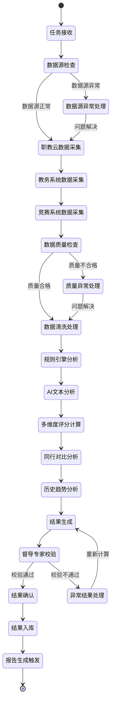

# 评估执行流程

## 流程概述

评估执行流程是AI助评系统的核心数据处理和分析流程，负责从多个数据源采集教学相关数据，通过规则引擎和AI算法进行智能分析，最终生成科学、客观的教学质量评价结果。该流程实现了评价工作的自动化、智能化和标准化。

## 业务目标

- **自动化执行**: 减少人工干预，提高评价效率
- **智能分析**: 运用AI技术进行深度数据分析
- **客观评价**: 基于多维度数据进行科学评估
- **实时处理**: 支持近实时的数据采集和分析

## 参与角色

| 角色 | 主要职责 | 权限级别 |
|------|----------|----------|
| 数据工程师 | 数据采集监控、质量保障、异常处理 | 数据管理权限 |
| AI分析引擎 | 自动化数据处理、算法执行、结果计算 | 系统执行权限 |
| 督导专家 | 结果校验、质量把控、异常复核 | 专家审核权限 |
| 系统管理员 | 流程监控、性能优化、问题处理 | 系统管理权限 |

## 流程状态图



## 详细流程步骤

### 第一阶段：数据采集

#### 步骤1：任务接收
- **触发条件**: 收到来自评估任务管理流程的评价任务
- **主要操作**:
  - 接收任务参数和配置信息
  - 验证任务有效性
  - 初始化执行环境
- **输入**: 评价任务ID、配置参数、执行时间
- **输出**: 任务执行状态
- **处理时间**: ≤2分钟

#### 步骤2：数据源检查
- **触发条件**: 完成任务接收
- **主要操作**:
  - 检查三大数据源连接状态
  - 验证数据同步时效性
  - 确认数据源可用性
- **检查项目**:
  - 职教云平台API连接状态
  - 教务系统数据库连接状态
  - 竞赛系统数据接口状态
  - 各系统最后同步时间
- **输入**: 数据源配置信息
- **输出**: 数据源状态报告
- **异常处理**: 数据源异常时启动异常处理流程

#### 步骤3：职教云数据采集
- **触发条件**: 数据源检查通过
- **主要操作**:
  - 从46个数据表采集教学活动数据
  - 获取师生互动、作业提交、考试安排等信息
  - 按时间范围筛选相关数据
- **核心数据表**:
  - 教学活动表：备课、授课、辅导记录
  - 学生互动表：提问、回答、讨论参与
  - 作业管理表：作业发布、提交、批改记录
  - 考试管理表：考试安排、成绩录入、试卷分析
- **数据量**: 预计10-50万条记录
- **采集时间**: ≤15分钟

#### 步骤4：教务系统数据采集
- **触发条件**: 完成职教云数据采集
- **主要操作**:
  - 从25个数据表采集教务管理数据
  - 获取课程安排、学生信息、成绩数据
  - 收集教学计划和执行情况
- **核心数据表**:
  - 课程信息表：课程基本信息、教学大纲
  - 学生信息表：学生基本信息、选课记录
  - 成绩管理表：平时成绩、期末成绩、综合评定
  - 教学计划表：教学进度安排、实际执行
- **数据量**: 预计5-20万条记录
- **采集时间**: ≤10分钟

#### 步骤5：竞赛系统数据采集
- **触发条件**: 完成教务系统数据采集
- **主要操作**:
  - 从12个数据表采集竞赛相关数据
  - 获取师生竞赛参与和获奖情况
  - 收集技能比赛和创新项目信息
- **核心数据表**:
  - 竞赛信息表：竞赛名称、级别、时间
  - 参与记录表：师生参与情况、项目信息
  - 获奖记录表：获奖等级、奖项类别
  - 创新项目表：项目类型、完成情况
- **数据量**: 预计1-5万条记录
- **采集时间**: ≤5分钟

### 第二阶段：数据处理与质量检查

#### 步骤6：数据质量检查
- **触发条件**: 完成所有数据源采集
- **主要操作**:
  - 检查数据完整性
  - 验证数据一致性
  - 评估数据准确性
- **质量标准**:
  - 数据完整率≥99.9%
  - 关键字段非空率100%
  - 数据格式一致性100%
  - 时间序列连续性≥99.5%
- **检查指标**:
  - 缺失值比例
  - 重复记录数量
  - 异常值比例
  - 数据时效性
- **输出**: 数据质量报告

#### 步骤7：数据清洗处理
- **触发条件**: 数据质量检查通过
- **主要操作**:
  - 处理缺失值和异常值
  - 标准化数据格式
  - 去除重复数据
  - 数据类型转换
- **清洗规则**:
  - 缺失值：采用插值法或默认值填充
  - 异常值：基于统计方法识别并处理
  - 重复值：保留最新或最完整记录
  - 格式统一：日期、数字、文本格式标准化
- **处理算法**: 机器学习算法辅助数据清洗
- **输出**: 清洗后的标准数据集

### 第三阶段：智能分析

#### 步骤8：规则引擎分析
- **触发条件**: 完成数据清洗
- **主要操作**:
  - 应用预定义评价规则
  - 计算基础指标得分
  - 生成初步评价结果
- **评价规则**:
  - **教学活跃度规则**:
    - 备课次数权重：备课数/周 × 2分
    - 教学时长权重：实际课时/计划课时 × 3分
    - 互动频次权重：互动次数/学生数 × 2分
  - **学生参与度规则**:
    - 出勤率权重：实际出勤/应出勤 × 3分
    - 作业完成率权重：完成作业数/布置作业数 × 4分
    - 参与讨论权重：讨论参与次数/总讨论次数 × 3分
- **输出**: 各维度基础得分

#### 步骤9：AI文本分析
- **触发条件**: 完成规则引擎分析
- **主要操作**:
  - 分析学生评教文本内容
  - 处理作业和考试反馈
  - 提取关键评价要素
- **分析技术**:
  - 自然语言处理（NLP）
  - 情感分析算法
  - 主题模型分析
  - 关键词提取
- **分析内容**:
  - 学生评教文本的情感倾向
  - 教学内容的完整性和准确性
  - 教学方法的创新性和有效性
  - 师生互动的质量和深度
- **AI模型**: 基于BERT的情感分析模型
- **输出**: 文本分析结果和情感评分

#### 步骤10：多维度评分计算
- **触发条件**: 完成AI文本分析
- **主要操作**:
  - 综合规则得分和AI分析结果
  - 应用权重计算最终评分
  - 生成各维度详细评分
- **计算公式**:
  ```
  总评分 = (教学活跃度得分 × 25%) + (学生参与度得分 × 30%) + (教学效果得分 × 35%) + (教学创新得分 × 10%)
  ```
- **评分细则**:
  - 教学活跃度（0-25分）：基于教学活动数据
  - 学生参与度（0-30分）：基于学生互动数据
  - 教学效果（0-35分）：基于学习成果和评价
  - 教学创新（0-10分）：基于新方法和创新实践
- **输出**: 综合评分和各维度得分

### 第四阶段：对比分析与趋势计算

#### 步骤11：同行对比分析
- **触发条件**: 完成多维度评分计算
- **主要操作**:
  - 与同课程、同年级教师对比
  - 计算百分位排名
  - 识别优势和不足
- **对比维度**:
  - 同课程教师对比
  - 同年级教师对比
  - 同院系教师对比
  - 全校教师对比
- **统计指标**:
  - 平均分对比
  - 百分位排名
  - 标准差分析
  - 优秀率比较
- **输出**: 对比分析报告

#### 步骤12：历史趋势分析
- **触发条件**: 完成同行对比分析
- **主要操作**:
  - 分析历史评价数据趋势
  - 计算进步幅度
  - 预测发展趋势
- **分析方法**:
  - 时间序列分析
  - 回归分析
  - 季节性调整
  - 异常点检测
- **趋势指标**:
  - 月度/季度变化趋势
  - 年度进步幅度
  - 稳定性评估
  - 发展潜力预测
- **输出**: 历史趋势分析结果

### 第五阶段：结果生成与校验

#### 步骤13：结果生成
- **触发条件**: 完成历史趋势分析
- **主要操作**:
  - 整合所有分析结果
  - 生成0-100分综合评分
  - 识别关键改进点
  - 生成个性化改进建议
- **结果内容**:
  - 综合评分（0-100分）
  - 各维度得分（教学活跃度、学生参与度、教学效果、教学创新）
  - 同行对比排名和百分位
  - 历史趋势变化图表
  - 3-5条具体改进建议
- **改进建议类型**:
  - 教学方法优化建议
  - 师生互动改善建议
  - 内容设计完善建议
  - 创新实践拓展建议
- **输出**: 完整评价结果报告

#### 步骤14：督导专家校验
- **触发条件**: 完成结果生成
- **主要操作**:
  - 督导专家审核结果合理性
  - 检查异常评分和极端情况
  - 确认改进建议的实用性
- **校验要点**:
  - 评分与教学实际表现的一致性
  - 数据异常的识别和处理
  - 改进建议的针对性和可操作性
  - 整体评价结果的逻辑性
- **校验方式**:
  - 系统自动校验：基于预设规则
  - 人工专家校验：基于专业经验
  - 抽样对比校验：随机抽取样本对比
- **校验标准**:
  - 评分偏差≤5分
  - 建议可操作率≥90%
  - 异常识别率≥95%
- **输出**: 校验确认结果

#### 步骤15：结果确认
- **触发条件**: 督导专家校验通过
- **主要操作**:
  - 最终确认评价结果
  - 标记结果状态为"已确认"
  - 记录确认时间和责任人
- **确认流程**:
  - 自动校验结果记录
  - 专家校验意见记录
  - 最终确认决策
  - 结果版本管理
- **输出**: 确认状态的评价结果

### 第六阶段：结果入库与报告触发

#### 步骤16：结果入库
- **触发条件**: 完成结果确认
- **主要操作**:
  - 将评价结果存入数据库
  - 更新历史评价记录
  - 记录执行过程日志
- **存储内容**:
  - 评价任务基本信息
  - 各维度详细得分
  - 对比分析和趋势数据
  - 改进建议和校验记录
- **数据备份**: 同时生成备份副本
- **输出**: 数据入库确认

#### 步骤17：报告生成触发
- **触发条件**: 完成结果入库
- **主要操作**:
  - 触发报告生成流程
  - 通知相关用户结果可用
  - 更新任务状态为"已完成"
- **通知方式**:
  - 系统内消息通知
  - 邮件通知（可选）
  - 短信通知（重要结果）
- **输出**: 报告生成触发信号

## 关键业务规则

### 数据采集规则
- 数据同步延迟不得超过30分钟
- 采集数据必须覆盖完整的评价周期
- 关键指标数据缺失率不得超过0.1%
- 异常数据比例不得超过1%

### 评分计算规则
- 总评分必须严格按权重公式计算
- 各维度得分范围控制在0到权重满分之间
- 评分精度保留到小数点后1位
- 极端值需要进行平滑处理

### 质量控制规则
- 所有数据必须经过双重质量检查
- 评价结果必须经过专家校验确认
- 异常结果必须经过复核处理
- 最终确认结果不可随意修改

## 技术实现要点

### 数据采集技术
- **增量采集**: 只采集新增和变更数据，提高效率
- **并行处理**: 多数据源同时采集，缩短总时间
- **容错机制**: 单个数据源异常不影响其他数据源
- **数据缓存**: 建立数据缓存层，提高访问速度

### AI分析技术
- **自然语言处理**: 使用BERT等先进模型进行文本分析
- **机器学习算法**: 应用各种ML算法进行模式识别和预测
- **深度学习**: 使用深度神经网络处理复杂数据关系
- **知识图谱**: 构建教学知识图谱支持智能分析

### 性能优化
- **分布式计算**: 采用Spark等分布式计算框架
- **内存计算**: 使用内存数据库加速数据处理
- **算法优化**: 针对具体场景优化算法效率
- **资源调度**: 动态调整计算资源分配

## 异常处理机制

### 数据采集异常
1. **连接超时**: 自动重试3次，每次间隔5分钟
2. **数据格式异常**: 启动格式转换和清洗流程
3. **数据量异常**: 检查数据源状态，必要时暂停采集
4. **权限异常**: 重新认证或联系数据源管理员

### 分析计算异常
1. **算法执行异常**: 回退到备用算法或人工处理
2. **内存溢出**: 分批次处理或增加计算资源
3. **结果异常**: 触发专家人工校验流程
4. **系统故障**: 启动容灾恢复流程

## 绩效指标

### 效率指标
- 数据采集总时间：≤30分钟
- 数据处理时间：≤10分钟
- 智能分析时间：≤20分钟
- 总执行时间：≤60分钟

### 质量指标
- 数据采集准确率：≥99.9%
- 数据处理完整率：100%
- 分析计算准确率：≥99.5%
- 结果校验通过率：≥98%

### 性能指标
- 系统响应时间：≤3秒
- 并发处理能力：≥10个任务
- 数据处理吞吐量：≥100万条/小时
- 系统可用性：≥99.9%

## 安全与隐私保护

### 数据安全
- 传输加密：所有数据传输采用SSL/TLS加密
- 存储加密：敏感数据采用AES-256加密存储
- 访问控制：严格的权限控制和访问审计
- 备份策略：定期数据备份和容灾恢复

### 隐私保护
- 数据脱敏：个人敏感信息进行脱敏处理
- 最小化原则：只收集和分析必要的数据
- 匿名化：统计分析使用匿名化数据
- 合规性：遵守相关数据保护法规

## 相关文档

- [评估任务创建和管理流程](./01-评估任务创建和管理流程.md)
- [报告生成流程](./05-报告生成流程.md)
- [系统管理流程](./06-系统管理流程.md)
- [AI助评应用软件需求规格说明书(SRS)](../AI助评应用软件需求规格说明书(SRS).md)

---

**文档版本**: V1.0
**创建日期**: 2025-11-23
**最后更新**: 2025-11-23
**审批状态**: 待审批
**维护责任人**: 系统分析团队