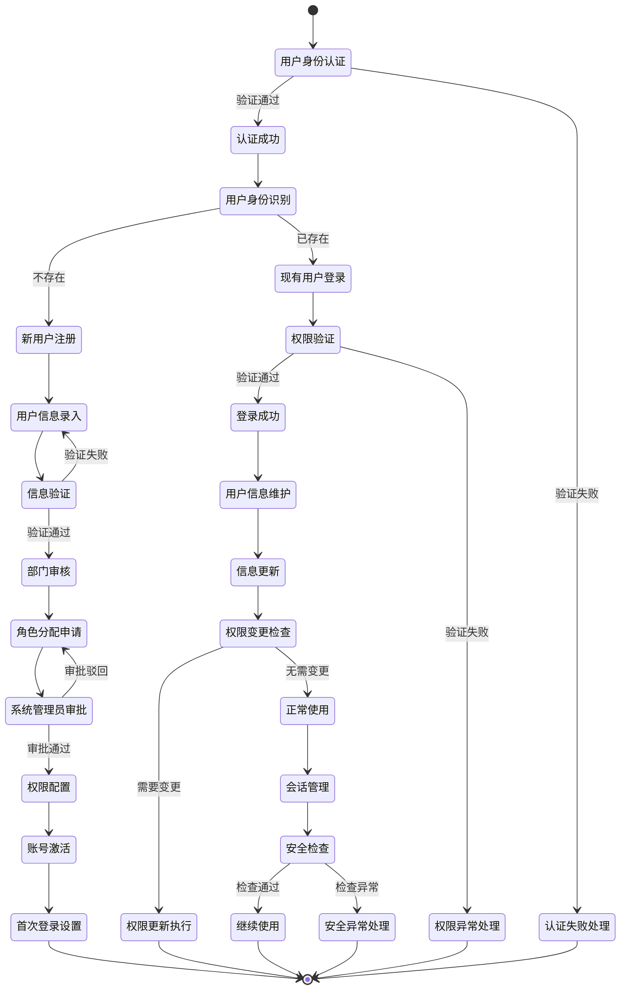

# 用户管理流程

## 流程概述

用户管理流程是AI助评系统的基础支撑流程，负责用户身份认证、账号创建、权限分配、信息维护等全生命周期管理。该流程确保系统用户身份的合法性、权限的准确性以及信息安全性的基础上，为所有其他业务流程提供用户身份验证和授权服务。

## 业务目标

- **统一身份**: 建立统一的用户身份认证体系
- **精准权限**: 实现基于角色的精细化权限管理
- **安全保障**: 确保用户信息和系统安全性
- **用户体验**: 提供便捷高效的用户管理服务

## 参与角色

| 角色 | 主要职责 | 权限级别 |
|------|----------|----------|
| 系统管理员 | 用户账号管理、权限分配、系统配置 | 系统管理权限 |
| 部门管理员 | 本部门用户信息确认、权限初审 | 部门管理权限 |
| 用户本人 | 个人信息维护、密码修改、安全设置 | 个人权限 |
| 安全管理员 | 安全策略制定、安全事件处理 | 安全管理权限 |

## 流程状态图

## 详细流程步骤

### 第一阶段：用户身份认证

#### 步骤1：用户身份认证
- **触发条件**: 用户访问系统或进行身份验证
- **主要操作**:
  - 接收用户认证请求
  - 验证用户身份凭证
  - 与学校统一身份认证系统集成
- **认证方式**:
  - **单点登录（SSO）**: 与学校统一身份认证系统集成
  - **多因素认证（MFA）**: 用户名+密码+短信/邮箱验证码
  - **数字证书**: 支持学校数字证书认证
  - **生物识别**: 指纹、人脸识别（可选）
- **集成系统**:
  - 学校统一身份认证系统
  - 教务管理系统
  - 人事管理系统
- **输入**: 用户账号、密码、验证码等认证信息
- **输出**: 认证结果（成功/失败）
- **响应时间**: ≤3秒

#### 步骤2：认证失败处理
- **触发条件**: 用户身份认证失败
- **主要操作**:
  - 记录认证失败日志
  - 分析失败原因
  - 提供错误提示和解决方案
- **失败原因处理**:
  - **账号密码错误**: 提供重试机会，最多3次
  - **账号不存在**: 引导用户注册或联系管理员
  - **账号被锁定**: 提供解锁流程或联系管理员
  - **系统故障**: 提示稍后重试或联系技术支持
- **安全措施**:
  - 连续失败3次锁定账号30分钟
  - 异地登录发送安全提醒
  - 可疑登录行为触发人工审核
- **输出**: 错误信息和解决建议

### 第二阶段：新用户注册流程

#### 步骤3：用户身份识别
- **触发条件**: 认证成功后的身份检查
- **主要操作**:
  - 检查用户是否在系统中存在
  - 识别用户类型和来源
  - 确定后续处理流程
- **识别依据**:
  - 统一身份认证系统中的用户信息
  - 用户来源（教师、学生、管理员等）
  - 所属部门和角色
- **输出**: 用户存在状态和基础身份信息

#### 步骤4：新用户注册
- **触发条件**: 用户在系统中不存在
- **主要操作**:
  - 引导用户完成注册流程
  - 收集必要用户信息
  - 建立基础用户档案
- **注册方式**:
  - **自动注册**: 基于统一身份认证信息自动创建
  - **邀请注册**: 管理员发送邀请邮件/短信
  - **自主注册**: 用户填写注册申请表
- **必要信息**:
  - 基本身份信息：姓名、工号/学号、部门
  - 联系方式：邮箱、手机号码
  - 职位信息：职位、职级、专业方向（教师）
- **输入**: 用户填写的注册信息
- **输出**: 注册申请记录

#### 步骤5：用户信息录入
- **触发条件**: 完成新用户注册
- **主要操作**:
  - 系统录入用户基础信息
  - 建立用户初始档案
  - 设置用户初始状态
- **录入内容**:
  - 个人基本信息
  - 联系方式信息
  - 组织架构信息
  - 账户安全信息
- **数据来源**:
  - 统一身份认证系统同步
  - 人事管理系统获取
  - 用户自主填写
- **输出**: 用户基础档案

#### 步骤6：信息验证
- **触发条件**: 完成用户信息录入
- **主要操作**:
  - 验证信息完整性和准确性
  - 检查信息一致性
  - 确认数据有效性
- **验证项目**:
  - 必填字段完整性检查
  - 联系方式有效性验证
  - 组织架构关系确认
  - 身份信息真实性核对
- **验证方式**:
  - 系统自动验证：格式、规则检查
  - 数据源对比：与权威系统对比
  - 人工审核：特殊情况人工确认
- **输出**: 验证结果和问题清单

### 第三阶段：审核与权限分配

#### 步骤7：部门审核
- **触发条件**: 信息验证通过
- **主要操作**:
  - 部门管理员审核用户信息
  - 确认用户身份和部门归属
  - 提出初步角色建议
- **审核要点**:
  - 用户身份真实性确认
  - 部门归属准确性验证
  - 职位信息正确性检查
  - 业务需求合理性评估
- **审核流程**:
  - 系统自动发送审核通知
  - 部门管理员在线审核
  - 审核意见记录和反馈
- **输入**: 用户信息、审核请求
- **输出**: 部门审核意见

#### 步骤8：角色分配申请
- **触发条件**: 部门审核通过
- **主要操作**:
  - 根据用户职位申请角色
  - 说明角色分配理由
  - 提交系统管理员审批
- **角色类型**:
  - **系统管理员**: 全部系统权限
  - **教学管理人员**: 教学管理和查看权限
  - **督导专家**: 专业评价和审核权限
  - **教师**: 个人数据和评价结果查看权限
  - **学生**: 评价参与和基础查看权限
- **申请依据**:
  - 用户职位和职责
  - 业务需求分析
  - 安全权限原则
- **输出**: 角色分配申请

#### 步骤9：系统管理员审批
- **触发条件**: 收到角色分配申请
- **主要操作**:
  - 审核角色分配合理性
  - 确认权限范围适当性
  - 最终审批决策
- **审批标准**:
  - 角色与职责匹配度
  - 权限最小化原则
  - 安全风险评估
  - 业务必要性验证
- **审批流程**:
  - 系统自动初步审核
  - 人工管理员最终审批
  - 审批结果通知
- **输入**: 角色分配申请、用户信息
- **输出**: 审批结果和权限配置指令

#### 步骤10：权限配置
- **触发条件**: 角色分配申请审批通过
- **主要操作**:
  - 根据审批结果配置用户权限
  - 设置功能权限和数据权限
  - 配置时间和范围限制
- **权限类型**:
  - **功能权限**: 菜单访问、按钮操作、功能使用
  - **数据权限**: 数据范围、字段访问、操作权限
  - **时间权限**: 访问时间、有效期限制
- **配置原则**:
  - 最小权限原则
  - 职责分离原则
  - 权限审计原则
- **输出**: 权限配置完成

### 第四阶段：账号激活与首次登录

#### 步骤11：账号激活
- **触发条件**: 完成权限配置
- **主要操作**:
  - 激活用户账号
  - 发送激活通知
  - 设置账号有效期
- **激活方式**:
  - 邮件激活链接
  - 短信激活码
  - 管理员手动激活
- **激活信息**:
  - 登录地址和方式
  - 初始密码设置指引
  - 安全设置要求
- **输出**: 账号激活状态

#### 步骤12：首次登录设置
- **触发条件**: 用户首次登录系统
- **主要操作**:
  - 强制修改初始密码
  - 设置安全问题
  - 完善个人信息
- **安全设置**:
  - 密码复杂度要求：8位以上，包含大小写、数字、特殊字符
  - 安全问题设置：3-5个安全问题
  - 多因素认证绑定：手机号、邮箱
  - 登录设备管理：信任设备设置
- **个人信息完善**:
  - 联系方式确认
  - 个人简介和头像（可选）
  - 通知偏好设置
- **输出**: 完成首次登录设置

### 第五阶段：现有用户登录与权限验证

#### 步骤13：现有用户登录
- **触发条件**: 已存在用户访问系统
- **主要操作**:
  - 验证用户登录凭证
  - 检查账号状态
  - 验证登录环境
- **登录检查项目**:
  - 账号有效性：未过期、未锁定
  - 密码有效期：未过期或需要修改
  - 登录环境：IP地址、设备、时间
  - 安全策略：满足系统安全要求
- **输出**: 登录结果

#### 步骤14：权限验证
- **触发条件**: 用户登录成功
- **主要操作**:
  - 获取用户权限信息
  - 验证当前操作权限
  - 设置用户会话
- **验证内容**:
  - 功能权限：可访问的菜单和功能
  - 数据权限：可查看的数据范围
  - 操作权限：可执行的操作类型
  - 时间权限：当前时间是否在有效期内
- **会话管理**:
  - 会话ID生成和管理
  - 会话超时控制（默认30分钟）
  - 并发会话限制
- **输出**: 用户会话和权限信息

### 第六阶段：用户信息维护

#### 步骤15：用户信息维护
- **触发条件**: 用户登录系统后
- **主要操作**:
  - 提供个人信息查看和编辑
  - 管理账号安全设置
  - 处理权限变更申请
- **维护功能**:
  - 个人信息编辑：联系方式、个人简介等
  - 密码管理：修改密码、找回密码
  - 安全设置：多因素认证、安全问题
  - 登录历史：查看登录记录和安全事件
- **操作范围**:
  - 用户本人：个人信息和安全设置
  - 管理员：全部用户信息和权限管理
- **输出**: 信息更新结果

#### 步骤16：信息更新
- **触发条件**: 用户修改个人信息
- **主要操作**:
  - 验证更新信息的合法性
  - 更新用户档案
  - 记录变更历史
- **更新验证**:
  - 格式验证：手机号、邮箱格式
  - 唯一性验证：避免重复信息
  - 合理性验证：信息逻辑一致性
- **变更记录**:
  - 变更时间、变更内容、变更人
  - 原值和新值对比
  - 变更原因记录
- **输出**: 更新确认和变更记录

#### 步骤17：权限变更检查
- **触发条件**: 用户职位或职责发生变化
- **主要操作**:
  - 检查权限配置是否需要调整
  - 评估权限变更必要性
  - 触发权限变更流程
- **变更触发条件**:
  - 用户职位变更
  - 部门调整
  - 职责范围变化
  - 安全策略更新
- **变更评估**:
  - 原有权限是否仍然适用
  - 是否需要增加或减少权限
  - 权限范围是否需要调整
- **输出**: 权限变更评估结果

#### 步骤18：权限更新执行
- **触发条件**: 确认需要权限变更
- **主要操作**:
  - 执行权限配置变更
  - 更新用户角色
  - 通知相关用户
- **变更流程**:
  - 权限变更申请
  - 管理员审批
  - 权限配置更新
  - 生效时间确认
- **变更通知**:
  - 通知用户本人
  - 通知相关部门管理员
  - 记录变更日志
- **输出**: 权限变更完成确认

### 第七阶段：会话管理与安全检查

#### 步骤19：会话管理
- **触发条件**: 用户使用系统过程中
- **主要操作**:
  - 监控用户会话状态
  - 处理会话超时和异常
  - 管理并发会话
- **会话控制**:
  - 会话超时检测和处理
  - 并发登录限制：同一账号最多3个并发会话
  - 会话安全检查：异地登录、异常操作检测
- **会话优化**:
  - 会话数据缓存
  - 负载均衡支持
  - 失效会话清理
- **输出**: 会话状态管理

#### 步骤20：安全检查
- **触发条件**: 用户操作过程中
- **主要操作**:
  - 实时安全状态检查
  - 异常行为检测
  - 安全风险评估
- **检查项目**:
  - 操作权限验证
  - 敏感操作二次确认
  - 异常登录检测
  - 数据访问审计
- **异常处理**:
  - 可疑操作告警
  - 账号自动锁定
  - 强制退出登录
  - 安全事件记录
- **输出**: 安全检查结果和异常处理

## 关键业务规则

### 用户身份规则
- 用户必须通过统一身份认证系统验证
- 用户身份信息必须与权威系统保持一致
- 禁止匿名用户访问系统
- 用户身份唯一性保证

### 权限管理规则
- 遵循最小权限原则
- 权限分配必须与用户职责匹配
- 敏感权限需要多级审批
- 定期审查和更新权限配置

### 安全管理规则
- 密码必须符合复杂度要求
- 启用多因素认证
- 记录所有用户操作日志
- 定期进行安全审计

## 安全与隐私保护

### 身份认证安全
- **强密码策略**: 强制复杂密码要求
- **多因素认证**: 密码+短信/邮箱验证
- **登录限制**: 异常IP和设备检测
- **会话安全**: 会话超时和加密传输

### 数据隐私保护
- **数据最小化**: 只收集必要信息
- **数据加密**: 敏感数据加密存储
- **访问控制**: 严格的数据访问权限
- **隐私合规**: 遵循数据保护法规

### 审计与监控
- **操作审计**: 记录所有用户操作
- **安全监控**: 实时安全状态监控
- **异常检测**: 自动识别异常行为
- **事件响应**: 快速响应安全事件

## 异常处理机制

### 认证异常处理
1. **账号锁定**: 连续失败锁定30分钟，管理员可解锁
2. **密码过期**: 强制用户修改密码
3. **异地登录**: 发送安全提醒，需要二次确认
4. **系统异常**: 提供备用认证方式

### 权限异常处理
1. **权限不足**: 明确提示所需权限和申请流程
2. **权限冲突**: 自动检测并解决权限冲突
3. **权限过期**: 自动更新或提示用户申请延期
4. **越权操作**: 自动阻止并记录安全事件

## 绩效指标

### 效率指标
- 用户注册时间：≤5分钟
- 登录响应时间：≤3秒
- 权限配置时间：≤10分钟
- 信息更新响应时间：≤2秒

### 质量指标
- 身份认证准确率：100%
- 权限配置准确率：100%
- 用户信息完整率：≥99.9%
- 系统可用性：≥99.9%

### 安全指标
- 账号安全事件率：≤0.1%
- 数据泄露事件：0次
- 越权操作检测率：100%
- 安全事件响应时间：≤5分钟

### 用户满意度
- 登录便捷性：≥4.5/5.0
- 权限管理满意度：≥4.0/5.0
- 系统安全性满意度：≥4.5/5.0

## 相关文档

- [权限管理流程](./04-权限管理流程.md)
- [评估任务创建和管理流程](./01-评估任务创建和管理流程.md)
- [系统管理流程](./06-系统管理流程.md)
- [AI助评应用软件需求规格说明书(SRS)](../AI助评应用软件需求规格说明书(SRS).md)

---

**文档版本**: V1.0
**创建日期**: 2025-11-23
**最后更新**: 2025-11-23
**审批状态**: 待审批
**维护责任人**: 系统分析团队