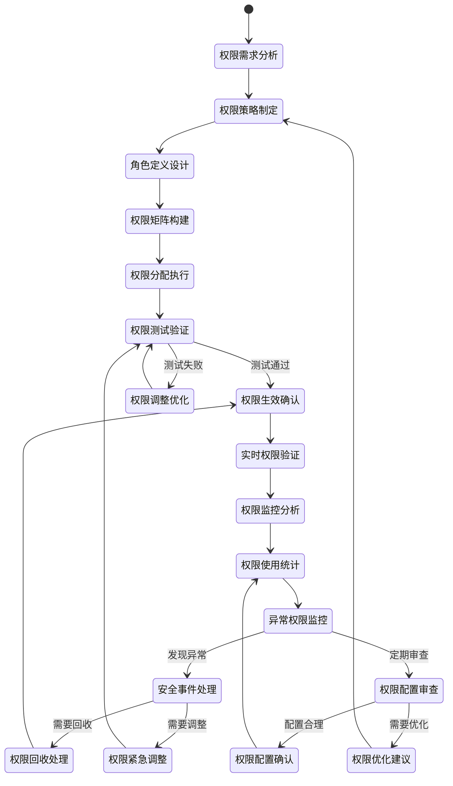

# 权限管理流程

## 流程概述

权限管理流程是AI助评系统的安全保障核心流程，负责基于角色的访问控制（RBAC）设计、权限策略制定、权限分配执行、权限监控审计等全生命周期管理。该流程确保系统的安全性、数据的保密性，同时提供灵活的权限控制机制，满足不同角色和业务场景的访问需求。

## 业务目标

- **安全控制**: 建立完善的权限控制体系，确保系统安全
- **精细管理**: 实现基于角色和场景的精细化权限管理
- **灵活配置**: 支持权限的灵活配置和动态调整
- **合规审计**: 满足安全合规要求，提供完整的权限审计

## 参与角色

| 角色 | 主要职责 | 权限级别 |
|------|----------|----------|
| 系统管理员 | 权限策略制定、权限分配、系统安全配置 | 系统管理权限 |
| 安全管理员 | 安全策略监督、权限审计、安全事件处理 | 安全管理权限 |
| 部门负责人 | 本部门权限需求确认、权限使用监督 | 部门管理权限 |
| 审计员 | 权限使用审计、合规检查、风险评估 | 审计权限 |

## 流程状态图



## 详细流程步骤

### 第一阶段：权限需求分析与策略制定

#### 步骤1：权限需求分析
- **触发条件**: 系统初始化或业务功能变更
- **主要操作**:
  - 收集各业务模块权限需求
  - 分析用户角色和职责
  - 识别敏感数据和关键操作
- **分析方法**:
  - **业务流程分析**: 基于业务流程识别权限点
  - **角色职责分析**: 明确各角色的职责范围
  - **数据分类分析**: 按敏感度分类数据访问权限
  - **风险评估分析**: 识别潜在安全风险
- **需求分类**:
  - 功能权限：菜单访问、按钮操作、功能使用
  - 数据权限：数据范围、字段访问、操作权限
  - 时间权限：访问时间、有效期限制
  - 地域权限：IP地址、地理位置限制
- **输出**: 权限需求分析报告

#### 步骤2：权限策略制定
- **触发条件**: 完成权限需求分析
- **主要操作**:
  - 制定整体权限管理策略
  - 确定权限控制原则
  - 定义权限管理规范
- **策略内容**:
  - **最小权限原则**: 用户只获得完成任务所需的最小权限
  - **职责分离原则**: 关键操作需要多角色协作
  - **权限生命周期管理**: 权限申请、分配、使用、回收全流程
  - **权限审计要求**: 完整的权限使用记录和审计
- **安全策略**:
  - 权限分级管理：普通、重要、核心权限
  - 权限审批流程：不同级别权限需要不同审批
  - 权限定期审查：定期检查权限配置的合理性
  - 异常权限监控：自动识别和处理权限异常
- **输出**: 权限管理策略文档

#### 步骤3：角色定义设计
- **触发条件**: 完成权限策略制定
- **主要操作**:
  - 定义系统用户角色
  - 设计角色职责边界
  - 建立角色层次结构
- **角色体系**:
  - **系统管理员**:
    - 职责：系统配置、用户管理、权限分配、系统监控
    - 权限：全部系统功能和数据的访问权限
    - 约束：需要多重认证，操作日志完整记录
  - **教学管理人员**:
    - 职责：评价管理、报告配置、数据查看、任务管理
    - 权限：教学管理相关功能和院系级数据访问权限
    - 约束：不能修改系统配置，只能查看本人负责范围数据
  - **督导专家**:
    - 职责：评价审核、结果校验、专业建议、质量监督
    - 权限：评价相关功能和专业领域数据访问权限
    - 约束：只能查看分配的评估任务相关数据
  - **教师**:
    - 职责：查看个人评价结果、了解改进建议
    - 权限：个人数据和评价结果查看权限
    - 约束：只能查看本人相关数据
  - **学生**:
    - 职责：参与评价活动、查看基础信息
    - 权限：评价参与和基础信息查看权限
    - 约束：无法查看敏感评价结果
- **角色关系**:
  - 角色继承：高级角色包含低级角色权限
  - 角色互斥：某些角色不能同时分配给同一用户
  - 角色限制：单个用户最多分配3个角色
- **输出**: 角色定义文档和层次结构

#### 步骤4：权限矩阵构建
- **触发条件**: 完成角色定义设计
- **主要操作**:
  - 构建角色-权限对应矩阵
  - 定义权限粒度和范围
  - 设置权限约束条件
- **权限矩阵结构**:
  ```
  | 角色 | 功能权限 | 数据权限范围 | 时间限制 | 特殊约束 |
  |------|----------|-------------|----------|----------|
  | 系统管理员 | 全部 | 全校数据 | 7×24小时 | 需要双重认证 |
  | 教学管理人员 | 教学管理 | 院系级数据 | 工作时间 | 数据脱敏 |
  | 督导专家 | 评价审核 | 任务相关数据 | 任务期间 | 只读权限 |
  | 教师 | 结果查看 | 个人数据 | 全天 | 结果延迟3天 |
  | 学生 | 评价参与 | 无敏感数据 | 评价期间 | 匿名评价 |
  ```
- **权限粒度**:
  - **粗粒度**: 菜单级别权限控制
  - **中粒度**: 功能模块级别权限控制
  - **细粒度**: 数据字段级别权限控制
- **输出**: 权限配置矩阵和约束规则

### 第二阶段：权限分配与测试

#### 步骤5：权限分配执行
- **触发条件**: 完成权限矩阵构建
- **主要操作**:
  - 根据角色定义分配用户权限
  - 设置权限生效时间和条件
  - 配置权限继承和约束
- **分配方式**:
  - **自动分配**: 基于用户职位自动分配基础角色权限
  - **手动分配**: 管理员根据实际需要手动分配特定权限
  - **临时分配**: 为特殊任务临时分配权限，到期自动回收
- **分配流程**:
  1. 权限申请：用户或部门提交权限申请
  2. 需求审核：管理员审核权限申请的合理性
  3. 权限分配：批准后执行权限配置
  4. 分配确认：通知用户权限分配结果
- **权限范围控制**:
  - **数据范围**: 个人级、班级级、院系级、学校级
  - **时间范围**: 工作时间、特定期间、永久有效
  - **功能范围**: 基础功能、高级功能、管理功能
- **输出**: 权限分配执行记录

#### 步骤6：权限测试验证
- **触发条件**: 完成权限分配执行
- **主要操作**:
  - 测试权限配置的正确性
  - 验证权限控制的有效性
  - 检查权限约束的执行
- **测试内容**:
  - **正向测试**: 验证授权操作是否正常执行
  - **反向测试**: 验证未授权操作是否正确拒绝
  - **边界测试**: 测试权限边界的准确性
  - **场景测试**: 模拟真实业务场景的权限控制
- **测试方法**:
  - 自动化测试：编写测试用例自动验证
  - 手动测试：管理员手动验证关键权限
  - 渗透测试：安全团队进行安全渗透测试
- **测试用例**:
  - 用户只能访问授权的菜单和功能
  - 用户只能查看授权范围内的数据
  - 敏感操作需要二次确认
  - 权限变更后立即生效
- **输出**: 权限测试报告

#### 步骤7：权限生效确认
- **触发条件**: 权限测试通过
- **主要操作**:
  - 确认权限配置生效
  - 通知相关用户权限变更
  - 记录权限变更历史
- **生效确认**:
  - 系统验证权限配置正确加载
  - 测试用户登录验证权限生效
  - 权限审计日志正常记录
- **通知机制**:
  - 用户权限变更通知
  - 管理员权限分配确认
  - 安全团队权限变更告警
- **历史记录**:
  - 变更时间、变更内容、变更人
  - 变更原因和审批记录
  - 影响范围和风险评估
- **输出**: 权限生效确认和变更记录

### 第三阶段：实时权限验证与监控

#### 步骤8：实时权限验证
- **触发条件**: 用户进行系统操作时
- **主要操作**:
  - 实时验证用户操作权限
  - 检查权限时效性和有效性
  - 执行权限控制策略
- **验证机制**:
  - **访问控制列表（ACL）**: 基于用户和资源的权限列表
  - **基于角色的访问控制（RBAC）**: 基于角色的权限控制
  - **基于属性的访问控制（ABAC）**: 基于用户属性和环境的动态权限控制
- **验证内容**:
  - 功能访问权限：用户是否有权访问特定功能
  - 数据操作权限：用户是否有权操作特定数据
  - 时间有效性：权限是否在有效期内
  - 地域合法性：用户是否在允许的地理位置
- **响应策略**:
  - 权限允许：正常执行用户请求
  - 权限拒绝：明确提示权限不足
  - 权限异常：记录安全事件并告警
- **输出**: 权限验证结果和操作决策

#### 步骤9：权限监控分析
- **触发条件**: 实时权限验证过程中
- **主要操作**:
  - 监控权限使用情况
  - 分析权限使用模式
  - 识别异常权限行为
- **监控指标**:
  - 权限使用频率：各权限的使用次数统计
  - 权限使用时间：用户使用权限的时间分布
  - 权限使用地域：用户访问权限的地理位置分布
  - 权限使用设备：用户使用权限的设备信息
- **分析维度**:
  - **用户维度**: 单个用户的权限使用分析
  - **角色维度**: 各角色权限的使用模式
  - **功能维度**: 各功能模块的权限使用情况
  - **时间维度**: 权限使用的时间趋势分析
- **输出**: 权限使用分析报告

#### 步骤10：权限使用统计
- **触发条件**: 定期统计分析
- **主要操作**:
  - 统计权限使用数据
  - 生成使用趋势报告
  - 识别权限使用问题
- **统计内容**:
  - 权限分配统计：各角色权限分配数量
  - 权限使用统计：各权限的实际使用情况
  - 权限闲置统计：长期未使用的权限
  - 权限申请统计：权限申请的类型和频率
- **报告类型**:
  - 日报：每日权限使用基本情况
  - 周报：每周权限使用趋势分析
  - 月报：每月权限使用综合分析
  - 专题报告：特定权限问题的深入分析
- **输出**: 权限使用统计报告

### 第四阶段：异常监控与安全事件处理

#### 步骤11：异常权限监控
- **触发条件**: 实时监控权限使用异常
- **主要操作**:
  - 监控异常权限访问行为
  - 检测权限滥用和越权操作
  - 识别潜在安全威胁
- **异常类型**:
  - **越权访问**: 用户访问超出权限范围的功能或数据
  - **权限滥用**: 用户频繁使用敏感权限
  - **异常登录**: 异地登录、异常时间登录
  - **权限升级**: 用户试图获得更高权限
- **检测方法**:
  - 规则引擎：基于预定义规则检测异常
  - 机器学习：基于历史数据识别异常模式
  - 行为分析：分析用户行为模式的变化
  - 实时告警：发现异常立即告警
- **告警级别**:
  - 高级：立即处理的安全威胁
  - 中级：需要关注的异常行为
  - 低级：需要记录的异常情况
- **输出**: 异常监控报告和安全告警

#### 步骤12：安全事件处理
- **触发条件**: 检测到权限异常或安全事件
- **主要操作**:
  - 评估安全事件等级
  - 采取应急处理措施
  - 调查事件原因和影响
- **处理流程**:
  1. **事件发现**: 自动检测或人工报告
  2. **初步评估**: 评估事件的严重程度和影响范围
  3. **应急响应**: 采取紧急措施控制事态发展
  4. **深入调查**: 详细调查事件原因和过程
  5. **问题修复**: 修复安全漏洞和配置问题
  6. **事件总结**: 总结经验教训，改进安全措施
- **应急措施**:
  - 立即锁定相关用户账号
  - 撤销可疑的权限配置
  - 加强相关功能的访问控制
  - 通知安全团队和管理人员
- **输出**: 安全事件处理报告

#### 步骤13：权限回收处理
- **触发条件**: 用户离职、转岗或权限调整
- **主要操作**:
  - 回收用户相关权限
  - 清理用户访问凭证
  - 更新权限配置
- **回收场景**:
  - **用户离职**: 回收全部系统权限，删除访问账号
  - **用户转岗**: 回收原岗位权限，分配新岗位权限
  - **任务完成**: 回收临时任务权限
  - **权限调整**: 回收部分权限，保留核心权限
- **回收流程**:
  1. 权限回收申请
  2. 权限使用确认
  3. 权限回收执行
  4. 回收结果验证
- **回收检查**:
  - 确认所有相关权限已回收
  - 验证用户无法访问原授权资源
  - 检查权限变更日志完整性
- **输出**: 权限回收确认和审计记录

#### 步骤14：权限紧急调整
- **触发条件**: 发现安全漏洞或权限配置错误
- **主要操作**:
  - 紧急调整权限配置
  - 修复权限安全漏洞
  - 加强权限安全控制
- **调整场景**:
  - 权限配置错误导致安全风险
  - 发现权限漏洞被利用
  - 权限策略需要紧急更新
  - 安全要求发生变化
- **调整流程**:
  1. 紧急评估：快速评估问题和影响
  2. 快速修复：立即修复权限配置
  3. 影响评估：评估修复对用户的影响
  4. 通知沟通：及时通知相关用户
- **快速修复措施**:
  - 临时收紧权限配置
  - 增加权限验证步骤
  - 加强监控和告警
  - 限制敏感操作
- **输出**: 紧急权限调整记录

### 第五阶段：权限配置审查与优化

#### 步骤15：权限配置审查
- **触发条件**: 定期权限审查或安全审计要求
- **主要操作**:
  - 全面审查权限配置
  - 检查权限使用合理性
  - 评估权限安全风险
- **审查周期**:
  - 月度审查：关键权限和敏感配置
  - 季度审查：全部角色和权限配置
  - 年度审查：整体权限管理体系
- **审查内容**:
  - 权限分配的合理性和必要性
  - 权限使用的频率和效果
  - 权限配置的一致性和完整性
  - 权限控制的有效性和安全性
- **审查方法**:
  - 配置对比：与权限策略对比分析
  - 使用分析：基于使用数据的分析评估
  - 安全评估：安全风险和威胁评估
  - 合规检查：与法规标准的合规性检查
- **输出**: 权限配置审查报告

#### 步骤16：权限优化建议
- **触发条件**: 权限配置审查发现问题
- **主要操作**:
  - 制定权限优化方案
  - 提出改进建议
  - 规划优化实施计划
- **优化方向**:
  - **权限简化**: 减少不必要的权限，简化权限结构
  - **权限细化**: 根据实际需要细化权限粒度
  - **权限自动化**: 增加权限分配和管理的自动化程度
  - **权限智能化**: 引入智能算法优化权限配置
- **改进措施**:
  - 优化角色定义和权限分配
  - 完善权限控制策略和规则
  - 加强权限监控和审计机制
  - 提升权限管理的用户体验
- **实施计划**:
  - 优先级排序：根据风险和影响确定优先级
  - 时间安排：制定详细的时间计划
  - 资源配置：安排必要的人力和技术资源
  - 风险控制：制定风险控制和回滚方案
- **输出**: 权限优化方案和实施计划

## 关键业务规则

### 权限分配规则
- 严格遵循最小权限原则
- 关键权限需要多级审批
- 权限分配必须有明确的业务理由
- 临时权限必须设置明确的到期时间

### 权限使用规则
- 用户只能使用被明确授权的权限
- 敏感操作需要二次确认和记录
- 禁止权限共享和转借
- 异常权限使用会触发安全告警

### 权限审计规则
- 所有权限变更必须完整记录
- 定期进行权限配置审查
- 关键权限使用需要重点监控
- 安全事件必须及时报告和处理

## 技术实现要点

### 权限控制技术
- **访问控制框架**: 基于Spring Security或类似框架
- **权限数据模型**: RBAC模型扩展，支持复杂权限关系
- **权限缓存机制**: Redis缓存热点权限数据
- **权限验证中间件**: 统一的权限验证拦截器

### 安全技术
- **数据加密**: 敏感权限数据加密存储
- **传输安全**: HTTPS和SSL/TLS加密传输
- **身份认证**: 多因素认证和数字证书
- **会话安全**: 安全的会话管理机制

### 监控技术
- **实时监控**: 基于消息队列的实时权限监控
- **日志分析**: ELK Stack权限日志分析
- **异常检测**: 机器学习算法检测权限异常
- **可视化监控**: 权限使用情况可视化展示

## 异常处理机制

### 权限异常处理
1. **权限不足**: 明确提示和权限申请指引
2. **权限冲突**: 自动检测冲突并提供解决方案
3. **权限失效**: 及时通知和处理权限失效问题
4. **权限泄露**: 立即停止相关权限，调查泄露原因

### 系统异常处理
1. **权限服务故障**: 启用备用权限验证机制
2. **数据同步异常**: 人工干预和数据修复
3. **性能异常**: 权限验证优化和资源调整
4. **网络异常**: 本地权限缓存和离线验证

## 绩效指标

### 安全指标
- 权限配置准确率：100%
- 安全事件检测率：≥99%
- 权限异常响应时间：≤5分钟
- 权限泄露事件：0次/年

### 效率指标
- 权限分配时间：≤10分钟
- 权限验证响应时间：≤100毫秒
- 权限变更生效时间：≤1分钟
- 权限审查完成时间：≤2小时

### 质量指标
- 权限使用覆盖率：≥95%
- 权限配置一致性：100%
- 权限审计完整性：100%
- 用户权限满意度：≥4.0/5.0

## 相关文档

- [用户管理流程](./03-用户管理流程.md)
- [评估任务创建和管理流程](./01-评估任务创建和管理流程.md)
- [系统管理流程](./06-系统管理流程.md)
- [AI助评应用软件需求规格说明书(SRS)](../AI助评应用软件需求规格说明书(SRS).md)

---

**文档版本**: V1.0
**创建日期**: 2025-11-23
**最后更新**: 2025-11-23
**审批状态**: 待审批
**维护责任人**: 系统分析团队