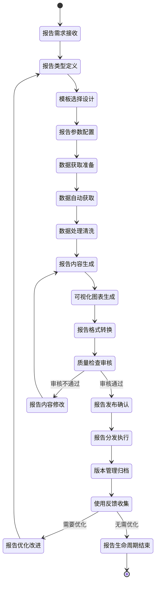

# 报告生成流程

## 流程概述

报告生成流程是AI助评系统的输出服务流程，负责将评价执行流程生成的分析结果转化为易于理解的业务报告，支持多种报告类型和输出格式，满足不同用户的信息需求。该流程实现了评价结果的可视化呈现和有效传递，为教学质量改进提供数据支撑和决策参考。

## 业务目标

- **多样化报告**: 提供多种类型和格式的报告服务
- **可视化展示**: 实现数据的可视化呈现和图表展示
- **自动化生成**: 支持报告的自动化生成和定时分发
- **个性化定制**: 满足不同用户的个性化报告需求

## 参与角色

| 角色 | 主要职责 | 权限级别 |
|------|----------|----------|
| 教学管理人员 | 报告需求提出、模板配置、分发管理 | 报告管理权限 |
| 系统管理员 | 报告生成任务管理、系统维护 | 系统管理权限 |
| 教师/学生 | 报告查看、结果使用、反馈提供 | 查看权限 |
| 报告设计师 | 报告模板设计、样式优化、可视化设计 | 设计权限 |

## 流程状态图

## 详细流程步骤

### 第一阶段：需求分析与类型定义

#### 步骤1：报告需求接收
- **触发条件**: 用户提出报告需求或定时任务触发
- **主要操作**:
  - 接收用户报告需求申请
  - 分析需求的合理性和可行性
  - 确定报告优先级和紧急程度
- **需求来源**:
  - **定期需求**: 按周、月、学期定期生成的报告
  - **专项需求**: 针对特定评价任务的专项报告
  - **临时需求**: 用户临时提出的个性化报告
  - **应急需求**: 突发事件需要的紧急报告
- **需求信息**:
  - 报告类型和用途
  - 时间范围和数据范围
  - 输出格式和分发方式
  - 期望完成时间
- **输入**: 报告需求申请表
- **输出**: 需求分析结果和优先级排序

#### 步骤2：报告类型定义
- **触发条件**: 完成需求分析
- **主要操作**:
  - 确定报告的具体类型
  - 定义报告的目标用户
  - 明确报告的核心内容
- **报告类型体系**:
  - **教学质量报告**:
    - 教师个人教学质量报告
    - 课程教学质量报告
    - 院系教学质量报告
    - 学校整体教学质量报告
  - **课堂分析报告**:
    - 单次课堂分析报告
    - 周次课堂分析报告
    - 月度课堂分析报告
    - 学期课堂分析报告
  - **课程评估报告**:
    - 课程内容评估报告
    - 教学资源评估报告
    - 教学效果评估报告
    - 改进建议报告
  - **趋势分析报告**:
    - 教学质量趋势报告
    - 问题发现趋势报告
    - 对比分析报告
    - 预测分析报告
- **目标用户分析**:
  - 管理层：关注整体趋势和关键指标
  - 教师：关注个人表现和改进建议
  - 督导：关注专业评价和质量标准
  - 研究人员：关注深度分析和数据洞察
- **输出**: 报告类型定义和目标用户分析

### 第二阶段：模板设计与参数配置

#### 步骤3：模板选择设计
- **触发条件**: 完成报告类型定义
- **主要操作**:
  - 选择合适的报告模板
  - 设计或优化报告样式
  - 配置报告结构和布局
- **模板管理**:
  - **标准模板**: 系统预置的通用模板
  - **自定义模板**: 用户根据需求设计的专属模板
  - **行业模板**: 基于教育行业最佳实践的模板
  - **合规模板**: 符合法规和标准要求的模板
- **设计要素**:
  - **报告结构**: 封面、目录、正文、附录、封底
  - **页面布局**: 页眉页脚、页边距、分栏设置
  - **样式规范**: 字体字号、颜色主题、图标风格
  - **品牌元素**: 学校LOGO、标准色彩、版权信息
- **可视化设计**:
  - **图表类型**: 柱状图、折线图、饼图、雷达图等
  - **配色方案**: 符合学校VI标准和数据可视化原则
  - **交互元素**: 支持缩放、筛选、钻取等交互功能
  - **响应式设计**: 适配不同设备和屏幕尺寸
- **输出**: 报告模板设计和样式配置

#### 步骤4：报告参数配置
- **触发条件**: 完成模板选择设计
- **主要操作**:
  - 配置报告生成参数
  - 设置数据筛选条件
  - 定义计算规则和指标
- **参数类型**:
  - **时间参数**: 报告时间范围、对比时间段
  - **范围参数**: 数据覆盖范围（个人/班级/院系/学校）
  - **指标参数**: 关键指标选择和计算方式
  - **格式参数**: 输出格式、精度要求、语言设置
- **配置规则**:
  - **时间配置**: 支持绝对时间（如2025-01-01至2025-01-31）和相对时间（如最近30天）
  - **范围配置**: 支持多层级数据范围选择和组合
  - **指标配置**: 支持自定义指标和复合指标
  - **格式配置**: 支持多种输出格式和个性化设置
- **约束条件**:
  - 时间范围不超过365天
  - 数据范围不超过用户权限范围
  - 指标数量不超过20个
  - 文件大小不超过50MB
- **输出**: 报告参数配置和生成规则

### 第三阶段：数据获取与处理

#### 步骤5：数据获取准备
- **触发条件**: 完成报告参数配置
- **主要操作**:
  - 分析数据需求
  - 准备数据查询语句
  - 验证数据源可用性
- **数据分析**:
  - **数据源识别**: 确定所需数据来自哪些表和系统
  - **数据关系**: 明确数据表之间的关联关系
  - **数据量评估**: 估算查询数据量，优化查询性能
  - **数据质量**: 检查数据完整性和准确性
- **查询准备**:
  - **SQL优化**: 编写高效的SQL查询语句
  - **索引使用**: 充分利用数据库索引提高查询速度
  - **分区查询**: 对大数据量进行分区查询
  - **缓存策略**: 利用缓存减少重复查询
- **数据源验证**:
  - 连接状态检查
  - 数据同步状态确认
  - 数据权限验证
  - 数据质量检查
- **输出**: 数据获取准备就绪确认

#### 步骤6：数据自动获取
- **触发条件**: 完成数据获取准备
- **主要操作**:
  - 执行数据查询和获取
  - 处理数据获取异常
  - 验证获取数据的完整性
- **获取方式**:
  - **实时查询**: 直接查询数据库获取最新数据
  - **批量抽取**: 从数据仓库批量抽取数据
  - **API调用**: 通过接口获取外部系统数据
  - **文件读取**: 读取CSV、Excel等格式文件
- **获取策略**:
  - **增量获取**: 只获取新增或变更的数据
  - **全量获取**: 获取指定范围内的全部数据
  - **分批获取**: 大数据量分批次获取
  - **并行获取**: 多个数据源并行获取
- **异常处理**:
  - 连接超时重试机制
  - 数据格式异常处理
  - 权限不足处理
  - 数据源故障处理
- **输出**: 原始数据集

#### 步骤7：数据处理清洗
- **触发条件**: 完成数据自动获取
- **主要操作**:
  - 数据清洗和预处理
  - 数据格式标准化
  - 数据质量提升
- **清洗操作**:
  - **缺失值处理**: 删除、填充、插值
  - **异常值处理**: 识别、修正、删除
  - **重复值处理**: 识别、合并、删除
  - **格式转换**: 日期格式、数字格式、文本格式
- **数据标准化**:
  - **编码统一**: 统一各种编码标准
  - **命名规范**: 统一字段命名规范
  - **单位统一**: 统一度量衡单位
  - **精度统一**: 统一数字精度要求
- **质量提升**:
  - **数据验证**: 业务规则验证、逻辑一致性检查
  - **数据补充**: 关联数据补充、衍生数据计算
  - **数据标记**: 标记数据质量等级和可信度
- **输出**: 清洗后的标准数据集

### 第四阶段：内容生成与可视化

#### 步骤8：报告内容生成
- **触发条件**: 完成数据处理清洗
- **主要操作**:
  - 生成报告文字内容
  - 计算关键指标数据
  - 编写分析结论和建议
- **内容生成**:
  - **数据概览**: 生成数据基本情况和统计摘要
  - **指标分析**: 计算和解释关键评价指标
  - **趋势分析**: 分析数据变化趋势和规律
  - **对比分析**: 进行横向和纵向对比分析
  - **问题识别**: 识别存在的问题和风险点
  - **建议生成**: 基于分析结果生成改进建议
- **生成规则**:
  - **内容结构化**: 按照预定义结构生成内容
  - **逻辑一致性**: 确保内容逻辑连贯一致
  - **数据准确性**: 保证数据计算和分析准确
  - **语言规范**: 使用标准的教育评价术语
- **智能生成**:
  - **自然语言生成**: 使用NLP技术自动生成文字描述
  - **模板填充**: 基于模板自动填充数据内容
  - **规则引擎**: 基于业务规则自动生成分析结论
- **输出**: 报告文字内容和分析结果

#### 步骤9：可视化图表生成
- **触发条件**: 完成报告内容生成
- **主要操作**:
  - 生成数据可视化图表
  - 设计图表布局和样式
  - 优化图表可读性和美观性
- **图表类型**:
  - **趋势图表**: 折线图、面积图展示数据趋势
  - **对比图表**: 柱状图、条形图展示数据对比
  - **占比图表**: 饼图、环形图展示数据占比
  - **关系图表**: 散点图、气泡图展示数据关系
  - **分布图表**: 直方图、箱线图展示数据分布
  - **综合图表**: 雷达图、仪表盘展示综合情况
- **设计原则**:
  - **数据准确性**: 确保图表准确反映数据情况
  - **可读性**: 图表清晰易懂，信息传达有效
  - **美观性**: 图表设计美观，符合视觉审美
  - **一致性**: 图表风格与报告整体风格一致
- **交互功能**:
  - **缩放功能**: 支持图表缩放查看细节
  - **筛选功能**: 支持数据筛选和动态更新
  - **钻取功能**: 支持从概览到详细的多级钻取
  - **导出功能**: 支持图表单独导出和分享
- **输出**: 可视化图表和交互元素

#### 步骤10：报告格式转换
- **触发条件**: 完成可视化图表生成
- **主要操作**:
  - 生成多种格式的报告文件
  - 优化不同格式的显示效果
  - 确保格式转换的准确性
- **支持格式**:
  - **PDF格式**: 适合打印和正式分发
  - **Word格式**: 适合编辑和内容修改
  - **Excel格式**: 适合数据分析和图表制作
  - **HTML格式**: 适合网页展示和在线查看
  - **PowerPoint格式**: 适合演示和汇报
  - **图片格式**: 适合图表单独分享
- **转换特点**:
  - **PDF转换**: 保持格式稳定，支持数字签名
  - **Word转换**: 保持可编辑性，支持样式修改
  - **Excel转换**: 数据结构化，支持公式计算
  - **HTML转换**: 响应式设计，支持移动端查看
- **质量控制**:
  - 格式一致性检查
  - 内容完整性验证
  - 显示效果优化
  - 文件大小控制
- **输出**: 多格式的报告文件

### 第五阶段：质量检查与发布

#### 步骤11：质量检查审核
- **触发条件**: 完成报告格式转换
- **主要操作**:
  - 检查报告内容质量
  - 验证数据准确性
  - 审核格式规范
- **检查项目**:
  - **内容检查**: 文字内容准确性、逻辑性、完整性
  - **数据检查**: 数据计算准确性、一致性、时效性
  - **格式检查**: 格式规范统一性、美观性、专业性
  - **技术检查**: 文件完整性、可打开性、可读性
- **审核流程**:
  - **自动检查**: 系统自动检查基本格式和规则
  - **人工审核**: 专业人员审核内容质量和专业性
  - **抽样检查**: 随机抽样进行详细检查
  - **专家评审**: 重要报告需要专家评审确认
- **质量标准**:
  - 内容准确率：100%
  - 数据一致性：100%
  - 格式规范率：100%
  - 用户满意度：≥4.5/5.0
- **输出**: 质量检查报告和修改建议

#### 步骤12：报告发布确认
- **触发条件**: 质量检查审核通过
- **主要操作**:
  - 最终确认报告内容
  - 设置发布权限和范围
  - 安排发布时间和方式
- **发布决策**:
  - **直接发布**: 质量符合要求，直接发布
  - **修改后发布**: 存在轻微问题，修改后发布
  - **暂缓发布**: 存在严重问题，需要重新制作
- **权限设置**:
  - **查看权限**: 设置哪些用户可以查看报告
  - **下载权限**: 设置哪些用户可以下载报告
  - **分享权限**: 设置哪些用户可以分享报告
  - **打印权限**: 设置哪些用户可以打印报告
- **发布安排**:
  - **即时发布**: 立即发布报告
  - **定时发布**: 在指定时间自动发布
  - **条件发布**: 满足特定条件后发布
- **输出**: 发布确认和权限配置

### 第六阶段：分发执行与版本管理

#### 步骤13：报告分发执行
- **触发条件**: 完成报告发布确认
- **主要操作**:
  - 按照分发计划执行报告分发
  - 发送通知给相关用户
  - 记录分发执行情况
- **分发方式**:
  - **系统内通知**: 通过系统消息通知用户
  - **邮件分发**: 通过邮件发送报告文件或链接
  - **短信通知**: 通过短信通知报告发布信息
  - **自动推送**: 根据订阅设置自动推送报告
  - **手动下载**: 用户登录系统手动下载
- **分发规则**:
  - **用户分级**: 不同级别用户接收不同报告
  - **频率控制**: 避免过度分发，控制通知频率
  - **时效性**: 确保报告及时分发到用户
  - **可追溯**: 记录分发的完整过程
- **通知内容**:
  - 报告基本信息和获取方式
  - 报告主要发现和建议
  - 查看报告的操作指引
  - 反馈和咨询联系方式
- **输出**: 分发执行记录和通知日志

#### 步骤14：版本管理归档
- **触发条件**: 完成报告分发执行
- **主要操作**:
  - 创建报告版本记录
  - 执行报告归档存储
  - 管理报告生命周期
- **版本管理**:
  - **版本编号**: 采用统一的版本编号规则
  - **变更记录**: 记录版本变更内容和原因
  - **版本比较**: 支持不同版本对比查看
  - **版本回退**: 支持回退到历史版本
- **归档策略**:
  - **存储位置**: 专门的报告存储服务器
  - **存储格式**: 保留原始格式和备份格式
  - **存储周期**: 根据重要性设置不同存储周期
  - **存储安全**: 加密存储和访问控制
- **生命周期管理**:
  - **活跃期**: 报告发布后的主要使用期（1-3个月）
  - **稳定期**: 报告的参考使用期（6-12个月）
  - **归档期**: 报告的历史保存期（3-5年）
  - **销毁期**: 超过保存期的报告安全销毁
- **输出**: 版本记录和归档确认

### 第七阶段：反馈收集与持续改进

#### 步骤15：使用反馈收集
- **触发条件**: 报告发布后
- **主要操作**:
  - 收集用户使用反馈
  - 分析反馈意见和建议
  - 评估报告使用效果
- **收集方式**:
  - **在线问卷**: 通过系统发送满意度调查问卷
  - **用户访谈**: 深度了解用户使用体验
  - **使用统计**: 分析报告使用频率和模式
  - **建议收集**: 设立反馈渠道收集改进建议
- **反馈内容**:
  - **内容质量**: 报告内容的准确性、有用性、可读性
  - **格式设计**: 报告格式、样式、美观程度
  - **使用体验**: 报告获取、查看、使用的便捷性
  - **改进建议**: 具体的改进意见和建议
- **分析方法**:
  - **定量分析**: 满意度评分、使用频率统计
  - **定性分析**: 文本反馈的情感分析和主题分析
  - **趋势分析**: 反馈变化趋势和模式识别
  - **关联分析**: 反馈与用户特征的关联分析
- **输出**: 反馈分析报告和改进建议

#### 步骤16：报告优化改进
- **触发条件**: 收集到有价值的反馈建议
- **主要操作**:
  - 制定优化改进方案
  - 实施报告模板和流程改进
  - 验证改进效果
- **改进方向**:
  - **内容优化**: 改进报告内容结构和分析深度
  - **格式优化**: 优化报告设计和视觉效果
  - **流程优化**: 提高报告生成和分发效率
  - **功能优化**: 增强报告交互性和个性化
- **实施方法**:
  - **小步快跑**: 采用迭代方式逐步改进
  - **用户参与**: 邀请用户参与设计和测试
  - **数据驱动**: 基于使用数据指导改进方向
  - **最佳实践**: 借鉴行业最佳实践经验
- **效果验证**:
  - **A/B测试**: 对比改进前后的效果
  - **用户反馈**: 收集用户对新版本的反馈
  - **指标监控**: 监控关键指标的变化情况
  - **持续跟踪**: 长期跟踪改进效果的稳定性
- **输出**: 改进实施报告和效果验证

## 关键业务规则

### 报告生成规则
- 报告数据必须是经过验证的准确数据
- 报告内容必须符合教育评价的专业标准
- 报告格式必须保持统一和规范
- 报告生成必须保证及时性和效率

### 质量控制规则
- 所有报告必须经过质量检查才能发布
- 重要报告需要专家审核确认
- 数据准确性必须达到100%
- 用户满意度必须达到4.0/5.0以上

### 分发使用规则
- 报告分发必须严格按照权限设置执行
- 报告使用必须符合相关法规和制度
- 报告分享必须保护数据安全和隐私
- 报告反馈必须及时收集和处理

## 技术实现要点

### 报告生成技术
- **模板引擎**: 基于模板引擎实现报告内容生成
- **图表库**: 使用ECharts、D3.js等生成可视化图表
- **文档处理**: 使用Apache POI、iText等处理文档格式
- **自然语言生成**: 使用NLP技术生成文字描述

### 数据处理技术
- **大数据处理**: 使用Spark等处理大规模数据
- **实时计算**: 使用Flink、Storm进行实时数据处理
- **数据仓库**: 基于数据仓库进行复杂查询分析
- **缓存技术**: 使用Redis缓存提高查询性能

### 分发通知技术
- **消息队列**: 使用消息队列实现异步分发
- **邮件服务**: 集成邮件服务实现邮件分发
- **短信服务**: 集成短信服务实现短信通知
- **推送服务**: 实现移动端推送通知

## 性能指标

### 效率指标
- 简单报告生成时间：≤5分钟
- 复杂报告生成时间：≤30分钟
- 批量报告生成时间：≤2小时
- 报告分发时间：≤10分钟

### 质量指标
- 报告内容准确率：100%
- 数据一致性：100%
- 格式规范率：100%
- 用户满意度：≥4.5/5.0

### 系统性能
- 报告并发生成数：≥10个
- 报告存储容量：≥1TB
- 报告访问响应时间：≤3秒
- 系统可用性：≥99.5%

## 相关文档

- [评估执行流程](./02-评估执行流程.md)
- [用户管理流程](./03-用户管理流程.md)
- [权限管理流程](./04-权限管理流程.md)
- [AI助评应用软件需求规格说明书(SRS)](../AI助评应用软件需求规格说明书(SRS).md)

---

**文档版本**: V1.0
**创建日期**: 2025-11-23
**最后更新**: 2025-11-23
**审批状态**: 待审批
**维护责任人**: 系统分析团队