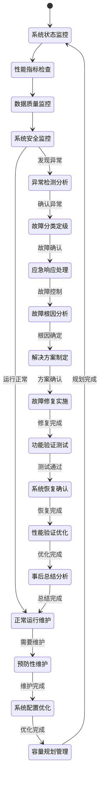

# 系统管理流程

## 流程概述

系统管理流程是AI助评系统的运维保障流程，负责数据质量管理、系统监控维护、配置和优化、故障处理等全生命周期运维管理工作。该流程确保系统的稳定性、可靠性、安全性和性能，为所有业务流程提供坚实的技术基础设施保障。

## 业务目标

- **系统稳定**: 保障系统7×24小时稳定运行，可用性≥99.5%
- **数据质量**: 确保数据的准确性、完整性、一致性和及时性
- **性能优化**: 持续优化系统性能，提升用户体验
- **安全防护**: 建立完善的安全防护体系，保障系统安全

## 参与角色

| 角色 | 主要职责 | 权限级别 |
|------|----------|----------|
| 系统管理员 | 系统日常运维、配置管理、性能优化 | 系统管理权限 |
| 运维工程师 | 基础设施维护、监控告警、故障处理 | 运维管理权限 |
| 数据管理员 | 数据质量管理、备份恢复、数据治理 | 数据管理权限 |
| 安全管理员 | 安全策略制定、安全监控、事件响应 | 安全管理权限 |

## 流程状态图

## 详细流程步骤

### 第一阶段：系统监控与状态检查

#### 步骤1：系统状态监控
- **触发条件**: 系统运行期间持续监控
- **主要操作**:
  - 监控系统各组件运行状态
  - 检查服务可用性和响应情况
  - 监控系统资源使用情况
- **监控对象**:
  - **应用服务**: Web服务、API服务、业务服务
  - **中间件**: 数据库、缓存、消息队列
  - **基础设施**: 服务器、存储、网络设备
  - **外部依赖**: 第三方接口、外部数据源
- **监控指标**:
  - **可用性指标**: 服务可用率、响应时间、错误率
  - **性能指标**: CPU使用率、内存使用率、磁盘I/O
  - **业务指标**: 交易量、并发用户数、处理延迟
  - **资源指标**: 磁盘空间、网络带宽、连接数
- **监控方式**:
  - **主动监控**: 定期主动检查各系统状态
  - **被动监控**: 接收系统主动上报的状态信息
  - **实时监控**: 实时监控系统运行状态
  - **定时巡检**: 定期进行系统全面检查
- **监控频率**:
  - 核心服务：每分钟监控
  - 重要服务：每5分钟监控
  - 一般服务：每15分钟监控
  - 全面巡检：每日一次
- **输出**: 系统运行状态报告

#### 步骤2：性能指标检查
- **触发条件**: 系统状态监控发现性能问题或定时检查
- **主要操作**:
  - 分析系统性能指标
  - 识别性能瓶颈
  - 评估性能趋势
- **性能指标分类**:
  - **响应性能**:
    - Web页面响应时间：≤3秒
    - API接口响应时间：≤1秒
    - 数据库查询时间：≤100ms
    - 文件上传/下载时间：≤30秒
  - **处理性能**:
    - 并发用户数支持：≥1000
    - 交易处理速度：≥100TPS
    - 数据处理速度：≥100万条/小时
    - 报告生成速度：≤30分钟
  - **资源性能**:
    - CPU使用率：≤70%
    - 内存使用率：≤80%
    - 磁盘使用率：≤85%
    - 网络带宽利用率：≤70%
- **分析方法**:
  - **趋势分析**: 分析性能指标的历史变化趋势
  - **对比分析**: 与基准值和历史最佳值对比
  - **关联分析**: 分析不同指标间的关联关系
  - **预测分析**: 基于历史数据预测性能趋势
- **输出**: 性能分析报告和优化建议

#### 步骤3：数据质量监控
- **触发条件**: 数据同步完成后或定时质量检查
- **主要操作**:
  - 监控数据完整性
  - 验证数据一致性
  - 检查数据准确性
- **质量维度**:
  - **完整性检查**:
    - 必填字段完整率：100%
    - 记录完整性：无缺失记录
    - 关联完整性：外键关联正确
    - 业务完整性：符合业务规则
  - **一致性检查**:
    - 格式一致性：日期、数字、文本格式统一
    - 编码一致性：字典编码统一规范
    - 逻辑一致性：业务逻辑关系正确
    - 跨表一致性：关联表数据一致
  - **准确性检查**:
    - 范围检查：数值在合理范围内
    - 规则检查：符合业务规则约束
    - 关联检查：关联数据关系正确
    - 统计检查：统计指标合理
- **监控方法**:
  - **自动检查**: 系统自动执行数据质量检查规则
  - **抽样检查**: 随机抽样进行人工验证
  - **对比检查**: 与权威数据源对比验证
  - **业务检查**: 业务专家审核数据合理性
- **质量标准**:
  - 数据完整率：≥99.9%
  - 数据准确率：≥99.9%
  - 数据一致性：100%
  - 数据及时性：延迟≤30分钟
- **输出**: 数据质量报告和问题清单

#### 步骤4：系统安全监控
- **触发条件**: 系统运行期间持续安全监控
- **主要操作**:
  - 监控系统安全状态
  - 检测安全威胁和攻击
  - 验证安全策略执行
- **安全监控项目**:
  - **访问安全**:
    - 登录行为监控：异常登录检测
    - 权限使用监控：越权操作检测
    - 会话安全监控：会话劫持检测
    - 访问频率监控：暴力破解检测
  - **数据安全**:
    - 数据访问监控：敏感数据访问记录
    - 数据传输监控：传输加密验证
    - 数据存储监控：存储加密检查
    - 数据泄露监控：异常数据导出检测
  - **网络安全**:
    - 网络流量监控：异常流量检测
    - 端口扫描监控：扫描攻击检测
    - DDoS攻击监控：分布式攻击检测
    - 恶意软件监控：病毒木马检测
  - **应用安全**:
    - 应用漏洞监控：已知漏洞检查
    - SQL注入监控：注入攻击检测
    - XSS攻击监控：跨站脚本攻击检测
    - 文件上传监控：恶意文件上传检测
- **监控工具**:
  - **入侵检测系统（IDS）**: 实时检测入侵行为
  - **安全信息事件管理（SIEM）**: 统一安全事件管理
  - **漏洞扫描工具**: 定期扫描系统漏洞
  - **日志分析工具**: 分析安全日志和事件
- **安全告警级别**:
  - **紧急告警**: 严重安全威胁，需立即处理
  - **重要告警**: 重要安全事件，需及时处理
  - **一般告警**: 一般安全问题，需关注处理
  - **信息告警**: 安全信息记录，需了解关注
- **输出**: 安全监控报告和告警信息

### 第二阶段：异常检测与故障处理

#### 步骤5：异常检测分析
- **触发条件**: 监控发现异常指标或告警
- **主要操作**:
  - 分析异常现象和影响范围
  - 确定异常严重程度
  - 评估异常影响和风险
- **异常类型**:
  - **性能异常**: 响应慢、吞吐量下降、资源使用异常
  - **可用性异常**: 服务不可用、功能异常、连接失败
  - **数据异常**: 数据错误、数据丢失、同步异常
  - **安全异常**: 安全攻击、权限异常、数据泄露
- **分析方法**:
  - **现象分析**: 分析异常现象的具体表现
  - **影响分析**: 评估异常对业务的影响范围
  - **根因分析**: 分析异常产生的根本原因
  - **趋势分析**: 分析异常的发展趋势
- **影响评估**:
  - **用户影响**: 影响用户数量和影响程度
  - **业务影响**: 对业务流程的影响情况
  - **数据影响**: 对数据完整性和准确性的影响
  - **系统影响**: 对系统稳定性和安全性的影响
- **输出**: 异常分析报告和处理建议

#### 步骤6：故障分类定级
- **触发条件**: 完成异常检测分析
- **主要操作**:
  - 对故障进行分类
  - 确定故障级别
  - 制定处理策略
- **故障分类**:
  - **硬件故障**: 服务器、存储、网络设备故障
  - **软件故障**: 应用程序、中间件、操作系统故障
  - **数据故障**: 数据损坏、丢失、不一致故障
  - **网络故障**: 网络连接、带宽、配置故障
  - **安全故障**: 安全攻击、漏洞、权限故障
- **故障定级**:
  - **P1级（紧急）**: 系统完全不可用，影响所有用户
  - **P2级（重要）**: 核心功能异常，影响大部分用户
  - **P3级（一般）**: 部分功能异常，影响少数用户
  - **P4级（轻微）**: 性能下降，不影响核心功能
- **处理策略**:
  - **P1级**: 立即响应，15分钟内开始处理
  - **P2级**: 快速响应，30分钟内开始处理
  - **P3级**: 及时响应，2小时内开始处理
  - **P4级**: 计划处理，24小时内开始处理
- **输出**: 故障分类定级报告

#### 步骤7：应急响应处理
- **触发条件**: 故障分类定级完成
- **主要操作**:
  - 启动应急响应预案
  - 组建应急处理团队
  - 执行应急处理措施
- **响应流程**:
  - **应急启动**: 根据故障级别启动相应预案
  - **团队组建**: 召集相关技术和业务人员
  - **情况通报**: 向相关方通报故障情况
  - **应急处置**: 执行紧急措施控制故障影响
  - **进度跟踪**: 持续跟踪处理进展和效果
- **应急措施**:
  - **服务隔离**: 隔离故障服务，防止影响扩散
  - **负载转移**: 将负载转移到备用系统
  - **服务降级**: 降低服务质量保证核心功能
  - **数据备份**: 保护关键数据，防止数据丢失
  - **安全加固**: 加强安全防护，防止安全事件扩散
- **沟通机制**:
  - **内部沟通**: 建立应急团队沟通渠道
  - **外部沟通**: 及时向用户和相关部门通报
  - **管理层沟通**: 定期向管理层报告处理进展
  - **媒体沟通**: 必要时进行媒体沟通和公关
- **输出**: 应急处理记录和当前状态

#### 步骤8：故障根因分析
- **触发条件**: 故障得到初步控制
- **主要操作**:
  - 深入分析故障根本原因
  - 识别故障触发条件
  - 制定根本解决方案
- **分析方法**:
  - **5Why分析法**: 连续问"为什么"找到根本原因
  - **鱼骨图分析**: 从人、机、料、法、环分析原因
  - **故障树分析**: 从顶层事件向下分析故障原因
  - **时序分析**: 分析故障发生的时间序列关系
- **分析工具**:
  - **日志分析**: 分析系统日志和错误日志
  - **监控数据**: 分析监控数据和历史趋势
  - **配置对比**: 对比故障前后系统配置变化
  - **代码分析**: 分析代码变更和潜在问题
- **根因分类**:
  - **技术根因**: 技术设计、实现、配置问题
  - **流程根因**: 流程设计、执行、监控问题
  - **人员根因**: 人员技能、操作、意识问题
  - **环境根因**: 硬件、网络、环境问题
- **输出**: 根因分析报告和解决方案

#### 步骤9：解决方案制定
- **触发条件**: 完成故障根因分析
- **主要操作**:
  - 制定详细解决方案
  - 评估方案风险和影响
  - 制定实施计划和回滚方案
- **解决方案类型**:
  - **立即修复**: 快速修复，立即恢复服务
  - **临时方案**: 临时解决方案，后续完善
  - **永久修复**: 彻底解决，防止复发
  - **预防措施**: 加强监控，预防未来发生
- **方案评估**:
  - **有效性**: 方案能否有效解决问题
  - **可行性**: 方案在技术上和资源上是否可行
  - **风险性**: 方案实施可能带来的风险
  - **时效性**: 方案实施所需的时间和影响
- **实施计划**:
  - **准备阶段**: 准备必要的环境、工具、数据
  - **实施阶段**: 按步骤执行解决方案
  - **验证阶段**: 验证解决方案的效果
  - **恢复阶段**: 恢复正常服务状态
- **回滚方案**:
  - **回滚触发**: 明确回滚的触发条件
  - **回滚步骤**: 详细的回滚操作步骤
  - **回滚验证**: 回滚后的验证和确认
  - **回滚记录**: 完整的回滚过程记录
- **输出**: 解决方案文档和实施计划

### 第三阶段：故障修复与验证

#### 步骤10：故障修复实施
- **触发条件**: 解决方案制定完成
- **主要操作**:
  - 执行解决方案
  - 监控修复过程
  - 记录修复过程
- **修复方式**:
  - **在线修复**: 在不影响服务的情况下修复
  - **离线修复**: 停止服务进行修复
  - **灰度修复**: 逐步修复，逐步验证
  - **紧急修复**: 紧急情况下快速修复
- **修复操作**:
  - **代码修复**: 修复程序代码中的错误
  - **配置修复**: 修正系统配置参数
  - **数据修复**: 修复损坏或错误的数据
  - **环境修复**: 修复系统环境问题
- **过程监控**:
  - **操作监控**: 监控修复操作的执行情况
  - **系统监控**: 监控修复过程中的系统状态
  - **效果监控**: 监控修复措施的效果
  - **风险监控**: 监控修复过程中的风险
- **修复记录**:
  - **操作记录**: 详细记录每个修复操作
  - **时间记录**: 记录操作的时间和持续时间
  - **结果记录**: 记录每个操作的结果
  - **问题记录**: 记录修复过程中遇到的问题
- **输出**: 修复实施记录

#### 步骤11：功能验证测试
- **触发条件**: 故障修复实施完成
- **主要操作**:
  - 执行功能和性能测试
  - 验证修复效果
  - 检查系统完整性
- **测试类型**:
  - **功能测试**: 验证修复后的功能是否正常
  - **性能测试**: 验证系统性能是否恢复正常
  - **安全测试**: 验证系统安全性没有降低
  - **兼容性测试**: 验证与其他系统的兼容性
- **测试方法**:
  - **自动化测试**: 使用自动化测试工具执行测试
  - **手动测试**: 测试人员手动执行测试用例
  - **压力测试**: 模拟高负载情况下的系统表现
  - **用户验收测试**: 邀请用户参与测试验证
- **验证标准**:
  - **功能正常**: 所有功能按预期正常工作
  - **性能达标**: 性能指标达到正常水平
  - **数据准确**: 数据完整性和准确性得到保证
  - **用户满意**: 用户对修复结果满意
- **问题处理**:
  - **测试失败**: 修复未成功，需要重新修复
  - **性能不足**: 性能未完全恢复，需要优化
  - **新增问题**: 修复过程中引入新问题
  - **兼容问题**: 与其他系统出现兼容性问题
- **输出**: 测试验证报告

#### 步骤12：系统恢复确认
- **触发条件**: 功能验证测试通过
- **主要操作**:
  - 确认系统恢复正常
  - 通知相关用户和管理层
  - 更新系统状态
- **恢复确认**:
  - **服务恢复**: 所有服务恢复正常运行
  - **性能恢复**: 系统性能恢复正常水平
  - **数据恢复**: 数据完整性和准确性得到保证
  - **功能恢复**: 所有功能正常可用
- **通知机制**:
  - **用户通知**: 通知用户系统已恢复正常
  - **管理通知**: 通知管理层故障已解决
  - **团队通知**: 通知所有相关人员处理结果
  - **公开通知**: 必要时发布公开恢复通知
- **状态更新**:
  - **监控状态**: 更新监控系统状态
  - **文档更新**: 更新系统文档和配置
  - **知识库更新**: 更新故障处理知识库
  - **流程更新**: 更新相关管理流程
- **输出**: 系统恢复确认报告

### 第四阶段：性能优化与持续改进

#### 步骤13：性能验证优化
- **触发条件**: 系统恢复正常运行后
- **主要操作**:
  - 验证系统性能是否稳定
  - 优化系统性能参数
  - 调整系统资源配置
- **性能验证**:
  - **基准测试**: 与故障前性能基准对比
  - **压力测试**: 验证系统在高负载下的表现
  - **稳定性测试**: 长时间运行验证稳定性
  - **容量测试**: 验证系统容量是否满足需求
- **性能优化**:
  - **参数调优**: 优化数据库、中间件、应用参数
  - **代码优化**: 优化程序代码，提高执行效率
  - **架构优化**: 优化系统架构，提高扩展性
  - **资源配置**: 优化CPU、内存、存储、网络配置
- **监控调整**:
  - **阈值调整**: 根据新情况调整监控阈值
  - **告警调整**: 优化告警规则和级别
  - **监控项调整**: 增加或调整监控指标
  - **报告调整**: 优化监控报告内容
- **输出**: 性能优化报告和监控调整记录

#### 步骤14：事后总结分析
- **触发条件**: 故障处理完成，系统稳定运行后
- **主要操作**:
  - 总结故障处理过程
  - 分析经验教训
  - 制定改进措施
- **总结内容**:
  - **故障回顾**: 回顾故障发生和处理的全过程
  - **经验总结**: 总结成功的经验和做法
  - **教训分析**: 分析存在的问题和不足
  - **改进建议**: 提出系统和流程改进建议
- **经验教训**:
  - **技术教训**: 技术方案、工具使用方面的教训
  - **流程教训**: 故障处理流程、协作机制方面的教训
  - **管理教训**: 应急管理、人员配置方面的教训
  - **预防教训**: 故障预防、监控预警方面的教训
- **改进措施**:
  - **技术改进**: 改进技术架构、代码质量、监控手段
  - **流程改进**: 优化故障处理流程、协作机制
  - **人员改进**: 加强培训、提高技能、明确职责
  - **预防改进**: 加强预防措施、完善监控体系
- **知识沉淀**:
  - **文档更新**: 更新技术文档、操作手册
  - **知识库**: 将经验教训录入知识库
  - **培训材料**: 制作培训材料，分享经验
  - **最佳实践**: 总结最佳实践，推广应用
- **输出**: 事后总结报告和改进计划

### 第五阶段：预防性维护与系统优化

#### 步骤15：预防性维护
- **触发条件**: 定期维护计划或系统运行指标预警
- **主要操作**:
  - 执行系统健康检查
  - 进行预防性维护操作
  - 更新系统组件和补丁
- **维护类型**:
  - **日常维护**: 每日例行检查和维护
  - **周期维护**: 按周、月、季度进行定期维护
  - **专项维护**: 针对特定系统或组件的维护
  - **应急维护**: 响应预警信息的紧急维护
- **维护内容**:
  - **系统清理**: 清理日志文件、临时文件、缓存数据
  - **性能优化**: 优化数据库、应用性能参数
  - **安全加固**: 更新安全补丁，加固安全配置
  - **备份验证**: 验证备份数据的完整性和可用性
  - **容量检查**: 检查存储容量，规划扩容需求
- **维护计划**:
  - **维护窗口**: 选择业务低峰期进行维护
  - **维护时间**: 制定详细的维护时间表
  - **维护人员**: 安排合适的维护人员
  - **维护工具**: 准备必要的维护工具和环境
- **维护验证**:
  - **功能验证**: 验证维护后系统功能正常
  - **性能验证**: 验证维护后系统性能稳定
  - **安全验证**: 验证维护后系统安全可靠
- **输出**: 预防性维护报告

#### 步骤16：系统配置优化
- **触发条件**: 系统性能分析发现优化空间或业务需求变化
- **主要操作**:
  - 分析系统配置现状
  - 识别配置优化机会
  - 实施配置优化方案
- **配置优化领域**:
  - **数据库优化**: 索引优化、查询优化、参数调优
  - **应用优化**: JVM调优、缓存优化、连接池优化
  - **中间件优化**: Web服务器、消息队列优化
  - **网络优化**: 带宽配置、负载均衡、CDN优化
- **优化方法**:
  - **性能分析**: 使用性能分析工具识别瓶颈
  - **基准测试**: 建立性能基准，对比优化效果
  - **A/B测试**: 对比不同配置方案的效果
  - **容量规划**: 基于业务增长进行容量规划
- **配置管理**:
  - **配置标准化**: 建立配置标准和规范
  - **配置版本控制**: 使用版本控制管理配置变更
  - **配置自动化**: 实现配置变更的自动化
  - **配置审计**: 定期审计配置的合规性
- **效果验证**:
  - **性能提升**: 验证优化后的性能提升效果
  - **稳定性验证**: 验证优化后系统的稳定性
  - **业务影响**: 评估优化对业务的影响
- **输出**: 配置优化报告和新配置文档

#### 步骤17：容量规划管理
- **触发条件**: 系统资源使用率达到预警阈值或业务增长预测
- **主要操作**:
  - 分析当前资源使用情况
  - 预测未来资源需求
  - 制定容量扩展计划
- **容量分析**:
  - **资源使用分析**: CPU、内存、存储、网络使用趋势
  - **业务增长分析**: 用户增长、数据增长、业务增长趋势
  - **性能趋势分析**: 系统性能变化趋势
  - **瓶颈分析**: 识别系统容量瓶颈
- **需求预测**:
  - **短期预测**: 未来3-6个月的资源需求
  - **中期预测**: 未来1-2年的资源需求
  - **长期预测**: 未来3-5年的资源需求
  - **场景预测**: 不同业务场景下的资源需求
- **扩展策略**:
  - **垂直扩展**: 增强单台服务器的处理能力
  - **水平扩展**: 增加服务器数量实现分布式处理
  - **混合扩展**: 结合垂直和水平扩展的优势
  - **弹性扩展**: 基于云技术的弹性伸缩
- **成本优化**:
  - **资源利用率**: 提高资源利用率，降低成本
  - **技术选型**: 选择性价比最优的技术方案
  - **采购策略**: 制定合理的设备和软件采购策略
  - **运维成本**: 优化运维成本，提高效率
- **输出**: 容量规划报告和扩展计划

## 关键业务规则

### 系统可用性规则
- 系统核心功能可用性必须≥99.5%
- 计划维护必须提前通知用户
- 紧急故障必须在30分钟内响应
- 系统恢复必须经过完整验证

### 数据质量规则
- 数据完整率必须≥99.9%
- 数据准确率必须≥99.9%
- 数据同步延迟必须≤30分钟
- 数据备份必须每日执行

### 安全管理规则
- 所有用户操作必须记录审计日志
- 敏感数据必须加密存储和传输
- 系统漏洞必须在24小时内修复
- 安全事件必须在1小时内响应

## 技术实现要点

### 监控技术
- **全链路监控**: 使用APM工具实现端到端监控
- **智能监控**: 基于AI的异常检测和预警
- **可视化监控**: 使用Grafana等工具实现监控可视化
- **移动监控**: 支持移动端监控和告警

### 自动化技术
- **自动化运维**: 使用Ansible、Puppet等工具
- **容器化部署**: 使用Docker、Kubernetes实现弹性部署
- **CI/CD流水线**: 实现持续集成和部署
- **自动化测试**: 实现自动化测试和验证

### 数据技术
- **大数据处理**: 使用Spark、Flink处理大数据
- **实时计算**: 使用Kafka、Storm实现实时计算
- **数据治理**: 建立完善的数据治理体系
- **数据安全**: 实现数据全生命周期的安全管理

## 绩效指标

### 可用性指标
- 系统可用率：≥99.5%
- 平均故障间隔时间（MTBF）：≥720小时
- 平均修复时间（MTTR）：≤2小时
- 计划外停机时间：≤4小时/月

### 性能指标
- 系统响应时间：≤3秒
- 并发用户支持数：≥1000
- 数据处理速度：≥100万条/小时
- 系统吞吐量：≥100TPS

### 质量指标
- 数据完整率：≥99.9%
- 数据准确率：≥99.9%
- 系统安全事件：≤1次/季度
- 用户满意度：≥4.0/5.0

### 效率指标
- 故障响应时间：≤30分钟
- 问题解决率：≥95%
- 预防性维护完成率：100%
- 系统优化效果：性能提升≥20%

## 相关文档

- [评估任务创建和管理流程](./01-评估任务创建和管理流程.md)
- [评估执行流程](./02-评估执行流程.md)
- [用户管理流程](./03-用户管理流程.md)
- [权限管理流程](./04-权限管理流程.md)
- [AI助评应用软件需求规格说明书(SRS)](../AI助评应用软件需求规格说明书(SRS).md)

---

**文档版本**: V1.0
**创建日期**: 2025-11-23
**最后更新**: 2025-11-23
**审批状态**: 待审批
**维护责任人**: 系统分析团队