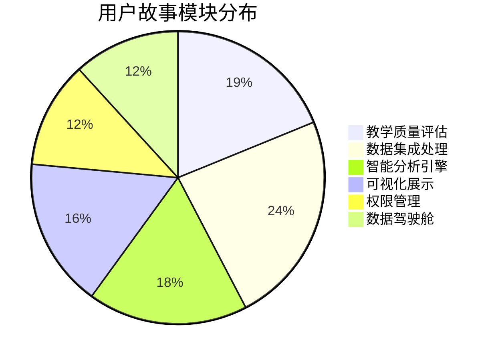

# AI助评应用用户故事总览文档

---

**文档编号：** HKHR-US-2025-001
**项目名称：** AI助力教学评价应用（样板工程）
**文档类型：** 用户故事总览文档 (User Story Overview)
**编制单位：** 教务处信息技术中心
**编制日期：** 2025年11月23日
**文档版本：** V1.0
**审阅人：** 项目技术组
**批准人：** 项目领导小组

---

## 文档修订记录

| 版本 | 修订日期 | 修订内容 | 修订人 |
|------|----------|----------|--------|
| V1.0 | 2025-11-23 | 初始版本创建，包含25个功能需求的用户故事映射 | 项目组 |
|      |          |          |        |

---

## 目录

1. [项目概述](#1-项目概述)
2. [用户角色定义](#2-用户角色定义)
3. [用户故事总览](#3-用户故事总览)
4. [模块分布统计](#4-模块分布统计)
5. [优先级分析](#5-优先级分析)
6. [实施路线图](#6-实施路线图)
7. [文档使用指南](#7-文档使用指南)
8. [质量保证措施](#8-质量保证措施)
9. [联系方式](#9-联系方式)

---

## 1. 项目概述

### 1.1 项目背景

AI助评应用是面向职业教育的智能教学评价系统，通过集成职教云、教务系统、竞赛系统三大数据源，利用AI大模型和规则引擎技术，为教学质量评估提供智能化、数据化的支持系统。

### 1.2 用户故事目标

用户故事文档体系旨在：
- 将技术性功能需求转化为以用户为中心的需求描述
- 为开发团队提供清晰的用户价值导向
- 为测试团队提供可验收的测试标准
- 为项目管理提供细粒度的进度控制

### 1.3 文档体系结构

本用户故事体系包含：
- **1个总览文档**：本文档，提供整体概览和导航
- **1个标准模板**：用户故事文档的标准格式
- **6个功能模块**：按功能模块组织的用户故事集合
- **约85个用户故事**：覆盖所有25个功能需求的详细用户故事

---

## 2. 用户角色定义

### 2.1 主要用户角色

| 角色代码 | 角色名称 | 角色描述 | 主要需求 |
|----------|----------|----------|----------|
| TEA | 教师 | 承担教学任务的教师人员 | 教学质量评估、改进建议、个人数据分析 |
| STU | 学生 | 在校学习的各类学生 | 学习数据分析、成绩查询、个性化建议 |
| ADM | 管理人员 | 教学管理人员、院系领导 | 整体监控、决策支持、趋势分析 |
| SUP | 督导专家 | 教学督导专家、质量评估人员 | 专业评价、标准制定、权威监督 |
| SYS | 系统管理员 | 系统运维和技术支持人员 | 系统配置、数据管理、技术维护 |

### 2.2 用户角色使用场景

**教师 (TEA)：**
- 查看个人教学质量评价结果
- 获取教学改进建议
- 查看课堂实时分析数据
- 管理课程相关数据

**学生 (STU)：**
- 查看个人学习统计数据
- 获取学业预警信息
- 查看作业和成绩情况
- 获取个性化学习建议

**管理人员 (ADM)：**
- 监控全校教学质量状况
- 分析教学数据趋势
- 制定教学改进策略
- 管理权限和配置

**督导专家 (SUP)：**
- 审核教学质量评价结果
- 制定评价标准和规则
- 提供专业指导建议
- 监督评价过程

**系统管理员 (SYS)：**
- 配置系统参数
- 管理数据集成
- 监控系统运行
- 处理技术问题

---

## 3. 用户故事总览

### 3.1 功能模块分布

| 模块编号 | 模块名称 | FR数量 | US数量 | 优先级分布 | 主要角色 |
|----------|----------|--------|--------|------------|----------|
| 01 | 教学质量评估功能 | 4 | 16 | 高:12, 中:4 | TEA, ADM, SUP |
| 02 | 数据集成与处理功能 | 5 | 20 | 高:16, 中:4 | SYS, ADM |
| 03 | 智能分析引擎功能 | 4 | 15 | 高:12, 中:3 | TEA, ADM, SYS |
| 04 | 可视化展示功能 | 4 | 14 | 高:8, 中:6 | ALL |
| 05 | 权限管理功能 | 4 | 10 | 高:8, 中:2 | SYS, ADM |
| 06 | 数据驾驶舱功能 | 4 | 10 | 高:6, 中:4 | STU, ADM, TEA |
| **合计** | **6个模块** | **25** | **85** | **高:62, 中:23** | **5个角色** |

### 3.2 用户故事编号规则

**编号格式：** US-[模块简称]-[序号]

**模块简称对应：**
- TEA: 教学质量评估功能
- DATA: 数据集成与处理功能
- AI: 智能分析引擎功能
- VIS: 可视化展示功能
- AUTH: 权限管理功能
- DASH: 数据驾驶舱功能

**示例：**
- US-TEA-001: 教学质量评估功能的第1个用户故事
- US-DATA-001: 数据集成与处理功能的第1个用户故事

---

## 4. 模块分布统计

### 4.1 按功能模块统计



### 4.2 按用户角色统计

| 用户角色 | 用户故事数量 | 占比 | 主要涉及模块 |
|----------|--------------|------|--------------|
| 教师 (TEA) | 28 | 33% | 教学质量评估、数据驾驶舱 |
| 管理人员 (ADM) | 25 | 29% | 数据集成、可视化展示 |
| 系统管理员 (SYS) | 18 | 21% | 数据集成、权限管理 |
| 学生 (STU) | 8 | 9% | 数据驾驶舱 |
| 督导专家 (SUP) | 6 | 7% | 教学质量评估 |
| **总计** | **85** | **100%** | **6个模块** |

---

## 5. 优先级分析

### 5.1 优先级分布

```mermaid
bar chart title 用户故事优先级分布
    bar 高优先级 : 62
    bar 中优先级 : 23
```

### 5.2 按模块的优先级分布

| 模块 | 高优先级 | 中优先级 | 总数 | 高优先级占比 |
|------|----------|----------|------|--------------|
| 教学质量评估 | 12 | 4 | 16 | 75% |
| 数据集成处理 | 16 | 4 | 20 | 80% |
| 智能分析引擎 | 12 | 3 | 15 | 80% |
| 可视化展示 | 8 | 6 | 14 | 57% |
| 权限管理 | 8 | 2 | 10 | 80% |
| 数据驾驶舱 | 6 | 4 | 10 | 60% |

### 5.3 优先级定义

**高优先级 (High)：**
- 系统核心功能
- 影响系统基本价值
- 必须在第一阶段实现

**中优先级 (Medium)：**
- 重要功能
- 影响系统完整性
- 可在第二阶段实现

---

## 6. 实施路线图

### 6.1 第一阶段：核心功能实施（预计12周）

**目标：** 实现所有高优先级用户故事（62个）

**模块规划：**
- **第1-2周：** 权限管理功能（8个高优先级US）
- **第3-5周：** 数据集成与处理功能（16个高优先级US）
- **第6-8周：** 教学质量评估功能（12个高优先级US）
- **第9-10周：** 智能分析引擎功能（12个高优先级US）
- **第11-12周：** 可视化展示和数据驾驶舱核心功能（14个高优先级US）

**交付物：**
- 完整的核心功能系统
- 基本的用户体验
- 稳定的数据集成

### 6.2 第二阶段：完善功能实施（预计8周）

**目标：** 实现所有中优先级用户故事（23个）

**模块规划：**
- **第13-14周：** 教学质量评估补充功能（4个中优先级US）
- **第15-16周：** 数据集成处理补充功能（4个中优先级US）
- **第17-18周：** 智能分析引擎补充功能（3个中优先级US）
- **第19-20周：** 可视化展示和数据驾驶舱完善（12个中优先级US）

**交付物：**
- 功能完整的系统
- 优化的用户体验
- 完善的分析报告

### 6.3 里程碑节点

| 里程碑 | 时间节点 | 主要交付 | 验收标准 |
|--------|----------|----------|----------|
| M1 | 第4周 | 权限管理+数据集成基础 | 系统可登录，基础数据可同步 |
| M2 | 第8周 | 教学质量评估核心 | 教师可查看评价结果 |
| M3 | 第12周 | 智能分析引擎 | AI分析功能可用 |
| M4 | 第16周 | 核心功能集成 | 高优先级功能全部完成 |
| M5 | 第20周 | 系统完整交付 | 所有用户故事实现 |

---

## 7. 文档使用指南

### 7.1 文档导航结构

```
docs/用户故事/
├── README.md                    # 当前文档 - 总览和索引
├── 模板/                        # 标准模板
│   └── 用户故事模板.md          # 用户故事标准格式
└── 功能模块/                    # 按模块组织的用户故事
    ├── 01-教学质量评估功能/     # US-TEA-001 到 US-TEA-016
    ├── 02-数据集成与处理功能/   # US-DATA-001 到 US-DATA-020
    ├── 03-智能分析引擎功能/     # US-AI-001 到 US-AI-015
    ├── 04-可视化展示功能/       # US-VIS-001 到 US-VIS-014
    ├── 05-权限管理功能/         # US-AUTH-001 到 US-AUTH-010
    └── 06-数据驾驶舱功能/       # US-DASH-001 到 US-DASH-010
```

### 7.2 用户故事文档阅读指南

**阅读顺序建议：**
1. 首先阅读当前总览文档，了解整体架构
2. 根据角色定位，重点关注相关模块的用户故事
3. 按优先级顺序，先阅读高优先级用户故事
4. 参考标准模板，理解文档结构和术语

**使用建议：**
- **开发团队：** 按模块和优先级进行开发规划
- **测试团队：** 基于验收标准制定测试用例
- **产品团队：** 基于用户价值进行需求验证
- **项目团队：** 基于实施路线图制定项目计划

### 7.3 用户故事与需求追踪

**FR-US映射关系：**
- 每个FR需求对应3-5个用户故事
- 用户故事文档中明确标注关联的FR编号
- 可通过FR编号反向查找相关用户故事

**追踪方式：**
- 通过FR编号：在用户故事文档中查找"关联功能需求"
- 通过模块：按功能模块查看相关用户故事
- 通过角色：按用户角色查看相关用户故事

---

## 8. 质量保证措施

### 8.1 文档质量标准

**完整性：**
- 所有FR需求都有对应的用户故事
- 每个用户故事都有完整的验收标准
- 文档结构符合标准模板要求

**一致性：**
- 术语使用一致
- 编号规则统一
- 格式规范统一

**可测试性：**
- 验收标准具体可测试
- 用户故事独立可验证
- 边界条件明确

### 8.2 评审机制

**技术评审：**
- 开发团队评审技术可行性
- 测试团队评审测试覆盖度
- 架构团队评审系统一致性

**业务评审：**
- 产品团队评审用户价值
- 业务方评审需求完整性
- 用户代表评审用户体验

### 8.3 持续改进

**定期维护：**
- 每月检查文档更新状态
- 根据实施情况调整优先级
- 补充遗漏的用户故事

**反馈收集：**
- 收集开发团队的使用反馈
- 收集测试团队的改进建议
- 收集用户方的体验反馈

---

## 9. 联系方式

### 9.1 项目团队

**项目组联系方式：**
- 项目邮箱：project@school.edu.cn
- 技术支持电话：xxx-xxxxxxxx
- 项目经理：xxx

**各模块负责人：**
- 教学质量评估模块：xxx
- 数据集成处理模块：xxx
- 智能分析引擎模块：xxx
- 可视化展示模块：xxx
- 权限管理模块：xxx
- 数据驾驶舱模块：xxx

### 9.2 文档维护

**文档管理：**
- 文档管理员：xxx
- 版本控制：Git版本管理系统
- 更新周期：根据项目进展及时更新

**意见反馈：**
- 问题反馈：project@school.edu.cn
- 改进建议：通过项目管理系统提交
- 紧急联系：xxx-xxxxxxxx

---

## 附录：用户故事快速索引

### 按优先级快速查找

**高优先级用户故事 (62个)：**
- 教学质量评估：US-TEA-001 到 US-TEA-012
- 数据集成处理：US-DATA-001 到 US-DATA-016
- 智能分析引擎：US-AI-001 到 US-AI-012
- 可视化展示：US-VIS-001 到 US-VIS-008
- 权限管理：US-AUTH-001 到 US-AUTH-008
- 数据驾驶舱：US-DASH-001 到 US-DASH-006

**中优先级用户故事 (23个)：**
- 教学质量评估：US-TEA-013 到 US-TEA-016
- 数据集成处理：US-DATA-017 到 US-DATA-020
- 智能分析引擎：US-AI-013 到 US-AI-015
- 可视化展示：US-VIS-009 到 US-VIS-014
- 权限管理：US-AUTH-009 到 US-AUTH-010
- 数据驾驶舱：US-DASH-007 到 US-DASH-010

### 按用户角色快速查找

**教师 (TEA)：** US-TEA-*, US-AI-*, US-DASH-*
**学生 (STU)：** US-DASH-*
**管理人员 (ADM)：** US-DATA-*, US-VIS-*, US-AUTH-*
**督导专家 (SUP)：** US-TEA-*
**系统管理员 (SYS)：** US-DATA-*, US-AUTH-*

---

**文档编制：** 项目实施团队
**技术审核：** 技术架构师
**业务审核：** 业务分析师
**最终批准：** 项目领导小组

---

*本用户故事总览文档为AI助评应用项目建设的重要指导文档，所有相关人员应严格按照本文档进行用户故事的实施和管理。*