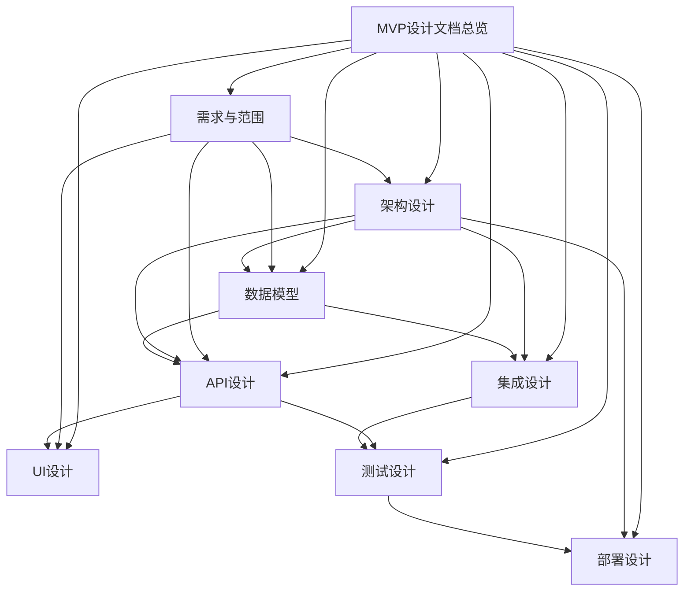

# AI助评系统MVP设计文档总览和索引

---

**文档编号：** HKHR-MVP-DESIGN-2025-001
**项目名称：** AI助力教学评价应用（MVP设计文档集合）
**编制单位：** 教务处信息技术中心
**编制日期：** 2025年11月23日
**文档版本：** V1.0
**审阅人：** 项目技术组
**批准人：** 项目领导小组

---

## 文档修订记录

| 版本 | 修订日期 | 修订内容 | 修订人 |
|------|----------|----------|--------|
| V1.0 | 2025-11-23 | 初始版本创建 | 项目组 |
|      |          |          |        |

---

## 1. 文档概述

### 1.1 目的

本文档是AI助评系统MVP阶段设计工作的总体规划文档，为MVP开发提供完整的设计指导。通过遵循软件工程最佳实践，确保设计工作的系统性、规范性和可执行性。

### 1.2 设计原则

#### MVP核心原则
- **聚焦核心价值**：优先验证AI助评的核心业务逻辑
- **快速迭代**：采用敏捷开发方法，快速验证假设
- **用户驱动**：以用户需求为中心，注重用户体验
- **技术可行**：选择成熟稳定的技术方案

#### 设计规范原则
- **系统性设计**：各设计文档间保持一致性和关联性
- **可追溯性**：设计决策可追溯至需求和约束条件
- **可维护性**：设计文档便于后续维护和更新
- **可扩展性**：为后续功能扩展预留接口和空间

### 1.3 设计范围

#### 核心业务范围
- **数据集成**：职教云系统数据对接和处理
- **AI分析引擎**：基础规则引擎和评价指标计算
- **可视化展示**：核心指标仪表盘和报表功能
- **简化认证**：基础用户登录和权限管理

#### 技术设计范围
- **系统架构**：前后端分离架构设计
- **数据模型**：核心业务数据模型设计
- **API接口**：RESTful API接口设计
- **用户界面**：响应式Web界面设计
- **测试策略**：完整的测试方案设计
- **部署方案**：生产环境部署设计

---

## 2. 设计文档体系

### 2.1 文档分类结构

```
docs/设计文档_MVP/
├── 00-MVP设计文档总览和索引.md
├── 01-需求与范围/
│   ├── 01-MVP需求规格说明书.md
│   ├── 02-功能范围定义.md
│   └── 03-非功能需求规范.md
├── 02-架构设计/
│   ├── 01-系统架构设计.md
│   ├── 02-技术架构选型.md
│   └── 03-模块架构设计.md
├── 03-数据模型/
│   ├── 01-概念数据模型.md
│   ├── 02-逻辑数据模型.md
│   └── 03-物理数据模型.md
├── 04-API设计/
│   ├── 01-API接口规范.md
│   ├── 02-数据采集API设计.md
│   ├── 03-AI分析API设计.md
│   └── 04-可视化API设计.md
├── 05-UI设计/
│   ├── 01-UI设计规范.md
│   ├── 02-页面结构设计.md
│   ├── 03-交互流程设计.md
│   └── 04-组件设计规范.md
├── 06-集成设计/
│   ├── 01-数据集成设计.md
│   ├── 02-第三方系统集成.md
│   └── 03-系统集成测试.md
├── 07-测试设计/
│   ├── 01-测试策略设计.md
│   ├── 02-测试用例设计.md
│   └── 03-测试环境设计.md
└── 08-部署设计/
    ├── 01-部署架构设计.md
    ├── 02-环境配置设计.md
    └── 03-监控运维设计.md
```

### 2.2 文档关系图



---

## 3. 设计文档详细说明

### 3.1 需求与范围设计文档

#### 01-MVP需求规格说明书
- **文档编号**: HKHR-MVP-REQ-001
- **主要内容**:
  - MVP功能需求详细说明
  - 用户角色和使用场景
  - 业务流程详细描述
  - 验收标准定义

#### 02-功能范围定义
- **文档编号**: HKHR-MVP-REQ-002
- **主要内容**:
  - MVP功能边界定义
  - 功能优先级排序
  - 不包含功能说明
  - 后续版本规划

#### 03-非功能需求规范
- **文档编号**: HKHR-MVP-REQ-003
- **主要内容**:
  - 性能需求规范
  - 安全需求规范
  - 可用性需求规范
  - 兼容性需求规范

### 3.2 架构设计文档

#### 01-系统架构设计
- **文档编号**: HKHR-MVP-ARCH-001
- **主要内容**:
  - 整体系统架构图
  - 分层架构设计
  - 模块间交互设计
  - 部署架构设计

#### 02-技术架构选型
- **文档编号**: HKHR-MVP-ARCH-002
- **主要内容**:
  - 技术栈选型说明
  - 技术选型对比分析
  - 技术风险评估
  - 技术实现方案

#### 03-模块架构设计
- **文档编号**: HKHR-MVP-ARCH-003
- **主要内容**:
  - 模块划分设计
  - 模块接口设计
  - 模块依赖关系
  - 模块扩展性设计

### 3.3 数据模型设计文档

#### 01-概念数据模型
- **文档编号**: HKHR-MVP-DATA-001
- **主要内容**:
  - 核心业务实体定义
  - 实体关系设计
  - 数据约束定义
  - 数据字典

#### 02-逻辑数据模型
- **文档编号**: HKHR-MVP-DATA-002
- **主要内容**:
  - 逻辑表结构设计
  - 字段定义和约束
  - 索引设计
  - 数据关系实现

#### 03-物理数据模型
- **文档编号**: HKHR-MVP-DATA-003
- **主要内容**:
  - 物理表结构定义
  - 存储优化设计
  - 分区策略设计
  - 性能优化方案

### 3.4 API设计文档

#### 01-API接口规范
- **文档编号**: HKHR-MVP-API-001
- **主要内容**:
  - API设计原则和规范
  - 统一响应格式
  - 错误处理机制
  - API版本控制策略

#### 02-数据采集API设计
- **文档编号**: HKHR-MVP-API-002
- **主要内容**:
  - 数据源连接API
  - 数据采集控制API
  - 数据质量检查API
  - 数据同步状态API

#### 03-AI分析API设计
- **文档编号**: HKHR-MVP-API-003
- **主要内容**:
  - 分析任务管理API
  - 评价指标计算API
  - 分析结果查询API
  - 规则配置API

#### 04-可视化API设计
- **文档编号**: HKHR-MVP-API-004
- **主要内容**:
  - 仪表盘数据API
  - 图表数据API
  - 报表生成API
  - 数据导出API

### 3.5 UI设计文档

#### 01-UI设计规范
- **文档编号**: HKHR-MVP-UI-001
- **主要内容**:
  - 设计原则和理念
  - 视觉设计规范
  - 交互设计原则
  - 响应式设计规范

#### 02-页面结构设计
- **文档编号**: HKHR-MVP-UI-002
- **主要内容**:
  - 信息架构设计
  - 页面层级结构
  - 导航系统设计
  - 页面布局规范

#### 03-交互流程设计
- **文档编号**: HKHR-MVP-UI-003
- **主要内容**:
  - 用户操作流程
  - 页面跳转逻辑
  - 异常处理流程
  - 用户反馈机制

#### 04-组件设计规范
- **文档编号**: HKHR-MVP-UI-004
- **主要内容**:
  - 组件库设计
  - 组件使用规范
  - 组件状态管理
  - 组件扩展机制

### 3.6 集成设计文档

#### 01-数据集成设计
- **文档编号**: HKHR-MVP-INT-001
- **主要内容**:
  - 数据源集成架构
  - ETL流程设计
  - 数据质量管理
  - 数据同步策略

#### 02-第三方系统集成
- **文档编号**: HKHR-MVP-INT-002
- **主要内容**:
  - 职教云系统集成
  - 外部API集成
  - 系统间通信
  - 集成监控机制

#### 03-系统集成��试
- **文档编号**: HKHR-MVP-INT-003
- **主要内容**:
  - 集成测试策略
  - 测试环境搭建
  - 测试用例设计
  - 测试执行计划

### 3.7 测试设计文档

#### 01-测试策略设计
- **文档编号**: HKHR-MVP-TEST-001
- **主要内容**:
  - 测试策略制定
  - 测试类型定义
  - 测试工具选择
  - 测试资源规划

#### 02-测试用例设计
- **文档编号**: HKHR-MVP-TEST-002
- **主要内容**:
  - 功能测试用例
  - 性能测试用例
  - 安全测试用例
  - 用户体验测试用例

#### 03-测试环境设计
- **文档编号**: HKHR-MVP-TEST-003
- **主要内容**:
  - 测试环境架构
  - 测试数据准备
  - 测试工具配置
  - 环境维护方案

### 3.8 部署设计文档

#### 01-部署架构设计
- **文档编号**: HKHR-MVP-DEPLOY-001
- **主要内容**:
  - 生产环境架构
  - 部署拓扑设计
  - 网络架构设计
  - 安全架构设计

#### 02-环境配置设计
- **文档编号**: HKHR-MVP-DEPLOY-002
- **主要内容**:
  - 环境配置管理
  - 配置项定义
  - 配置部署策略
  - 配置变更管理

#### 03-监控运维设计
- **文档编号**: HKHR-MVP-DEPLOY-003
- **主要内容**:
  - 监控系统设计
  - 日志管理方案
  - 告警机制设计
  - 运维流程规范

---

## 4. 设计工作流程

### 4.1 设计阶段划分

#### 第一阶段：需求分析设计（第1周）
- 完成需求与范围设计文档
- 确定MVP功能边界和验收标准
- 制定非功能需求规范

#### 第二阶段：架构设计（第1-2周）
- 完成系统架构设计
- 确定技术架构选型
- 设计模块架构和接口

#### 第三阶段：详细设计（第2-3周）
- 完成数据模型设计
- 完成API接口设计
- 完成UI界面设计
- 完成集成方案设计

#### 第四阶段：实施设计（第3-4周）
- 完成测试策略设计
- 完成部署方案设计
- 完善所有设计文档
- 进行设计评审和确认

### 4.2 设计质量控制

#### 设计评审机制
- **设计评审委员会**：由架构师、开发负责人、产品负责人组成
- **评审节点**：每个设计阶段完成后进行评审
- **评审标准**：遵循设计规范、满足需求、技术可行性

#### 设计变更管理
- **变更申请**：任何设计变更需要提交变更申请
- **变更评估**：评估变更对项目的影响
- **变更批准**：重要变更需要设计评审委员会批准
- **变更跟踪**：跟踪所有设计变更的实施情况

---

## 5. 设计标准规范

### 5.1 文档编写规范

#### 文档结构标准
- 统一的文档模板和格式
- 清晰的章节编号和层级结构
- 完整的文档元数据信息
- 规范的图表和代码格式

#### 内容质量标准
- 设计描述准确完整
- 逻辑结构清晰合理
- 技术方案可行可靠
- 图表说明清晰易懂

### 5.2 技术设计标准

#### 架构设计标准
- 遵循分层架构原则
- 采用松耦合设计
- 保证系统可扩展性
- 满足性能和安全要求

#### 接口设计标准
- 遵循RESTful API规范
- 采用统一的响应格式
- 完善的错误处理机制
- 清晰的接口文档

### 5.3 设计评审标准

#### 评审检查清单
- [ ] 需求覆盖度检查
- [ ] 技术可行性检查
- [ ] 架构合理性检查
- [ ] 接口完整性检查
- [ ] 性能满足度检查
- [ ] 安全性检查
- [ ] 可维护性检查
- [ ] 可扩展性检查

---

## 6. 设计交付物

### 6.1 设计文档交付清单

| 文档类别 | 文档数量 | 交付时间 | 责任人 |
|----------|----------|----------|--------|
| 需求与范围 | 3个文档 | 第1周末 | 产品设计师 |
| 架构设计 | 3个文档 | 第2周末 | 系统架构师 |
| 数据模型 | 3个文档 | 第2周末 | 数据架构师 |
| API设计 | 4个文档 | 第3周末 | API设计师 |
| UI设计 | 4个文档 | 第3周末 | UI/UX设计师 |
| 集成设计 | 3个文档 | 第3周末 | 集成架构师 |
| 测试设计 | 3个文档 | 第4周末 | 测试架构师 |
| 部署设计 | 3个文档 | 第4周末 | 运维架构师 |
| **总计** | **26个文档** | **第4周末** | **项目组** |

### 6.2 设计评审交付物

- 设计评审会议记录
- 设计问题跟踪清单
- 设计决策记录
- 设计优化建议

### 6.3 设计成果交付物

- 系统设计说明书
- 技术实现方案
- 开发指导文档
- 部署操作手册

---

## 7. 设计资源安排

### 7.1 设计团队配置

| 角色 | 人数 | 主要职责 |
|------|------|----------|
| 系统架构师 | 1 | 整体架构设计、技术选型 |
| 数据架构师 | 1 | 数据模型设计、数据库设计 |
| API设计师 | 1 | API接口设计、接口规范 |
| UI/UX设计师 | 1 | 界面设计、交互设计 |
| 集成架构师 | 1 | 系统集成设计、第三方对接 |
| 测试架构师 | 1 | 测试策略设计、测试方案 |
| 运维架构师 | 1 | 部署设计、运维方案 |
| 产品设计师 | 1 | 需求分析、功能设计 |

### 7.2 设计工具和环境

#### 设计工具
- **架构设计**: Enterprise Architect、Draw.io
- **数据建模**: PowerDesigner、ER/Studio
- **API设计**: Swagger、Postman
- **UI设计**: Figma、Sketch、Adobe XD
- **原型设计**: Axure、Figma

#### 协作环境
- **文档管理**: Confluence、GitLab Wiki
- **版本控制**: Git、GitLab
- **项目管理**: Jira、Teambition
- **协作沟通**: 钉钉、企业微信

---

## 8. 风险管理

### 8.1 设计风险识别

#### 技术风险
- **技术选型风险**: 新技术学习成本高
- **架构设计风险**: 架构复杂度过高
- **接口设计风险**: 接口兼容性问题
- **性能设计风险**: 性能目标难以达成

#### 需求风险
- **需求变更风险**: 需求频繁变更
- **需求理解风险**: 需求理解不一致
- **范围蔓延风险**: 功能范围不断扩大
- **验收标准风险**: 验收标准不明确

#### 资源风险
- **人员风险**: 设计人员技能不足
- **时间风险**: 设计时间不足
- **工具风险**: 设计工具不适用
- **沟通风险**: 团队沟通不畅

### 8.2 风险应对策略

#### 技术风险应对
- 采用成熟稳定的技术方案
- 进行技术原型验证
- 建立技术评审机制
- 制定技术备用方案

#### 需求风险应对
- 加强需求分析和确认
- 建立需求变更控制流程
- 明确MVP功能边界
- 制定清晰的验收标准

#### 资源风险应对
- 提前进行人员技能培训
- 合理安排设计时间
- 准备必要的设计工具
- 建立有效的沟通机制

---

## 9. 质量保证

### 9.1 设计质量标准

#### 完整性标准
- 需求覆盖完整
- 设计覆盖完整
- 文档覆盖完整

#### 一致性标准
- 设计思路一致
- 技术方案一致
- 文档格式一致

#### 可行性标准
- 技术方案可行
- 实现方案可行
- 部署方案可行

### 9.2 设计质量控制措施

#### 设计检查
- 设计规范性检查
- 设计合理性检查
- 设计完整性检查
- 设计一致性检查

#### 评审控制
- 设计方案评审
- 设计文档评审
- 设计变更评审
- 最终设计确认

---

## 10. 后续规划

### 10.1 设计文档维护

#### 文档更新机制
- 定期文档检查和更新
- 设计变更文档同步更新
- 文档版本控制管理
- 文档质量持续改进

#### 知识积累机制
- 设计经验总结和分享
- 设计最佳实践积累
- 设计模板和工具库建设
- 设计能力持续提升

### 10.2 设计能力建设

#### 团队能力提升
- 定期技术培训和学习
- 设计方法论学习和实践
- 行业最佳实践研究
- 设计工具使用技能提升

#### 设计流程优化
- 设计流程持续优化
- 设计工具持续改进
- 设计标准持续完善
- 设计质量持续提升

---

## 11. 附录

### 11.1 术语表

| 术语 | 英文 | 说明 |
|------|------|------|
| MVP | Minimum Viable Product | 最小可行产品 |
| API | Application Programming Interface | 应用程序编程接口 |
| UI | User Interface | 用户界面 |
| UX | User Experience | 用户体验 |
| ETL | Extract, Transform, Load | 数据提取、转换、加载 |
| REST | Representational State Transfer | 表现层状态转移 |
| CRUD | Create, Read, Update, Delete | 创建、读取、更新、删除 |

### 11.2 参考资料

1. 《AI助评系统MVP开发计划》
2. 《AI助评系统架构设计说明书》
3. 《AI助评应用业务需求文档(BRD)》
4. 《AI助评应用软件需求规格说明书(SRS)》
5. 《数据模型总览和索引》
6. 软件工程国家标准GB/T 8566-2007
7. 敏捷软件开发方法论

### 11.3 设计工具说明

#### 架构设计工具
- **Enterprise Architect**: 企业级架构设计工具
- **Draw.io**: 在线图表绘制工具
- **Lucidchart**: 在线图表和流程图工具

#### 数据建模工具
- **PowerDesigner**: 数据库设计和数据建模工具
- **ER/Studio**: 企业级数据建模工具
- **MySQL Workbench**: MySQL数据库设计工具

#### API设计工具
- **Swagger**: API设计和文档生成工具
- **Postman**: API测试和文档工具
- **Apigee**: API管理平台

---

**文档版本**: V1.0
**创建日期**: 2025-11-23
**最后更新**: 2025-11-23
**审批状态**: 待审批
**维护责任人**: 系统架构师团队

---

**联系方式**

- **项目负责人**: [项目负责人姓名] - [邮箱] - [电话]
- **系统架构师**: [架构师姓名] - [邮箱] - [电话]
- **文档管理员**: [文档管理员姓名] - [邮箱] - [电话]