# AI助评系统MVP系统架构设计

---

**文档编号：** HKHR-MVP-ARCH-001
**项目名称：** AI助力教学评价应用（MVP系统架构）
**编制单位：** 教务处信息技术中心
**编制日期：** 2025年11月23日
**文档版本：** V1.0
**审阅人：** 项目技术组
**批准人：** 项目领导小组

---

## 文档修订记录

| 版本 | 修订日期 | 修订内容 | 修订人 |
|------|----------|----------|--------|
| V1.0 | 2025-11-23 | 初始版本创建 | 项目组 |

---

## 目录

1. [引言](#1-引言)
   1.1 [文档目的](#11-文档目的)
   1.2 [架构设计原则](#12-架构设计原则)
   1.3 [架构设计目标](#13-架构设计目标)

2. [整体架构设计](#2-整体架构设计)
   2.1 [系统架构图](#21-系统架构图)
   2.2 [分层架构设计](#22-分层架构设计)
   2.3 [部署架构设计](#23-部署架构设计)

3. [技术架构设计](#3-技术架构设计)
   3.1 [前端架构](#31-前端架构)
   3.2 [后端架构](#32-后端架构)
   3.3 [数据架构](#33-数据架构)
   3.4 [集成架构](#34-集成架构)

4. [安全架构设计](#4-安全架构设计)
   4.1 [身份认证架构](#41-身份认证架构)
   4.2 [访问控制架构](#42-访问控制架构)
   4.3 [数据安全架构](#43-数据安全架构)
   4.4 [网络安全架构](#44-网络安全架构)

5. [模块架构设计](#5-模块架构设计)
   5.1 [模块划分](#51-模块划分)
   5.2 [模块交互](#52-模块交互)
   5.3 [模块部署](#53-模块部署)

6. [关键设计决策](#6-关键设计决策)
   6.1 [技术选型决策](#61-技术选型决策)
   6.2 [架构模式决策](#62-架构模式决策)
   6.3 [数据存储决策](#63-数据存储决策)
   6.4 [集成方案决策](#64-集成方案决策)

---

## 1. 引言

### 1.1 文档目的

本文档描述了AI助评系统MVP版本的整体架构设计，包括系统架构、技术架构、安全架构、模块架构等方面，为系统开发、部署、运维提供架构指导。

### 1.2 架构设计原则

#### 1.2.1 简单性原则
- **架构简洁**：避免过度设计，保持架构简洁明了
- **功能聚焦**：聚焦核心功能，避免复杂度蔓延
- **技术成熟**：采用成熟稳定的技术方案

#### 1.2.2 可扩展性原则
- **水平扩展**：支持通过增加节点进行水平扩展
- **模块化设计**：模块间松耦合，便于独立扩展
- **接口标准化**：采用标准化的接口设计

#### 1.2.3 高可用性原则
- **无单点故障**：关键组件避免单点故障
- **故障隔离**：故障影响范围最小化
- **快速恢复**：支持快速故障恢复

#### 1.2.4 安全性原则
- **纵深防御**：多层次安全防护
- **最小权限**：遵循最小权限原则
- **数据保护**：全程数据保护

### 1.3 架构设计目标

#### 1.3.1 功能目标
- **业务闭环**：形成完整的数据采集→分析→展示业务闭环
- **用户体验**：提供良好的用户体验
- **性能满足**：满足性能需求规格

#### 1.3.2 质量目标
- **可靠性**：系统可用性≥99%
- **安全性**：满足安全需求规范
- **可维护性**：易于维护和扩展

#### 1.3.3 技术目标
- **技术可行性**：验证关键技术方案的可行性
- **架构合理性**：确保架构设计合理有效
- **技术债务控制**：控制技术债务积累

---

## 2. 整体架构设计

### 2.1 系统架构图

#### 2.1.1 整体架构概览

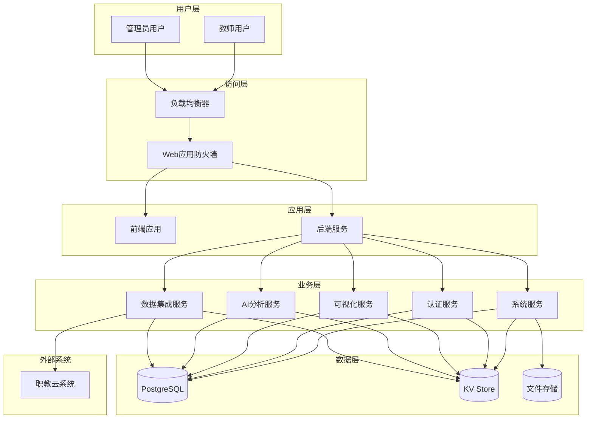

#### 2.1.2 数据流架构

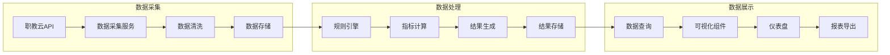

### 2.2 分层架构设计

#### 2.2.1 表现层（Presentation Layer）
**职责**：用户界面和交互
- **前端应用**：React + TypeScript + Tailwind CSS
- **响应式设计**：支持桌面和移动端访问
- **状态管理**：Zustand状态管理
- **路由管理**：React Router路由管理

#### 2.2.2 应用层（Application Layer）
**职责**：业务逻辑处理和协调
- **API网关**：统一API入口和路由
- **业务服务**：核心业务逻辑实现
- **中间件**：认证、日志、错误处理等横切关注点
- **服务编排**：协调多个服务的业务流程

#### 2.2.3 业务层（Business Layer）
**职责**：核心业务功能实现
- **数据集成服务**：职教云数据采集和处理
- **AI分析服务**：规则引擎和评价指标计算
- **可视化服务**：数据可视化和报表生成
- **认证服务**：用户身份认证和权限管理
- **系统服务**：系统配置和监控

#### 2.2.4 数据层（Data Layer）
**职责**：数据存储和管理
- **关系数据库**：PostgreSQL存储核心业务数据
- **KV存储**：缓存和会话存储
- **文件存储**：报表文件和静态资源存储
- **外部数据源**：职教云系统API

### 2.3 部署架构设计

#### 2.3.1 容器化部署架构

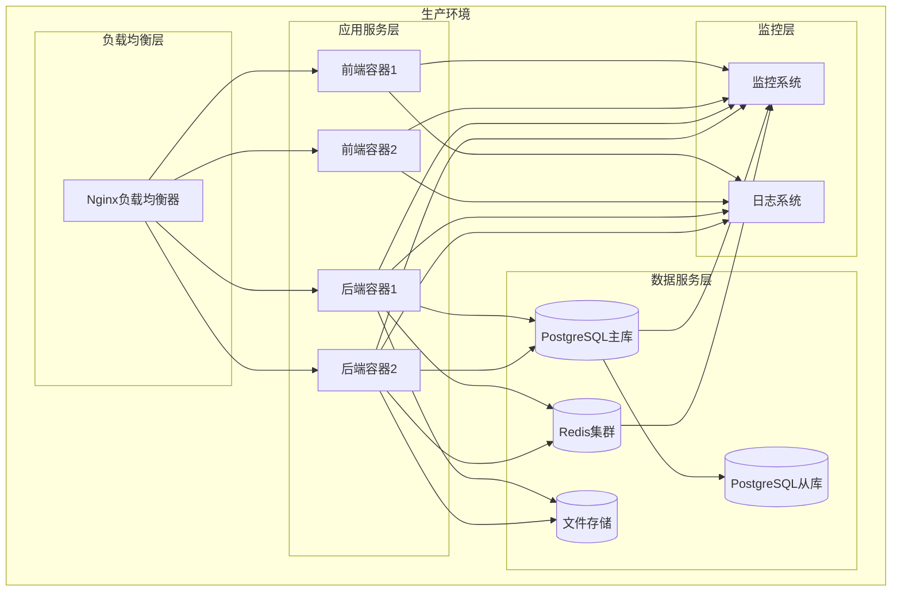

#### 2.3.2 网络架构设计

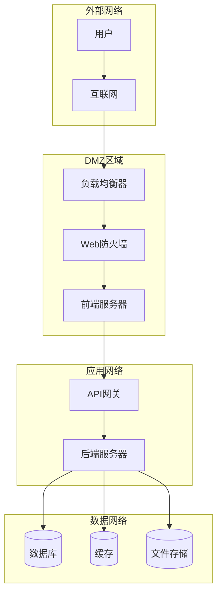

---

## 3. 技术架构设计

### 3.1 前端架构

#### 3.1.1 技术栈选择
- **框架**：React 18+
- **语言**：TypeScript
- **样式**：Tailwind CSS v4.0
- **组件库**：ShadCN UI
- **状态管理**：Zustand
- **路由管理**：React Router v6
- **图表库**：Recharts
- **HTTP客户端**：Axios

#### 3.1.2 前端架构图

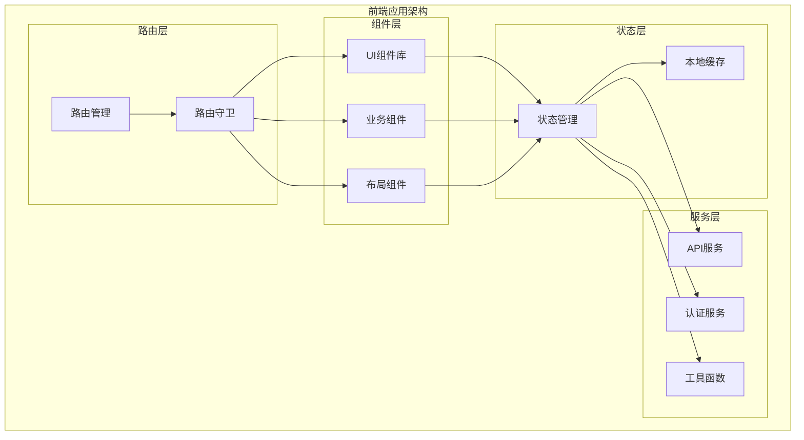

#### 3.1.3 组件架构设计

```
src/
├── components/
│   ├── ui/                 # 基础UI组件
│   │   ├── button/
│   │   ├── input/
│   │   ├── card/
│   │   └── table/
│   ├── layout/             # 布局组件
│   │   ├── header/
│   │   ├── sidebar/
│   │   └── footer/
│   ├── business/           # 业务组件
│   │   ├── dashboard/
│   │   ├── analysis/
│   │   └── reports/
│   └── common/             # 通用组件
│       ├── charts/
│       └── forms/
├── pages/                  # 页面组件
│   ├── Login.tsx
│   ├── Dashboard.tsx
│   ├── Analysis.tsx
│   └── Reports.tsx
├── hooks/                  # 自定义Hook
├── services/               # 服务层
├── stores/                 # 状态管理
├── utils/                  # 工具函数
└── types/                  # TypeScript类型定义
```

### 3.2 后端架构

#### 3.2.1 技术栈选择
- **运行时**：Deno
- **框架**：Hono
- **数据库**：PostgreSQL + Supabase
- **缓存**：KV Store (Deno KV)
- **认证**：JWT + Supabase Auth
- **文件存储**：Supabase Storage
- **ORM**：Supabase Client

#### 3.2.2 后端架构图

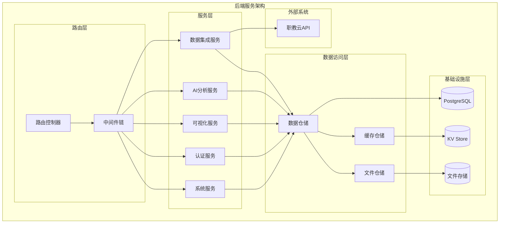

#### 3.2.3 后端模块结构

```
src/
├── routes/
│   ├── auth.ts             # 认证路由
│   ├── data.ts             # 数据管理路由
│   ├── analysis.ts         # 分析服务路由
│   ├── dashboard.ts        # 仪表盘路由
│   └── system.ts           # 系统管理路由
├── services/
│   ├── authService.ts      # 认证服务
│   ├── dataService.ts      # 数据服务
│   ├── analysisService.ts  # 分析服务
│   ├── visualService.ts    # 可视化服务
│   └── systemService.ts    # 系统服务
├── repositories/
│   ├── userRepository.ts   # 用户仓储
│   ├── dataRepository.ts   # 数据仓储
│   └── analysisRepository.ts # 分析仓储
├── models/
│   ├── User.ts             # 用户模型
│   ├── DataCollection.ts   # 数据采集模型
│   └── AnalysisResult.ts   # 分析结果模型
├── middleware/
│   ├── auth.ts             # 认证中间件
│   ├── cors.ts             # 跨域中间件
│   ├── logger.ts           # 日志中间件
│   └── error.ts            # 错误处理中间件
├── utils/
│   ├── database.ts         # 数据库工具
│   ├── cache.ts            # 缓存工具
│   └── logger.ts           # 日志工具
└── types/
    ├── auth.ts             # 认证类型
    ├── data.ts             # 数据类型
    └── api.ts              # API类型
```

### 3.3 数据架构

#### 3.3.1 数据存储架构

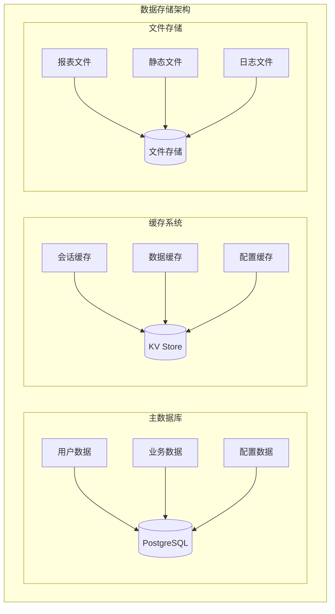

#### 3.3.2 数据流架构

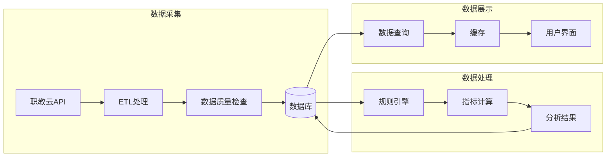

### 3.4 集成架构

#### 3.4.1 外部系统集成

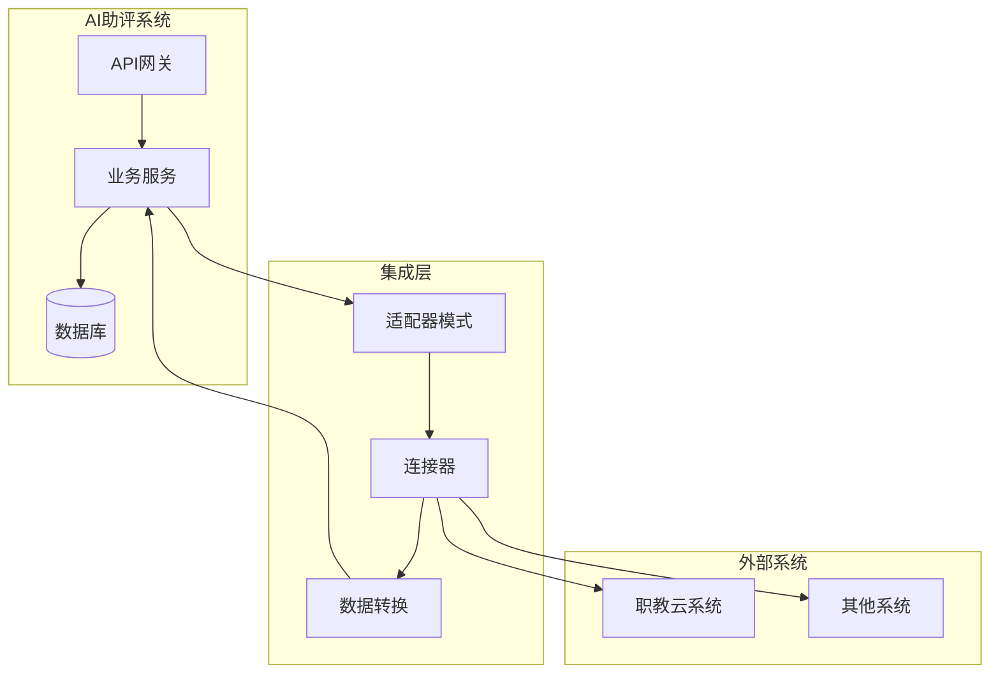

#### 3.4.2 API集成策略
- **RESTful API**：采用RESTful风格设计API
- **适配器模式**：为外部系统提供适配器
- **数据转换**：统一的数据格式转换
- **错误处理**：完善的错误处理机制
- **重试机制**：API调用失败重试机制

---

## 4. 安全架构设计

### 4.1 身份认证架构

#### 4.1.1 认证流程

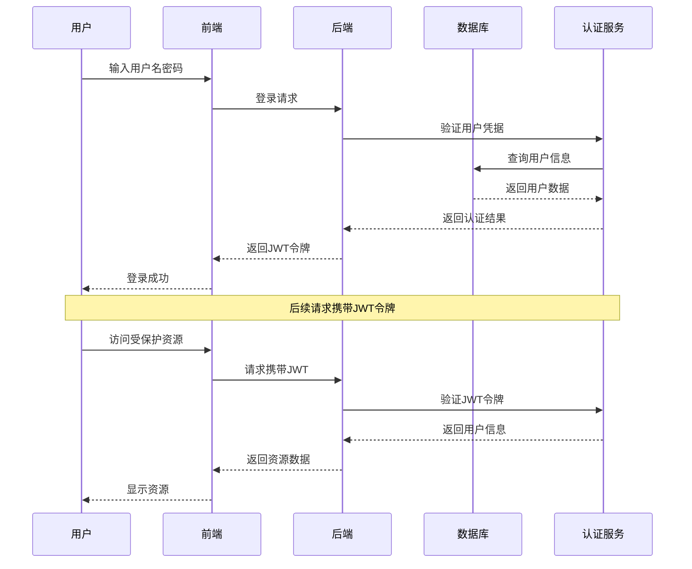

#### 4.1.2 认证机制
- **JWT令牌**：使用JWT进行无状态认证
- **密码加密**：使用bcrypt加密存储密码
- **会话管理**：JWT令牌有效期24小时
- **登录保护**：登录失败次数限制

### 4.2 访问控制架构

#### 4.2.1 权限模型

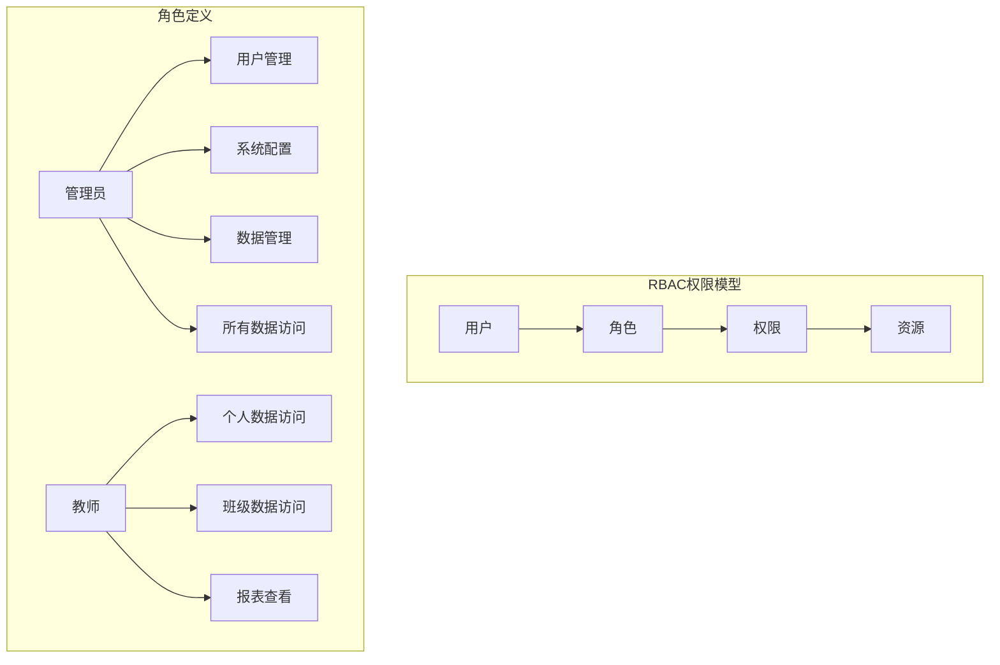

#### 4.2.2 权限控制机制
- **基于角色的访问控制（RBAC）**
- **资源级权限控制**
- **API接口权限验证**
- **前端路由权限控制**

### 4.3 数据安全架构

#### 4.3.1 数据保护策略

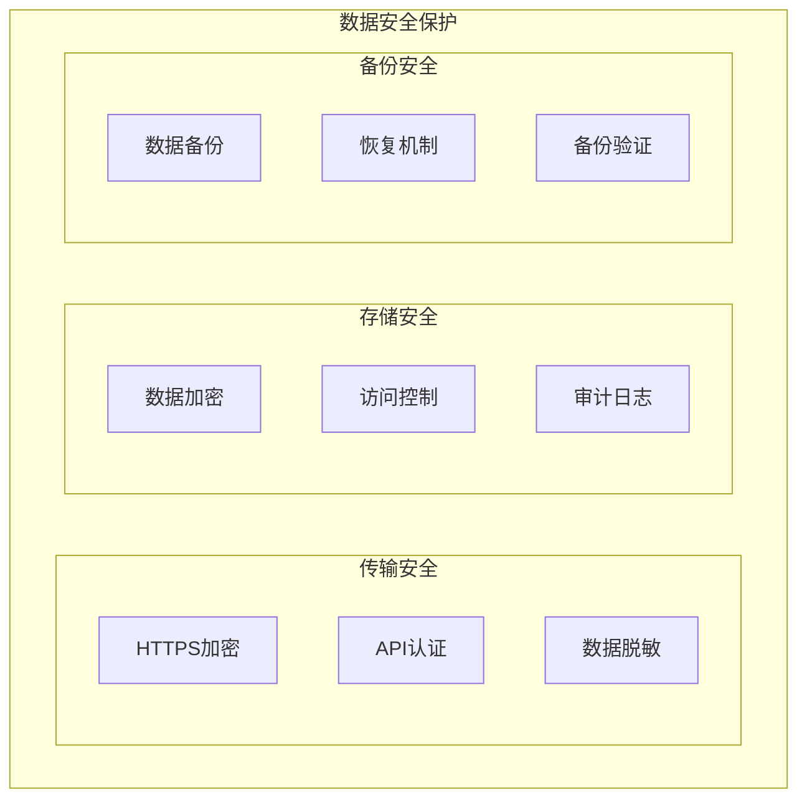

#### 4.3.2 数据安全措施
- **传输加密**：所有数据传输使用HTTPS
- **存储加密**：敏感数据加密存储
- **访问控制**：严格的数据访问控制
- **审计日志**：完整的数据操作审计

### 4.4 网络安全架构

#### 4.4.1 网络安全防护

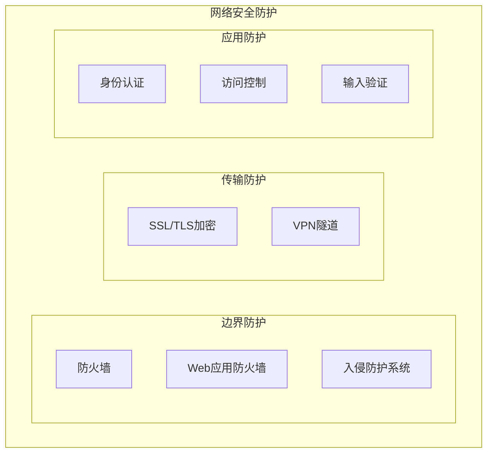

#### 4.4.2 网络安全措施
- **防火墙**：网络边界防火墙保护
- **WAF**：Web应用防火墙防护
- **HTTPS**：强制HTTPS传输
- **输入验证**：严格的输入验证和清理

---

## 5. 模块架构设计

### 5.1 模块划分

#### 5.1.1 模块架构图

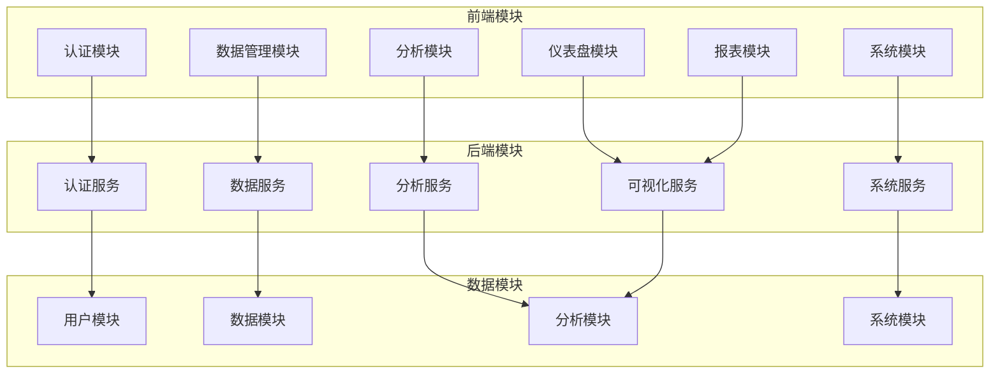

#### 5.1.2 模块职责划分

| 模块名称 | 前端职责 | 后端职责 | 数据模块 |
|----------|----------|----------|----------|
| 认证模块 | 登录界面、权限控制 | 用户认证、权限验证 | 用户数据 |
| 仪表盘模块 | 数据展示、图表组件 | 数据聚合、指标计算 | 分析结果数据 |
| 数据管理模块 | 数据配置、状态监控 | 数据采集、质量控制 | 采集数据、日志 |
| 分析模块 | 分析配置、结果查看 | 规则引擎、分析执行 | 规则配置、分析结果 |
| 报表模块 | 报表查看、导出功能 | 报表生成、文件管理 | 报表模板、报表文件 |
| 系统模块 | 系统配置、状态监控 | 系统管理、监控服务 | 系统配置、监控数据 |

### 5.2 模块交互

#### 5.2.1 模块依赖关系

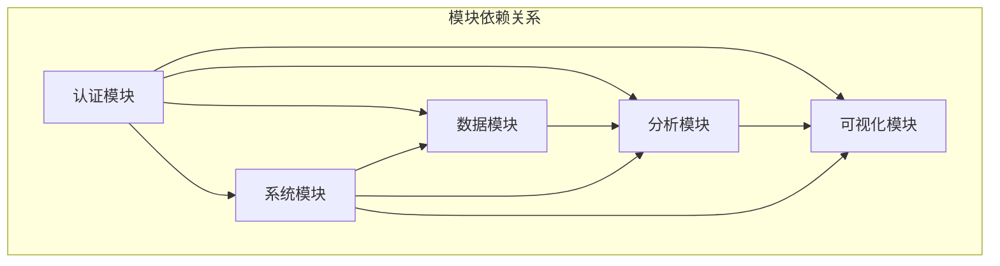

#### 5.2.2 模块通信机制
- **同步通信**：HTTP RESTful API
- **异步通信**：事件驱动机制
- **数据共享**：共享数据库
- **消息传递**：内部事件总线

### 5.3 模块部署

#### 5.3.1 部署策略

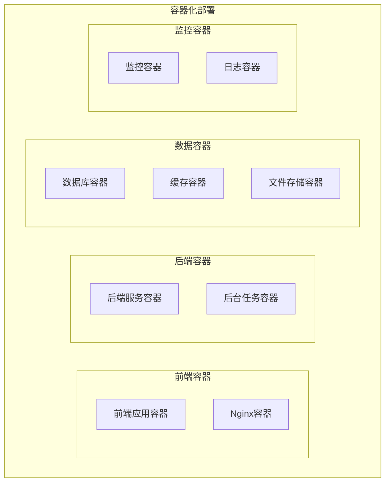

#### 5.3.2 容器配置
- **前端容器**：Nginx + 静态文件
- **后端容器**：Deno运行时环境
- **数据库容器**：PostgreSQL官方镜像
- **缓存容器**：Redis官方镜像
- **监控容器**：Prometheus + Grafana

---

## 6. 关键设计决策

### 6.1 技术选型决策

#### 6.1.1 前端技术选型

| 技术选型 | 选择理由 | 替代方案 | 决策依据 |
|----------|----------|----------|----------|
| React 18+ | 生态成熟，社区活跃 | Vue 3, Angular | 团队熟悉度高，生态完善 |
| TypeScript | 类型安全，开发效率高 | JavaScript | 提高代码质量和可维护性 |
| Tailwind CSS | 实用优先，开发效率高 | Styled Components, Emotion | 快速构建响应式界面 |
| Zustand | 轻量级，简单易用 | Redux, MobX | 避免过度设计，满足需求 |

#### 6.1.2 后端技术选型

| 技术选型 | 选择理由 | 替代方案 | 决策依据 |
|----------|----------|----------|----------|
| Deno | 现代化，安全性高 | Node.js, Bun | 技术前瞻性，安全特性 |
| Hono | 轻量级，性能好 | Express, Fastify | 与Deno集成好，API设计友好 |
| PostgreSQL | 功能强大，扩展性好 | MySQL, MongoDB | 复杂查询支持，ACID特性 |
| Supabase | 开箱即用，功能丰富 | Firebase, AWS Amplify | 降低开发复杂度 |

### 6.2 架构模式决策

#### 6.2.1 分层架构模式
**选择理由**：
- 关注点分离
- 易于测试和维护
- 团队协作友好
- 技术栈灵活

**替代方案**：
- 微服务架构
- 事件驱动架构
- 单体架构

**决策依据**：
- MVP阶段复杂度适中
- 开发团队规模小
- 部署运维成本考虑

#### 6.2.2 容器化部署模式
**选择理由**：
- 环境一致性
- 快速部署
- 易于扩展
- 资源隔离

**替代方案**：
- 传统部署
- 虚拟机部署
- Serverless部署

**决策依据**：
- 现代化部署方式
- 便于持续集成部署
- 支持弹性扩展

### 6.3 数据存储决策

#### 6.3.1 主数据库选择
**选择**：PostgreSQL
**理由**：
- ACID事务支持
- 复杂查询能力强
- 扩展性好
- 开源免费

**替代方案**：MySQL, MongoDB
**决策依据**：业务复杂度和数据一致性要求

#### 6.3.2 缓存策略选择
**选择**：KV Store (Deno KV)
**理由**：
- 与Deno生态集成好
- 简单易用
- 性能良好
- 成本低

**替代方案**：Redis, Memcached
**决策依据**：技术栈一致性和成本考虑

### 6.4 集成方案决策

#### 6.4.1 API集成方式
**选择**：RESTful API + 适配器模式
**理由**：
- 标准化程度高
- 易于理解和实现
- 工具链成熟
- 调试方便

**替代方案**：GraphQL, gRPC, Webhook
**决策依据**：外部API兼容性和开发效率

#### 6.4.2 数据同步策略
**选择**：增量同步 + 定时全量同步
**理由**：
- 平衡性能和一致性
- 实现复杂度适中
- 错误恢复能力强
- 资源消耗合理

**替代方案**：实时同步, 批量同步
**决策依据**：业务需求和系统资源限制

---

## 附录

### A. 架构设计检查清单

#### A.1 功能性检查
- [ ] 业务架构满足功能需求
- [ ] 数据架构支持业务流程
- [ ] 技术架构支撑系统功能
- [ ] 模块划分合理清晰

#### A.2 非功能性检查
- [ ] 性能架构满足性能需求
- [ ] 安全架构满足安全需求
- [ ] 可靠性架构满足可靠性需求
- [ ] 可扩展性架构满足扩展需求

#### A.3 技术可行性检查
- [ ] 技术选型合理可行
- [ ] 架构模式适用
- [ ] 集成方案可行
- [ ] 部署方案可实施

### B. 架构决策记录

| 决策编号 | 决策内容 | 决策日期 | 决策理由 | 替代方案 | 影响 |
|----------|----------|----------|----------|----------|------|
| ARCH-001 | 选择React作为前端框架 | 2025-11-23 | 团队熟悉度高，生态完善 | Vue 3, Angular | 前端开发效率 |
| ARCH-002 | 选择Deno作为后端运行时 | 2025-11-23 | 现代化，安全性高 | Node.js, Bun | 后端开发模式 |
| ARCH-003 | 选择PostgreSQL作为主数据库 | 2025-11-23 | 功能强大，扩展性好 | MySQL, MongoDB | 数据处理能力 |
| ARCH-004 | 采用分层架构模式 | 2025-11-23 | 关注点分离，易于维护 | 微服务架构 | 系统复杂度 |

---

**文档版本**: V1.0
**创建日期**: 2025-11-23
**最后更新**: 2025-11-23
**审批状态**: 待审批
**维护责任人**: 系统架构师团队