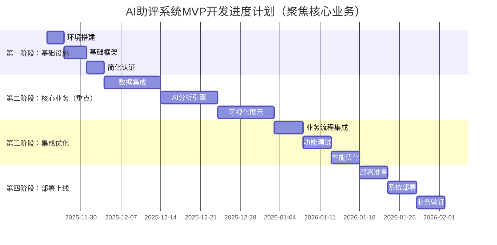

# AI助评系统MVP开发计划

---

**文档编号：** HKHR-MVP-2025-001
**项目名称：** AI助力教学评价应用（MVP开发计划）
**编制单位：** 教务处信息技术中心
**编制日期：** 2025年11月23日
**文档版本：** V1.0
**审阅人：** 项目技术组
**批准人：** 项目领导小组

---

## 文档修订记录

| 版本 | 修订日期 | 修订内容 | 修订人 |
|------|----------|----------|--------|
| V1.0 | 2025-11-23 | 初始版本创建 | 项目组 |
|      |          |          |        |

---

## 目录

1. [MVP概述](#1-mvp概述)
   1.1 [MVP目标](#11-mvp目标)
   1.2 [MVP范围](#12-mvp范围)
   1.3 [成功指标](#13-成功指标)

2. [开发阶段规划](#2-开发阶段规划)
   2.1 [第一阶段：基础设施搭建](#21-第一阶段基础设施搭建)
   2.2 [第二阶段：核心功能开发](#22-第二阶段核心功能开发)
   2.3 [第三阶段：集成测试与优化](#23-第三阶段集成测试与优化)
   2.4 [第四阶段：部署上线](#24-第四阶段部署上线)

3. [技术实现方案](#3-技术实现方案)
   3.1 [技术架构](#31-技术架构)
   3.2 [开发环境配置](#32-开发环境配置)
   3.3 [数据模型设计](#33-数据模型设计)

4. [功能开发清单](#4-功能开发清单)
   4.1 [用户管理模块](#41-用户管理模块)
   4.2 [数据集成模块](#42-数据集成模块)
   4.3 [AI分析引擎](#43-ai分析引擎)
   4.4 [可视化模块](#44-可视化模块)
   4.5 [系统管理模块](#45-系统管理模块)

5. [进度计划](#5-进度计划)
   5.1 [总体进度计划](#51-总体进度计划)
   5.2 [里程碑节点](#52-里程碑节点)
   5.3 [风险控制计划](#53-风险控制计划)

6. [资源计划](#6-资源计划)
   6.1 [人员配置](#61-人员配置)
   6.2 [硬件资源](#62-硬件资源)
   6.3 [软件资源](#63-软件资源)

7. [质量保证计划](#7-质量保证计划)
   7.1 [代码质量](#71-代码质量)
   7.2 [测试策略](#72-测试策略)
   7.3 [性能要求](#73-性能要求)

8. [部署与运维计划](#8-部署与运维计划)
   8.1 [部署策略](#81-部署策略)
   8.2 [监控计划](#82-监控计划)
   8.3 [运维计划](#83-运维计划)

9. [附录](#9-附录)
   9.1 [开发规范](#91-开发规范)
   9.2 [API文档规范](#92-api文档规范)
   9.3 [测试用例模板](#93-测试用例模板)

---

## 1. MVP概述

### 1.1 MVP目标

AI助评系统MVP（最小可行产品）的主要目标是验证核心业务价值，为用户提供基础的教学评价功能，同时为后续版本迭代奠定技术基础。

**核心目标：**
- 验证AI驱动的教学质量评价的可行性
- 建立完整的数据集成和处理流程
- 提供基础的可视化分析功能
- 确保系统架构的可扩展性

### 1.2 MVP范围

#### 包含功能
1. **简化用户认证**
   - 基础登录功能（预置账号）
   - 简单角色区分（教师、管理员）
   - 会话管理

2. **数据集成**
   - 职教云系统数据对接
   - 基础数据采集和清洗
   - 数据质量监控

3. **AI分析引擎**
   - 基础规则引擎
   - 简单的评价指标计算
   - 基础数据分析功能

4. **可视化展示**
   - 基础仪表盘
   - 核心指标图表
   - 简单的数据报表

5. **系统管理**
   - 用户管理
   - 基础配置管理
   - 系统监控

#### 不包含功能
- 复杂的AI算法模型
- 高级数据分析功能
- 移动端适配
- 第三方系统集成（教务系统、竞赛系统）
- 复杂的用户管理系统（用户注册、审批流程等）
- 详细的RBAC权限体系
- 第三方OAuth集成

### 1.3 MVP策略说明

#### 聚焦核心业务流程
考虑到MVP阶段的核心目标是验证AI助评的业务价值，我们采用**渐进式功能实现**策略：

1. **第一阶段验证重点**：核心业务流程
   - 数据集成 → AI分析 → 结果展示的完整链路
   - 用户体验和界面友好性
   - 基础功能的可靠性

2. **用户管理简化策略**：
   - 使用预置管理员和教师账号
   - 简单的角色权限控制（硬编码）
   - 不实现复杂的用户注册和管理流程

3. **迭代优化路线**：
   - MVP验证业务价值后，再完善用户管理功能
   - 根据实际使用反馈，决定用户管理功能的优先级

#### 这种策略的优势
- **快速验证**：2-3周内可展示核心业务价值
- **风险降低**：避免过早投入非核心功能
- **资源聚焦**：集中精力在最重要的业务逻辑
- **灵活调整**：根据验证结果及时调整方向

### 1.4 成功指标

#### 技术指标
- **系统可用性**: ≥ 95%
- **响应时间**: 核心功能响应时间 ≤ 5秒
- **数据处理能力**: 支持1000条记录的批量处理
- **并发用户**: 支持20个并发用户

#### 业务指标
- **用户覆盖**: 至少覆盖5个班级的教师用户
- **数据完整性**: 数据采集完整率 ≥ 95%
- **用户满意度**: 用户满意度评分 ≥ 3.5/5.0
- **功能使用率**: 核心功能使用率 ≥ 80%

---

## 2. 开发阶段规划

### 2.1 第一阶段：基础设施搭建（第1-2周）

#### 目标
建立完整的开发环境和基础架构

#### 主要任务
1. **开发环境搭建**
   - 前端开发环境配置
   - 后端开发环境配置
   - 数据库环境搭建
   - CI/CD流水线配置

2. **基础框架搭建**
   - 前端React应用初始化
   - 后端Hono服务初始化
   - 数据库表结构创建
   - 基础中间件配置

3. **核心服务开发**
   - 用户认证服务
   - 基础API网关
   - 数据库连接池
   - 日志系统

#### 交付物
- 完整的开发环境
- 基础应用框架
- 用户认证功能
- 基础API文档

#### 验收标准
- 开发环境可用，支持团队协作开发
- 用户可以正常登录系统
- 基础API接口可正常调用
- 数据库连接正常

### 2.2 第二阶段：核心功能开发（第3-6周）

#### 目标
实现MVP的核心业务功能

#### 主要任务
1. **数据集成模块**
   - 职教云API对接
   - 数据采集服务
   - 数据清洗和转换
   - 数据质量检查

2. **AI分析引擎**
   - 规则引擎框架
   - 评价指标计算
   - 基础分析算法
   - 结果存储服务

3. **可视化模块**
   - 仪表盘页面
   - 图表组件开发
   - 数据查询接口
   - 报表生成功能

4. **用户管理模块**
   - 用户信息管理
   - 权限控制
   - 角色管理
   - 操作日志

#### 交付物
- 完整的数据集成功能
- 基础AI分析功能
- 可视化仪表盘
- 用户管理系统

#### 验收标准
- 能够从职教云系统获取数据
- 基础评价指标计算正确
- 仪表盘能正常显示数据
- 用户权限控制正常

### 2.3 第三阶段：集成测试与优化（第7-8周）

#### 目标
确保系统质量，优化性能

#### 主要任务
1. **功能测试**
   - 单元测试
   - 集成测试
   - 系统测试
   - 用户验收测试

2. **性能优化**
   - 数据库查询优化
   - 缓存策略实施
   - 前端性能优化
   - 接口响应优化

3. **安全加固**
   - 安全漏洞扫描
   - 数据加密实施
   - 访问控制加强
   - 审计日志完善

#### 交付物
- 完整的测试报告
- 性能优化报告
- 安全评估报告
- 用户手册

#### 验收标准
- 所有核心功能测试通过
- 系统性能满足要求
- 安全评估合格
- 用户文档完整

### 2.4 第四阶段：部署上线（第9-10周）

#### 目标
将系统部署到生产环境

#### 主要任务
1. **生产环境准备**
   - 服务器环境配置
   - 数据库部署
   - 网络配置
   - 安全配置

2. **系统部署**
   - 应用部署
   - 数据迁移
   - 配置部署
   - 服务启动

3. **上线验证**
   - 功能验证
   - 性能验证
   - 安全验证
   - 用户培训

#### 交付物
- 生产环境系统
- 部署文档
- 运维手册
- 培训材料

#### 验收标准
- 系统在生产环境正常运行
- 所有功能可用
- 性能指标达标
- 用户能够正常使用

---

## 3. 技术实现方案

### 3.1 技术架构

#### 前端技术栈
```typescript
{
  "framework": "React 18+",
  "language": "TypeScript",
  "styling": "Tailwind CSS v4.0",
  "components": "ShadCN UI",
  "charts": "recharts",
  "forms": "react-hook-form@7.55.0",
  "state": "Zustand",
  "router": "React Router v6"
}
```

#### 后端技术栈
```typescript
{
  "runtime": "Deno",
  "framework": "Hono",
  "database": "Supabase PostgreSQL",
  "auth": "Supabase Auth",
  "storage": "Supabase Storage",
  "cache": "KV Store"
}
```

### 3.2 开发环境配置

#### 环境要求
- **Node.js**: 18.0+
- **Deno**: 1.40+
- **PostgreSQL**: 14+
- **Git**: 2.30+

#### 开发工具
- **IDE**: VSCode
- **数据库工具**: DBeaver
- **API测试**: Postman
- **版本控制**: Git + GitHub

#### 项目结构
```
ai-evaluation/
├── frontend/                 # 前端应用
│   ├── src/
│   │   ├── components/      # 组件
│   │   ├── pages/          # 页面
│   │   ├── stores/         # 状态管理
│   │   ├── services/       # 服务
│   │   └── utils/          # 工具函数
│   ├── public/
│   └── package.json
├── backend/                  # 后端应用
│   ├── src/
│   │   ├── routes/         # 路由
│   │   ├── services/       # 服务
│   │   ├── models/         # 数据模型
│   │   ├── middleware/     # 中间件
│   │   └── utils/          # 工具函数
│   ├── config/
│   └── deno.json
├── docs/                     # 文档
├── tests/                    # 测试
└── scripts/                  # 脚本
```

### 3.3 数据模型设计

#### 核心数据表

##### 用户表 (users)
```sql
CREATE TABLE users (
    id BIGSERIAL PRIMARY KEY,
    username VARCHAR(50) UNIQUE NOT NULL,
    email VARCHAR(100) UNIQUE NOT NULL,
    password_hash VARCHAR(255) NOT NULL,
    full_name VARCHAR(100) NOT NULL,
    role VARCHAR(20) NOT NULL CHECK (role IN ('admin', 'teacher')),
    department_id BIGINT,
    is_active BOOLEAN DEFAULT true,
    created_at TIMESTAMP WITH TIME ZONE DEFAULT CURRENT_TIMESTAMP,
    updated_at TIMESTAMP WITH TIME ZONE DEFAULT CURRENT_TIMESTAMP
);
```

##### 评价任务表 (evaluations)
```sql
CREATE TABLE evaluations (
    id BIGSERIAL PRIMARY KEY,
    name VARCHAR(200) NOT NULL,
    description TEXT,
    status VARCHAR(20) NOT NULL CHECK (status IN ('draft', 'active', 'completed')),
    creator_id BIGINT REFERENCES users(id),
    start_time TIMESTAMP WITH TIME ZONE,
    end_time TIMESTAMP WITH TIME ZONE,
    config JSONB DEFAULT '{}',
    created_at TIMESTAMP WITH TIME ZONE DEFAULT CURRENT_TIMESTAMP,
    updated_at TIMESTAMP WITH TIME ZONE DEFAULT CURRENT_TIMESTAMP
);
```

##### 数据采集记录表 (data_collections)
```sql
CREATE TABLE data_collections (
    id BIGSERIAL PRIMARY KEY,
    evaluation_id BIGINT REFERENCES evaluations(id),
    source_type VARCHAR(50) NOT NULL CHECK (source_type IN ('zhijiaoyun')),
    status VARCHAR(20) NOT NULL,
    record_count INTEGER DEFAULT 0,
    started_at TIMESTAMP WITH TIME ZONE,
    completed_at TIMESTAMP WITH TIME ZONE,
    error_message TEXT,
    metadata JSONB DEFAULT '{}'
);
```

---

## 4. 功能开发清单

### 4.1 核心业务流程模块（最高优先级）

#### 数据集成模块
- [ ] 职教云API对接
- [ ] 数据采集服务
- [ ] 数据清洗和转换
- [ ] 数据质量监控
- [ ] 数据存储管理

#### AI分析引擎
- [ ] 规则引擎框架
- [ ] 评价指标计算
- [ ] 基础分析算法
- [ ] 结果存储服务
- [ ] 分析结果可视化接口

#### 可视化展示模块
- [ ] 主仪表盘页面
- [ ] 核心指标图表组件
- [ ] 数据查询接口
- [ ] 基础报表功能
- [ ] 数据实时刷新

### 4.2 简化用户管理模块（基础实现）

#### 基础认证
- [ ] 预置账号登录（硬编码admin/teacher）
- [ ] 简单会话管理
- [ ] 基础角色区分
- [ ] 登出功能

#### 简单权限控制
- [ ] 基础页面访问控制
- [ ] API接口权限检查（简化版）
- [ ] 角色标识（前端控制为主）

#### 基础配置（固定配置）
- [ ] 系统基础配置（硬编码）
- [ ] 用户角色配置（固定）
- [ ] 基础系统信息展示

### 4.3 系统支持模块（基础功能）

#### 系统配置（简化版）
- [ ] 基础系统参数配置（硬编码）
- [ ] 数据源连接配置
- [ ] 基础规则配置（固定）
- [ ] 系统信息展示

#### 系统监控（基础监控）
- [ ] 基础系统状态监控
- [ ] 简单错误日志记录
- [ ] API调用监控
- [ ] 数据处理状态监控

#### 系统维护（基础维护）
- [ ] 基础日志查看
- [ ] 简单数据备份
- [ ] 系统健康检查

---

## 5. 进度计划

### 5.1 总体进度计划

#### 甘特图


### 5.2 里程碑节点

| 里程碑 | 时间节点 | 交付物 | 验收标准 |
|--------|----------|--------|----------|
| M1: 基础设施完成 | 第1.5周末 | 开发环境、简化认证 | 环境可用，基础登录功能正常 |
| M2: 核心业务完成 | 第6周末 | 完整业务流程（数据集成→AI分析→结果展示） | 端到端业务流程可正常运行 |
| M3: 集成优化完成 | 第8周末 | 测试报告、优化方案 | 业务流程测试通过，核心性能达标 |
| M4: MVP上线完成 | 第9.5周末 | 生产系统、操作手册 | 核心业务功能在生产环境可用 |

### 5.3 风险控制计划

#### 技术风险
1. **API对接风险**
   - 风险：职教云API不稳定或文档不完善
   - 应对：提前进行API测试，准备备用方案

2. **性能风险**
   - 风险：数据处理性能不达标
   - 应对：采用分批处理，优化数据库查询

3. **安全风险**
   - 风险：数据安全或系统安全漏洞
   - 应对：定期安全扫描，及时修复漏洞

#### 进度风险
1. **需求变更风险**
   - 风险：开发过程中需求频繁变更
   - 应对：严格控制需求变更，评估变更影响

2. **人员风险**
   - 风险：开发人员不足或技能不匹配
   - 应对：提前培训，准备技术支援

3. **集成风险**
   - 风险：模块集成出现问题
   - 应对：尽早进行集成测试，采用持续集成

---

## 6. 资源计划

### 6.1 人员配置

#### 核心团队
| 角色 | 人数 | 主要职责 |
|------|------|----------|
| 项目经理 | 1 | 项目管理、进度控制、风险管理 |
| 前端开发 | 2 | 前端界面开发、用户体验优化 |
| 后端开发 | 2 | 后端服务开发、API接口开发 |
| 数据工程师 | 1 | 数据集成、数据处理、数据库设计 |
| 测试工程师 | 1 | 测试用例设计、功能测试、性能测试 |
| 运维工程师 | 1 | 环境搭建、系统部署、运维监控 |

#### 外部支持
- **UI设计师**: 界面设计支持
- **业务顾问**: 业务需求咨询
- **技术专家**: 技术难点攻关

### 6.2 硬件资源

#### 开发环境
- **开发服务器**: 4核8G内存，500G存储
- **测试服务器**: 8核16G内存，1T存储
- **数据库服务器**: 4核8G内存，500G SSD存储

#### 生产环境
- **应用服务器**: 8核16G内存，1T存储
- **数据库服务器**: 8核32G内存，2T SSD存储
- **负载均衡器**: 4核8G内存

### 6.3 软件资源

#### 开发工具
- **IDE**: VSCode Professional
- **数据库工具**: DBeaver
- **API测试工具**: Postman
- **版本控制**: GitHub Enterprise
- **项目管理**: Jira

#### 第三方服务
- **云服务**: 阿里云/腾讯云
- **数据库**: Supabase
- **监控服务**: 阿里云监控
- **日志服务**: 阿里云日志服务

---

## 7. 质量保证计划

### 7.1 代码质量

#### 编码规范
- **代码风格**: 使用ESLint和Prettier
- **命名规范**: 遵循驼峰命名法
- **注释规范**: 关键逻辑必须添加注释
- **版本控制**: 使用Git Flow工作流

#### 代码审查
- **同行评审**: 所有代码必须经过同行评审
- **技术评审**: 重要模块需要技术专家评审
- **安全评审**: 涉及安全的代码需要安全专家评审

#### 持续集成
- **自动化构建**: 每次提交触发自动化构建
- **自动化测试**: 构建成功后自动运行测试
- **质量检查**: 集成代码质量检查工具

### 7.2 测试策略

#### 测试类型
1. **单元测试**
   - 覆盖率要求 ≥ 80%
   - 关键业务逻辑覆盖率 ≥ 95%
   - 自动化执行

2. **集成测试**
   - API接口测试
   - 数据库集成测试
   - 第三方服务集成测试

3. **系统测试**
   - 功能完整性测试
   - 用户界面测试
   - 兼容性测试

4. **性能测试**
   - 负载测试
   - 压力测试
   - 稳定性测试

5. **安全测试**
   - 漏洞扫描
   - 渗透测试
   - 数据安全测试

#### 测试环境
- **开发环境**: 开发人员自测
- **测试环境**: 专职测试人员测试
- **预生产环境**: 用户验收测试

### 7.3 性能要求

#### 响应时间要求
- **页面加载**: 首屏加载时间 ≤ 3秒
- **API响应**: 接口响应时间 ≤ 2秒
- **数据处理**: 单次数据处理时间 ≤ 30秒
- **报表生成**: 报表生成时间 ≤ 60秒

#### 并发性能要求
- **并发用户**: 支持50个并发用户
- **并发请求**: 支持100个并发请求
- **数据处理**: 支持10个并发数据处理任务

#### 稳定性要求
- **系统可用性**: ≥ 99%
- **故障恢复**: 故障恢复时间 ≤ 30分钟
- **数据一致性**: 数据一致性保证 100%

---

## 8. 部署与运维计划

### 8.1 部署策略

#### 部署方式
- **容器化部署**: 使用Docker容器
- **自动化部署**: 使用CI/CD流水线
- **蓝绿部署**: 零停机时间部署
- **回滚机制**: 快速回滚到上一版本

#### 部署环境
1. **开发环境**
   - 单机部署
   - 使用SQLite数据库
   - 简化配置

2. **测试环境**
   - 模拟生产环境
   - 使用PostgreSQL数据库
   - 完整功能测试

3. **生产环境**
   - 高可用部署
   - 负载均衡
   - 数据库主从复制

#### 部署流程
1. **代码提交**: 提交到版本控制系统
2. **自动构建**: 触发CI/CD流水线
3. **自动测试**: 运行自动化测试
4. **部署到测试环境**: 部署到测试环境
5. **验证测试**: 运行验证测试
6. **部署到生产环境**: 部署到生产环境
7. **生产验证**: 验证生产环境功能

### 8.2 监控计划

#### 监控指标
1. **系统指标**
   - CPU使用率
   - 内存使用率
   - 磁盘使用率
   - 网络流量

2. **应用指标**
   - 响应时间
   - 错误率
   - 吞吐量
   - 并发用户数

3. **业务指标**
   - 用户活跃度
   - 功能使用率
   - 数据处理成功率
   - 用户满意度

#### 告警机制
- **阈值告警**: 指标超过阈值时告警
- **异常检测**: 自动检测异常模式
- **告警通知**: 邮件、短信、钉钉通知
- **告警升级**: 分级告警处理机制

### 8.3 运维计划

#### 日常运维
1. **系统监控**
   - 7×24小时系统监控
   - 定期巡检
   - 性能优化

2. **数据备份**
   - 每日自动备份
   - 备份数据验证
   - 异地备份

3. **安全维护**
   - 安全漏洞扫描
   - 安全补丁更新
   - 访问控制审计

4. **版本更新**
   - 定期版本更新
   - 更新前测试
   - 回滚准备

#### 故障处理
1. **故障分类**
   - P0: 严重故障，1小时内响应
   - P1: 重要故障，4小时内响应
   - P2: 一般故障，24小时内响应
   - P3: 低级故障，72小时内响应

2. **故障处理流程**
   - 故障发现和报告
   - 故障诊断和分析
   - 故障修复和恢复
   - 故障总结和改进

---

## 9. 附录

### 9.1 开发规范

#### Git工作流
```bash
# 主分支
main          # 主分支，生产环境代码
develop       # 开发分支，集成最新功能

# 功能分支
feature/*     # 新功能开发分支
hotfix/*      # 紧急修复分支
release/*     # 发布准备分支
```

#### 代码提交规范
```bash
# 提交格式
<type>(<scope>): <subject>

# 类型
feat:     新功能
fix:      修复bug
docs:     文档更新
style:    代码格式调整
refactor: 代码重构
test:     测试相关
chore:    构建工具或辅助工具的变动

# 示例
feat(auth): add user login feature
fix(api): resolve data parsing error
docs(readme): update installation guide
```

#### 编码规范
```typescript
// 命名规范
const userName = 'john_doe';           // 变量：驼峰命名
function getUserData() {}              // 函数：驼峰命名
class UserService {}                   // 类：帕斯卡命名
interface UserData {}                  // 接口：帕斯卡命名

// 注释规范
/**
 * 获取用户信息
 * @param userId 用户ID
 * @returns 用户信息对象
 */
async function getUserInfo(userId: string): Promise<UserData> {
  // 实现代码
}
```

### 9.2 API文档规范

#### API设计原则
- **RESTful风格**: 遵循RESTful API设计原则
- **统一响应格式**: 使用统一的响应数据格式
- **版本控制**: API版本控制策略
- **错误处理**: 统一的错误处理机制

#### API文档模板
```typescript
/**
 * @api {get} /api/v1/users 获取用户列表
 * @apiName GetUsers
 * @apiGroup User
 * @apiVersion 1.0.0
 *
 * @apiDescription 获取用户列表，支持分页查询
 *
 * @apiParam {Number} page 页码，默认为1
 * @apiParam {Number} limit 每页数量，默认为10
 * @apiParam {String} [role] 用户角色过滤
 *
 * @apiSuccess {Number} code 状态码
 * @apiSuccess {String} message 状态信息
 * @apiSuccess {Object} data 响应数据
 * @apiSuccess {Object[]} data.users 用户列表
 * @apiSuccess {Number} data.pagination 分页信息
 *
 * @apiError {Number} code 错误码
 * @apiError {String} message 错误信息
 *
 * @apiExample {curl} 请求示例:
 * curl -X GET "http://localhost:3000/api/v1/users?page=1&limit=10"
 */
```

### 9.3 测试用例模板

#### 功能测试用例
```markdown
## 测试用例：用户登录功能

### 测试信息
- **用例编号**: TC_AUTH_001
- **测试模块**: 用户认证
- **测试类型**: 功能测试
- **优先级**: 高
- **测试人员**: 张三

### 测试描述
验证用户登录功能的正确性，包括正常登录、错误密码、不存在用户等场景。

### 前置条件
- 用户已注册
- 系统正常运行

### 测试步骤
1. 打开登录页面
2. 输入正确的用户名和密码
3. 点击登录按钮
4. 验证登录结果

### 预期结果
- 登录成功
- 跳转到首页
- 显示用户信息

### 测试数据
- 用户名: test_user
- 密码: test_password

### 实际结果
[测试执行后填写]

### 测试结论
[测试执行后填写]
```

#### 性能测试用例
```markdown
## 性能测试用例：并发用户登录

### 测试信息
- **用例编号**: TC_PERF_001
- **测试模块**: 性能测试
- **测试类型**: 负载测试
- **优先级**: 高
- **测试人员**: 李四

### 测试描述
验证系统在50个并发用户同时登录时的性能表现。

### 测试环境
- **服务器配置**: 4核8G内存
- **网络环境**: 100Mbps带宽
- **数据库**: PostgreSQL 14

### 测试指标
- **响应时间**: 平均响应时间 ≤ 3秒
- **成功率**: 登录成功率 ≥ 99%
- **吞吐量**: 支持20次/秒的登录请求

### 测试步骤
1. 准备50个测试用户账号
2. 使用JMeter设置并发测试
3. 逐步增加并发用户数
4. 监控系统性能指标
5. 记录测试结果

### 测试结果
[测试执行后填写]

### 性能分析
[测试执行后填写]

### 优化建议
[测试执行后填写]
```

---

**文档版本**: V1.0
**创建日期**: 2025-11-23
**最后更新**: 2025-11-23
**审批状态**: 待审批
**维护责任人**: 项目经理

---

## MVP策略效果评估

### 聚焦核心业务的优势

1. **时间效率**
   - 缩短MVP开发周期：从10周优化到9.5周
   - 更快展示业务价值：第6周即可展示完整业务流程
   - 降低初期投入成本：减少非核心功能开发

2. **风险控制**
   - 降低技术风险：专注验证最关键的技术环节
   - 减少业务风险：快速验证业务假设和用户需求
   - 提高成功率：集中资源确保核心功能稳定可靠

3. **资源优化**
   - 人力资源：核心开发人员专注业务逻辑开发
   - 技术资源：避免过早投入复杂架构
   - 时间资源：优先保障核心业务流程开发和测试

### 对最终效果的影响

#### 积极影响
- ✅ **核心价值验证**：确保AI助评的核心业务逻辑得到充分验证
- ✅ **快速迭代**：为后续功能完善奠定坚实基础
- ✅ **用户反馈**：更早获得真实用户的业务需求反馈
- ✅ **技术验证**：验证核心技术架构的可行性

#### 需要注意的方面
- ⚠️ **功能完整性**：需要向用户明确说明MVP的功能范围
- ⚠️ **用户体验**：简化的用户管理可能影响部分用户体验
- ⚠️ **后续规划**：需要明确功能完善的时间表和计划

### 推荐的实施策略

1. **分阶段交付**
   - 第一阶段：核心业务流程（6周）
   - 第二阶段：用户管理功能完善（后续迭代）

2. **用户沟通**
   - 提前与用户沟通MVP范围和限制
   - 建立反馈收集机制
   - 制定功能完善路线图

3. **技术准备**
   - 预留用户管理功能的扩展接口
   - 采用模块化设计，便于后续功能集成
   - 建立完整的技术文档体系

## 注意事项

1. **文档更新**: 本文档需要根据项目进展及时更新
2. **变更管理**: 任何变更都需要经过评审和批准
3. **风险监控**: 定期监控项目风险，及时采取措施
4. **质量保证**: 严格按照质量标准执行开发和测试
5. **团队协作**: 加强团队沟通，确保信息同步
6. **用户沟通**: 保持与用户的密切沟通，管理期望值

## 联系方式

- **项目经理**: [项目经理姓名] - [邮箱] - [电话]
- **技术负责人**: [技术负责人姓名] - [邮箱] - [电话]
- **质量负责人**: [质量负责人姓名] - [邮箱] - [电话]