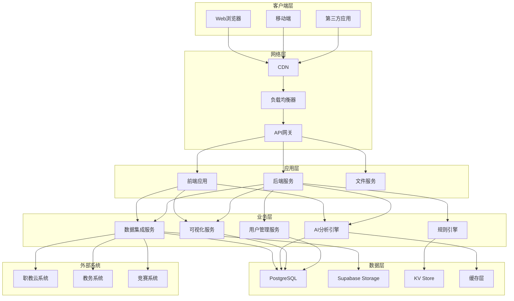
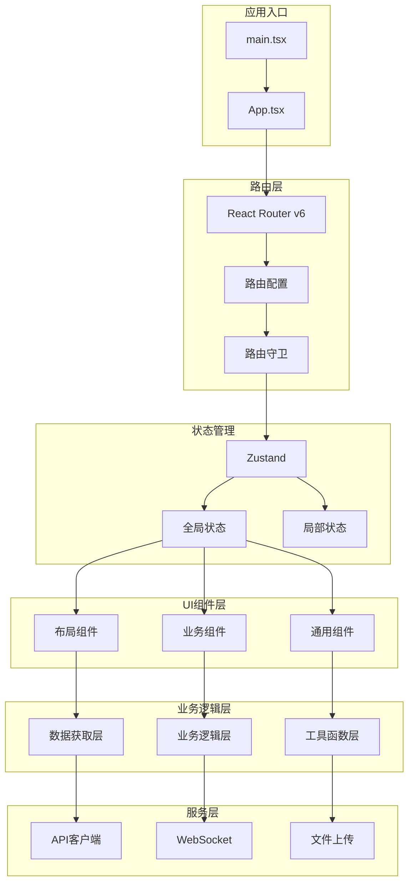
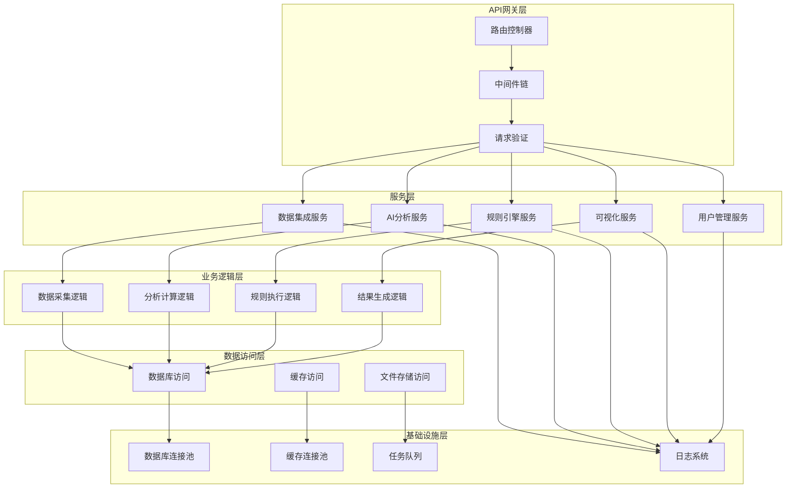
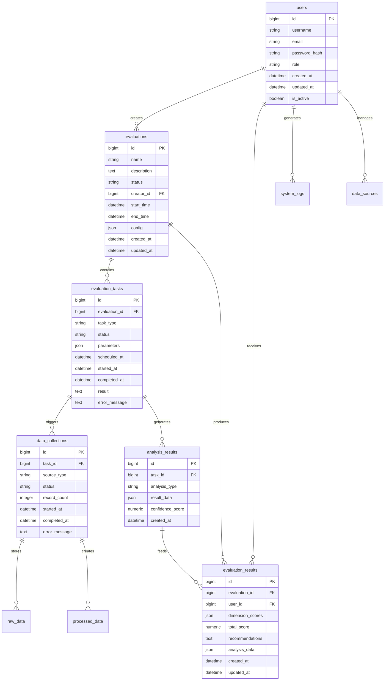
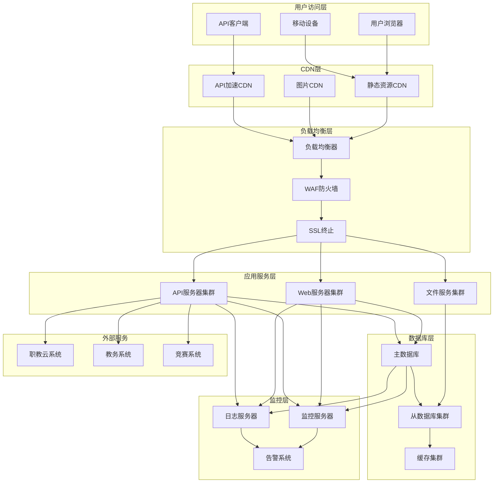

# AI助评系统架构设计说明书

---

**文档编号：** HKHR-ARCH-2025-001
**项目名称：** AI助力教学评价应用（样板工程）
**编制单位：** 教务处信息技术中心
**编制日期：** 2025年11月23日
**文档版本：** V1.0
**审阅人：** 项目技术组
**批准人：** 项目领导小组

---

## 文档修订记录

| 版本 | 修订日期 | 修订内容 | 修订人 |
|------|----------|----------|--------|
| V1.0 | 2025-11-23 | 初始版本创建 | 项目组 |
|      |          |          |        |

---

## 目录

1. [引言](#1-引言)
   1.1 [架构设计目标](#11-架构设计目标)
   1.2 [设计原则](#12-设计原则)
   1.3 [系统概述](#13-系统概述)

2. [技术架构](#2-技术架构)
   2.1 [整体架构图](#21-整体架构图)
   2.2 [分层架构设计](#22-分层架构设计)
   2.3 [技术栈选型](#23-技术栈选型)

3. [前端架构设计](#3-前端架构设计)
   3.1 [前端架构图](#31-前端架构图)
   3.2 [组件体系设计](#32-组件体系设计)
   3.3 [状态管理设计](#33-状态管理设计)
   3.4 [路由与导航设计](#34-路由与导航设计)

4. [后端架构设计](#4-后端架构设计)
   4.1 [后端架构图](#41-后端架构图)
   4.2 [API设计规范](#42-api设计规范)
   4.3 [服务分层设计](#43-服务分层设计)
   4.4 [中间件与拦截器](#44-中间件与拦截器)

5. [数据库架构设计](#5-数据库架构设计)
   5.1 [数据库架构图](#51-数据库架构图)
   5.2 [数据模型设计](#52-数据模型设计)
   5.3 [缓存策略设计](#53-缓存策略设计)
   5.4 [数据安全设计](#54-数据安全设计)

6. [部署架构设计](#6-部署架构设计)
   6.1 [部署架构图](#61-部署架构图)
   6.2 [容器化设计](#62-容器化设计)
   6.3 [负载均衡与高可用](#63-负载均衡与高可用)
   6.4 [监控与告警](#64-监控与告警)

7. [安全架构设计](#7-安全架构设计)
   7.1 [认证与授权](#71-认证与授权)
   7.2 [数据安全](#72-数据安全)
   7.3 [网络安全](#73-网络安全)
   7.4 [审计日志](#74-审计日志)

8. [性能优化设计](#8-性能优化设计)
   8.1 [前端性能优化](#81-前端性能优化)
   8.2 [后端性能优化](#82-后端性能优化)
   8.3 [数据库性能优化](#83-数据库性能优化)
   8.4 [缓存优化](#84-缓存优化)

9. [可扩展性设计](#9-可扩展性设计)
   9.1 [水平扩展](#91-水平扩展)
   9.2 [模块化设计](#92-模块化设计)
   9.3 [插件化架构](#93-插件化架构)
   9.4 [微服务化准备](#94-微服务化准备)

10. [附录](#10-附录)
    10.1 [术语表](#101-术语表)
    10.2 [配置文件模板](#102-配置文件模板)
    10.3 [性能指标](#103-性能指标)

---

## 1. 引言

### 1.1 架构设计目标

本系统旨在构建一个基于AI技术的智能教学评价平台，通过多数据源集成、智能分析和实时可视化，为教学质量评价提供科学、客观的数据支持。

**核心目标：**
- 构建高可用、高性能的教学评价平台
- 支持多数据源的实时集成和处理
- 提供AI驱动的智能分析和评价
- 确保系统的安全性和可扩展性
- 提供优秀的用户体验

### 1.2 设计原则

#### 技术原则
- **高性能**: 系统响应时间 ≤ 3秒，支持 ≥ 10个并发任务
- **高可用**: 系统可用性 ≥ 99.9%，支持故障自动恢复
- **可扩展**: 支持水平扩展和模块化扩展
- **安全性**: 数据传输加密，访问控制严格，审计日志完整
- **易维护**: 代码结构清晰，文档完善，部署简单

#### 业务原则
- **用户体验**: 界面友好，操作简单，响应迅速
- **数据质量**: 数据完整率 ≥ 99.9%，准确性 ≥ 99.5%
- **智能分析**: AI算法准确性 ≥ 95%，推荐可操作率 ≥ 90%
- **实时性**: 数据采集延迟 ≤ 30分钟，分析处理 ≤ 60分钟

### 1.3 系统概述

AI助评系统是一个复杂的企业级应用，主要功能包括：

1. **多数据源集成**: 集成职教云、教务系统、竞赛系统三大数据源
2. **智能分析引擎**: 基于规则引擎和AI算法进行教学质量评价
3. **实时可视化**: 提供数据大屏、个性化仪表盘、自动报表
4. **用户管理**: 支持教师、学生、管理员、督导专家等多角色
5. **权限管理**: 基于角色的访问控制（RBAC）
6. **系统监控**: 全方位的系统监控和告警机制

---

## 2. 技术架构

### 2.1 整体架构图



### 2.2 分层架构设计

#### 表现层（Presentation Layer）
- **前端应用**: React + TypeScript + Tailwind CSS
- **移动端适配**: 响应式设计，支持移动设备
- **API网关**: 统一入口，路由转发，负载均衡

#### 业务逻辑层（Business Layer）
- **数据集成服务**: ETL处理，数据质量控制
- **AI分析引擎**: 自然语言处理，情感分析，机器学习
- **规则引擎**: 业务规则执行，指标计算
- **可视化服务**: 图表生成，报表导出
- **用户管理**: 认证授权，权限控制

#### 数据层（Data Layer）
- **关系数据库**: PostgreSQL + Supabase
- **对象存储**: Supabase Storage
- **缓存系统**: KV Store
- **外部数据源**: 职教云、教务系统、竞赛系统

### 2.3 技术栈选型

#### 前端技术栈
- **框架**: React 18+
- **语言**: TypeScript
- **样式**: Tailwind CSS v4.0
- **组件库**: ShadCN UI
- **图标**: lucide-react
- **图表**: recharts
- **动画**: motion/react
- **表单**: react-hook-form@7.55.0
- **Toast**: sonner@2.0.3

#### 后端技术栈
- **运行时**: Deno
- **框架**: Hono (npm:hono)
- **数据库**: Supabase PostgreSQL + KV Store
- **认证**: Supabase Auth
- **存储**: Supabase Storage

选型理由：
- **现代化技术栈**: 采用最新稳定版本，提供最佳开发体验
- **生态完善**: 丰富的第三方库和工具支持
- **性能优异**: 满足高性能要求
- **易于维护**: 代码结构清晰，社区活跃
- **成本控制**: 开源技术，降低授权成本

---

## 3. 前端架构设计

### 3.1 前端架构图



### 3.2 组件体系设计

#### 组件分层结构

```
src/
├── components/
│   ├── ui/                     # 基础UI组件
│   │   ├── button/
│   │   ├── input/
│   │   ├── card/
│   │   └── ...
│   ├── layout/                 # 布局组件
│   │   ├── header/
│   │   ├── sidebar/
│   │   ├── footer/
│   │   └── main/
│   ├── business/               # 业务组件
│   │   ├── evaluation/
│   │   ├── dashboard/
│   │   ├── data-analysis/
│   │   └── user-management/
│   └── common/                 # 通用组件
│       ├── chart/
│       ├── table/
│       ├── modal/
│       └── loading/
```

#### 组件设计原则
- **原子设计**: 遵循原子设计原则，从小到大构建组件
- **单一职责**: 每个组件只负责一个功能
- **可复用性**: 组件设计支持多处复用
- **可组合性**: 组件可以自由组合
- **类型安全**: 使用TypeScript提供完整的类型支持

### 3.3 状态管理设计

#### 状态管理架构

```typescript
// stores/
├── auth.store.ts               # 认证状态
├── user.store.ts               # 用户信息
├── evaluation.store.ts         # 评价状态
├── dashboard.store.ts          # 仪表盘状态
├── system.store.ts             # 系统状态
└── index.ts                    # 导出所有store
```

#### 状态管理设计原则
- **集中管理**: 相关状态集中在一个store中
- **响应式**: 使用Zustand的响应式特性
- **持久化**: 关键状态支持本地持久化
- **类型安全**: 完整的TypeScript类型定义
- **按需更新**: 避免不必要的重新渲染

### 3.4 路由与导航设计

#### 路由结构

```typescript
// 路由配置
const routes = [
  {
    path: '/',
    element: <Layout />,
    children: [
      {
        path: '/',
        element: <Dashboard />,
        protected: true
      },
      {
        path: '/evaluation',
        children: [
          {
            path: 'overview',
            element: <EvaluationOverview />,
            protected: true
          },
          {
            path: 'detail/:id',
            element: <EvaluationDetail />,
            protected: true
          }
        ]
      },
      {
        path: '/data-analysis',
        element: <DataAnalysis />,
        protected: true,
        roles: ['admin', 'supervisor']
      },
      {
        path: '/user-management',
        element: <UserManagement />,
        protected: true,
        roles: ['admin']
      }
    ]
  },
  {
    path: '/login',
    element: <Login />
  },
  {
    path: '/404',
    element: <NotFound />
  }
]
```

#### 路由守卫机制
- **认证守卫**: 保护需要登录的页面
- **权限守卫**: 根据用户角色控制访问
- **数据预加载**: 路由切换时预加载数据
- **错误处理**: 路由错误的统一处理

---

## 4. 后端架构设计

### 4.1 后端架构图



### 4.2 API设计规范

#### RESTful API设计

```typescript
// API路由结构
app
  .get('/api/health', healthCheck)
  .group('/api/v1', (app) => {
    // 认证相关
    app.post('/auth/login', loginHandler)
    app.post('/auth/logout', authMiddleware, logoutHandler)
    app.get('/auth/me', authMiddleware, getCurrentUser)

    // 评价相关
    app.get('/evaluations', authMiddleware, getEvaluations)
    app.post('/evaluations', authMiddleware, createEvaluation)
    app.get('/evaluations/:id', authMiddleware, getEvaluationDetail)

    // 数据分析相关
    app.get('/analytics/dashboard', authMiddleware, getDashboardData)
    app.get('/analytics/trends', authMiddleware, getTrendAnalysis)

    // 用户管理相关
    app.get('/users', authMiddleware, adminMiddleware, getUsers)
    app.put('/users/:id', authMiddleware, adminMiddleware, updateUser)
  })
```

#### API响应格式

```typescript
// 统一响应格式
interface ApiResponse<T = any> {
  success: boolean
  data?: T
  message?: string
  code: number
  timestamp: string
}

// 分页响应格式
interface PaginatedResponse<T> {
  success: boolean
  data: T[]
  pagination: {
    page: number
    limit: number
    total: number
    totalPages: number
  }
}
```

### 4.3 服务分层设计

#### 服务层架构

```typescript
// 服务目录结构
src/
├── services/
│   ├── data-integration/
│   │   ├── collectors/
│   │   ├── processors/
│   │   └── validators/
│   ├── ai-engine/
│   │   ├── nlp/
│   │   ├── ml/
│   │   └── inference/
│   ├── rule-engine/
│   │   ├── rules/
│   │   ├── executor/
│   │   └── evaluator/
│   ├── visualization/
│   │   ├── charts/
│   │   ├── reports/
│   │   └── export/
│   └── user-management/
│       ├── auth/
│       ├── authorization/
│       └── profile/
```

#### 服务设计原则
- **单一职责**: 每个服务只负责一个业务领域
- **低耦合**: 服务间通过接口通信
- **高内聚**: 相关功能在同一服务内
- **可测试**: 每个服务都有完整的测试覆盖
- **可扩展**: 支持水平扩展和负载均衡

### 4.4 中间件与拦截器

#### 中间件链

```typescript
// 中间件顺序
app.use('*', async (c, next) => {
  // 1. 请求日志中间件
  await loggerMiddleware(c, next)
})

app.use('*', async (c, next) => {
  // 2. 跨域处理中间件
  await corsMiddleware(c, next)
})

app.use('*', async (c, next) => {
  // 3. 请求限流中间件
  await rateLimitMiddleware(c, next)
})

app.use('*', async (c, next) => {
  // 4. 认证中间件
  await authMiddleware(c, next)
})
```

#### 中间件功能
- **日志中间件**: 记录请求和响应日志
- **跨域中间件**: 处理CORS相关请求
- **限流中间件**: 防止接口滥用
- **认证中间件**: 验证用户身份
- **权限中间件**: 检查用户权限
- **缓存中间件**: 优化响应速度
- **错误处理中间件**: 统一错误处理

---

## 5. 数据库架构设计

### 5.1 数据库架构图



### 5.2 数据模型设计

#### 核心数据表

##### 1. 用户表 (users)
```sql
CREATE TABLE users (
    id BIGSERIAL PRIMARY KEY,
    username VARCHAR(50) UNIQUE NOT NULL,
    email VARCHAR(100) UNIQUE NOT NULL,
    password_hash VARCHAR(255) NOT NULL,
    full_name VARCHAR(100) NOT NULL,
    role VARCHAR(20) NOT NULL CHECK (role IN ('admin', 'teacher', 'supervisor', 'student')),
    department_id BIGINT,
    is_active BOOLEAN DEFAULT true,
    created_at TIMESTAMP WITH TIME ZONE DEFAULT CURRENT_TIMESTAMP,
    updated_at TIMESTAMP WITH TIME ZONE DEFAULT CURRENT_TIMESTAMP
);
```

##### 2. 评价任务表 (evaluations)
```sql
CREATE TABLE evaluations (
    id BIGSERIAL PRIMARY KEY,
    name VARCHAR(200) NOT NULL,
    description TEXT,
    status VARCHAR(20) NOT NULL CHECK (status IN ('draft', 'active', 'completed', 'cancelled')),
    creator_id BIGINT REFERENCES users(id),
    start_time TIMESTAMP WITH TIME ZONE,
    end_time TIMESTAMP WITH TIME ZONE,
    config JSONB DEFAULT '{}',
    created_at TIMESTAMP WITH TIME ZONE DEFAULT CURRENT_TIMESTAMP,
    updated_at TIMESTAMP WITH TIME ZONE DEFAULT CURRENT_TIMESTAMP
);
```

##### 3. 评价结果表 (evaluation_results)
```sql
CREATE TABLE evaluation_results (
    id BIGSERIAL PRIMARY KEY,
    evaluation_id BIGINT REFERENCES evaluations(id),
    user_id BIGINT REFERENCES users(id),
    dimension_scores JSONB NOT NULL,
    total_score NUMERIC(5,2) NOT NULL,
    recommendations TEXT,
    analysis_data JSONB,
    created_at TIMESTAMP WITH TIME ZONE DEFAULT CURRENT_TIMESTAMP,
    updated_at TIMESTAMP WITH TIME ZONE DEFAULT CURRENT_TIMESTAMP
);
```

##### 4. 数据采集记录表 (data_collections)
```sql
CREATE TABLE data_collections (
    id BIGSERIAL PRIMARY KEY,
    task_id BIGINT,
    source_type VARCHAR(50) NOT NULL CHECK (source_type IN ('zhijiaoyun', 'edu', 'competition')),
    status VARCHAR(20) NOT NULL,
    record_count INTEGER DEFAULT 0,
    started_at TIMESTAMP WITH TIME ZONE,
    completed_at TIMESTAMP WITH TIME ZONE,
    error_message TEXT,
    metadata JSONB DEFAULT '{}'
);
```

### 5.3 缓存策略设计

#### 缓存层次设计

```typescript
// 缓存策略
interface CacheStrategy {
  // L1: 内存缓存
  l1: {
    ttl: 300,      // 5分钟
    maxSize: 1000  // 最大1000个key
  },

  // L2: KV Store缓存
  l2: {
    ttl: 3600,     // 1小时
    compression: true
  },

  // L3: 数据库缓存
  l3: {
    ttl: 86400,    // 24小时
    strategy: 'write-through'
  }
}
```

#### 缓存内容分类
- **用户信息缓存**: 用户基础信息、权限信息
- **配置信息缓存**: 系统配置、评价规则
- **计算结果缓存**: 分析结果、统计数据
- **会话信息缓存**: 用户登录状态、临时数据

#### 缓存更新策略
- **主动更新**: 数据变更时主动更新缓存
- **被动过期**: 设置TTL自动过期
- **预热机制**: 系统启动时预加载热点数据
- **降级机制**: 缓存故障时自动降级到数据库

### 5.4 数据安全设计

#### 数据加密
- **传输加密**: 所有数据传输使用SSL/TLS
- **存储加密**: 敏感数据使用AES-256加密
- **密码加密**: 使用bcrypt或argon2加密
- **密钥管理**: 使用硬件安全模块(HSM)管理密钥

#### 数据备份
- **自动备份**: 每日自动备份，保留30天
- **异地备份**: 跨地域备份，确保数据安全
- **增量备份**: 增量备份，减少备份时间
- **恢复测试**: 定期进行恢复测试

---

## 6. 部署架构设计

### 6.1 部署架构图



### 6.2 容器化设计

#### Docker容器架构

```dockerfile
# 前端容器
FROM node:18-alpine AS frontend-builder
WORKDIR /app
COPY package*.json ./
RUN npm ci
COPY . .
RUN npm run build

# 后端容器
FROM denoland/deno:latest AS backend-builder
WORKDIR /app
COPY deno.json ./
COPY src ./src
RUN deno cache src/**/*.ts

# 生产容器
FROM nginx:alpine
COPY --from=frontend-builder /app/dist /usr/share/nginx/html
COPY nginx.conf /etc/nginx/nginx.conf
EXPOSE 80
EXPOSE 443
```

#### Kubernetes部署配置

```yaml
apiVersion: apps/v1
kind: Deployment
metadata:
  name: ai-evaluation-frontend
spec:
  replicas: 3
  selector:
    matchLabels:
      app: ai-evaluation-frontend
  template:
    metadata:
      labels:
        app: ai-evaluation-frontend
    spec:
      containers:
      - name: frontend
        image: ai-evaluation-frontend:latest
        ports:
        - containerPort: 80
        resources:
          requests:
            memory: "256Mi"
            cpu: "250m"
          limits:
            memory: "512Mi"
            cpu: "500m"
```

### 6.3 负载均衡与高可用

#### 负载均衡策略
- **轮询算法**: 默认的负载均衡算法
- **最少连接**: 优先选择连接数最少的服务器
- **IP哈希**: 基于客户端IP分配请求
- **健康检查**: 自动检测并剔除不健康的服务器

#### 高可用设计
- **多可用区**: 跨可用区部署，防止单点故障
- **自动扩缩**: 根据负载自动调整服务器数量
- **故障转移**: 自动检测并转移故障服务
- **数据同步**: 主从数据库实时同步

### 6.4 监控与告警

#### 监控指标
- **系统指标**: CPU使用率、内存使用率、磁盘使用率
- **应用指标**: 请求响应时间、错误率、吞吐量
- **业务指标**: 用户活跃度、任务完成率、数据质量
- **数据库指标**: 查询响应时间、连接数、慢查询数

#### 告警规则
- **性能告警**: CPU使用率 > 80%，内存使用率 > 85%
- **错误告警**: 5xx错误率 > 1%，连续3分钟
- **业务告警**: 数据采集失败率 > 5%
- **安全告警**: 异常登录尝试，API调用异常

---

## 7. 安全架构设计

### 7.1 认证与授权

#### 认证机制
- **JWT认证**: 使用JSON Web Token进行无状态认证
- **OAuth2.0**: 支持第三方登录集成
- **双因素认证**: 重要操作需要双因素认证
- **会话管理**: 支持会话超时和强制下线

#### 授权机制
- **RBAC模型**: 基于角色的访问控制
- **权限粒度**: 细粒度的权限控制
- **动态权限**: 支持动态权限配置
- **权限继承**: 支持权限继承和委托

### 7.2 数据安全

#### 数据加密
- **传输层加密**: HTTPS协议，TLS 1.3
- **应用层加密**: 敏感数据应用层加密
- **数据库加密**: 透明数据加密(TDE)
- **密钥轮换**: 定期轮换加密密钥

#### 数据脱敏
- **个人信息脱敏**: 姓名、电话、邮箱等敏感信息
- **统计数据脱敏**: 避免统计结果推断个人信息
- **日志脱敏**: 日志中的敏感信息进行脱敏处理

### 7.3 网络安全

#### 网络隔离
- **DMZ区域**: Web服务器部署在DMZ区域
- **内部网络**: 应用服务器和数据库部署在内部网络
- **访问控制**: 基于IP地址的访问控制
- **网络分段**: 按功能划分网络段

#### 防护措施
- **WAF防护**: Web应用防火墙防护
- **DDoS防护**: 分布式拒绝服务攻击防护
- **入侵检测**: 实时入侵检测和阻断
- **安全扫描**: 定期安全漏洞扫描

### 7.4 审计日志

#### 日志记录
- **操作日志**: 记录用户的所有操作
- **安全日志**: 记录安全相关事件
- **系统日志**: 记录系统运行状态
- **错误日志**: 记录系统错误和异常

#### 日志分析
- **实时监控**: 实时监控日志内容
- **异常检测**: 自动检测异常行为
- **趋势分析**: 分析系统运行趋势
- **合规检查**: 检查是否符合合规要求

---

## 8. 性能优化设计

### 8.1 前端性能优化

#### 加载优化
- **代码分割**: 按路由分割代码，减少初始加载时间
- **懒加载**: 图片和组件懒加载，减少资源消耗
- **预加载**: 预加载关键资源，提高用户体验
- **CDN加速**: 静态资源使用CDN加速

#### 渲染优化
- **虚拟滚动**: 长列表使用虚拟滚动，减少DOM节点
- **防抖节流**: 高频操作使用防抖节流，减少计算
- **缓存策略**: 合理使用浏览器缓存，减少网络请求
- **代码优化**: 优化JavaScript代码，提高执行效率

### 8.2 后端性能优化

#### 并发处理
- **异步处理**: 使用异步编程模型，提高并发能力
- **连接池**: 数据库连接池，减少连接开销
- **线程池**: 使用线程池管理并发任务
- **协程**: 使用协程提高并发性能

#### 缓存优化
- **多级缓存**: L1内存缓存、L2分布式缓存、L3数据库缓存
- **缓存预热**: 系统启动时预加载热点数据
- **缓存策略**: 合理的缓存失效和更新策略
- **缓存监控**: 监控缓存命中率和效果

### 8.3 数据库性能优化

#### 查询优化
- **索引优化**: 合理创建和使用索引
- **查询优化**: 优化SQL查询语句
- **分库分表**: 大数据量时进行分库分表
- **读写分离**: 主从数据库读写分离

#### 连接优化
- **连接池配置**: 合理配置连接池参数
- **连接超时**: 设置合理的连接超时时间
- **连接复用**: 复用数据库连接
- **连接监控**: 监控连接使用情况

### 8.4 缓存优化

#### 缓存策略
- **缓存预热**: 系统启动时预加载热点数据
- **缓存更新**: 主动更新缓存，保证数据一致性
- **缓存降级**: 缓存故障时降级到数据库
- **缓存监控**: 监控缓存命中率和性能

#### 缓存架构
- **本地缓存**: 本地内存缓存，访问速度快
- **分布式缓存**: Redis集群，支持分布式部署
- **多级缓存**: L1 + L2 + L3三级缓存架构
- **缓存同步**: 缓存间数据同步机制

---

## 9. 可扩展性设计

### 9.1 水平扩展

#### 应用层扩展
- **无状态设计**: 应用服务器无状态，易于扩展
- **负载均衡**: 支持负载均衡和自动扩缩
- **服务发现**: 自动发现和注册服务
- **容器化**: 支持Docker容器化部署

#### 数据层扩展
- **读写分离**: 主从数据库读写分离
- **分库分表**: 支持数据水平分割
- **分布式缓存**: 缓存集群支持水平扩展
- **分布式存储**: 支持分布式文件存储

### 9.2 模块化设计

#### 模块划分
- **核心模块**: 系统核心功能模块
- **扩展模块**: 可选的功能扩展模块
- **第三方模块**: 第三方集成模块
- **插件模块**: 用户自定义插件

#### 模块通信
- **事件驱动**: 基于事件的模块间通信
- **消息队列**: 使用消息队列解耦模块
- **API接口**: 标准化的API接口
- **配置管理**: 统一的配置管理机制

### 9.3 插件化架构

#### 插件系统
- **插件加载**: 动态加载和卸载插件
- **插件生命周期**: 插件生命周期管理
- **插件配置**: 插件配置管理
- **插件安全**: 插件安全机制

#### 插件开发
- **开发框架**: 提供插件开发框架
- **API文档**: 完整的API文档
- **开发工具**: 插件开发工具包
- **示例代码**: 插件开发示例

### 9.4 微服务化准备

#### 服务拆分
- **服务边界**: 清晰的服务边界定义
- **服务通信**: 服务间通信机制
- **服务注册**: 服务注册和发现
- **服务监控**: 服务监控和治理

#### 微服务架构
- **API网关**: 统一的API网关
- **服务网格**: 服务网格架构
- **容器编排**: Kubernetes容器编排
- **持续集成**: CI/CD流水线

---

## 10. 附录

### 10.1 术语表

| 术语 | 英文 | 说明 |
|------|------|------|
| AI助评 | AI Evaluation | 基于AI技术的教学质量评价系统 |
| 职教云 | Vocational Education Cloud | 职业教育云平台 |
| 规则引擎 | Rule Engine | 执行业务规则的组件 |
| AI分析引擎 | AI Analysis Engine | 基于AI技术的数据分析组件 |
| RBAC | Role-Based Access Control | 基于角色的访问控制 |
| JWT | JSON Web Token | 用于认证的令牌 |
| CDN | Content Delivery Network | 内容分发网络 |
| WAF | Web Application Firewall | Web应用防火墙 |
| API网关 | API Gateway | 统一的API入口 |
| ETL | Extract, Transform, Load | 数据提取、转换、加载 |

### 10.2 配置文件模板

#### 环境配置
```typescript
// config/environment.ts
export const environments = {
  development: {
    apiUrl: 'http://localhost:3000',
    database: {
      host: 'localhost',
      port: 5432,
      database: 'ai_evaluation_dev'
    },
    redis: {
      host: 'localhost',
      port: 6379
    }
  },
  production: {
    apiUrl: 'https://api.ai-evaluation.com',
    database: {
      host: 'prod-db.ai-evaluation.com',
      port: 5432,
      database: 'ai_evaluation_prod'
    },
    redis: {
      host: 'prod-redis.ai-evaluation.com',
      port: 6379
    }
  }
}
```

#### 应用配置
```typescript
// config/application.ts
export const appConfig = {
  name: 'AI助评系统',
  version: '1.0.0',
  description: '基于AI技术的教学质量评价平台',
  author: '教务处信息技术中心',

  server: {
    port: 3000,
    host: '0.0.0.0'
  },

  security: {
    jwtSecret: process.env.JWT_SECRET,
    jwtExpiresIn: '24h',
    bcryptRounds: 12
  },

  upload: {
    maxSize: '10MB',
    allowedTypes: ['image/jpeg', 'image/png', 'application/pdf']
  }
}
```

### 10.3 性能指标

#### 系统性能指标
- **响应时间**: 平均响应时间 ≤ 3秒
- **吞吐量**: 支持1000+并发请求
- **可用性**: 系统可用性 ≥ 99.9%
- **错误率**: 系统错误率 ≤ 0.1%

#### 数据处理指标
- **数据采集时间**: 单次采集 ≤ 30分钟
- **数据处理时间**: 单次处理 ≤ 10分钟
- **AI分析时间**: 单次分析 ≤ 20分钟
- **总执行时间**: 完整评价流程 ≤ 60分钟

#### 资源使用指标
- **CPU使用率**: 平均使用率 ≤ 70%
- **内存使用率**: 平均使用率 ≤ 80%
- **磁盘使用率**: 使用率 ≤ 85%
- **网络带宽**: 带宽使用率 ≤ 70%

---

**文档版本**: V1.0
**创建日期**: 2025-11-23
**最后更新**: 2025-11-23
**审批状态**: 待审批
**维护责任人**: 系统架构师团队