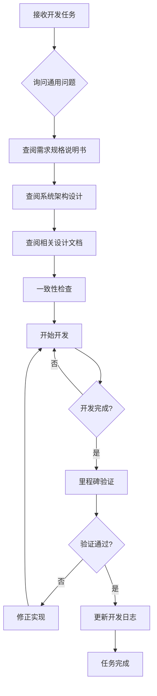

# AI助评系统MVP开发工作流程规则

## 核心控制策略

### 1. 通用问题询问原则

在执行任何开发任务前，必须先询问以下通用问题：

1. **需求理解确认**
   - "您需要我完成什么任务？"
   - "这个任务要达成的业务目标是什么？"
   - "当前进行到哪一步了？"

2. **上下文验证**
   - "我需要先阅读哪些文档来了解完整背景？"
   - "当前状态是否与设计文档一致？"
   - "是否有相关的实现已经完成？"

3. **约束条件确认**
   - "这个任务有什么具体约束条件吗？"
   - "是否有特定的技术栈或架构要求？"
   - "是否需要考虑向后兼容性？"

### 2. 文档依赖验证机制

在开始任何功能开发前，必须按以下顺序验证文档依赖：

#### 步骤1：查阅MVP需求规格说明书
- 文件路径：`docs/设计文档_MVP/01-需求与范围/01-MVP需求规格说明书.md`
- 验证内容：当前任务是否在MVP范围内、业务目标是否明确
- 关键检查点：功能列表、验收标准、业务流程

#### 步骤2：查阅系统架构设计
- 文件路径：`docs/设计文档_MVP/02-架构设计/01-系统架构设计.md`
- 验证内容：技术方案是否符合架构设计、组件间依赖关系
- 关键检查点：技术栈、模块划分、接口定义

#### 步骤3：查阅相关设计文档
根据任务类型查阅对应设计文档：

| 任务类型 | 查阅文档 | 关键验证点 |
|----------|----------|------------|
| API开发 | API接口规范 | 接口定义、参数格式、错误处理 |
| UI开发 | UI设计规范 | 视觉规范、组件库、交互标准 |
| 数据库设计 | 数据模型设计 | 表结构、字段定义、关系约束 |
| 测试 | 测试策略设计 | 测试用例、覆盖率、自动化策略 |

#### 步骤4：一致性检查
- **功能一致性**：实现功能是否与需求规格一致
- **架构一致性**：实现方案是否符合系统架构
- **接口一致性**：API是否与接口规范一致
- **UI一致性**：界面是否与设计规范一致

### 3. 里程碑验证检查点

每个开发里程碑必须包含以下验证环节：

#### 里程碑1：核心功能开发完成
**自检问题：**
- 所有核心功能是否已按需求规格实现？
- 每个功能是否都有对应的测试用例？
- API接口是否都按规范文档实现？

**验证方法：**
- 使用[功能验证清单](#功能验证清单)
- 运行测试套件
- API接口测试

#### 里程碑2：前后端集成
**自检问题：**
- 前端界面是否严格按UI设计规范实现？
- 前后端API对接是否按接口规范文档执行？
- 用户交互流程是否完整？

**验证方法：**
- 界面一致性检查
- API集成测试
- 端到端流程测试

#### 里程碑3：MVP功能验证
**自检问题：**
- MVP核心流程"数据集成→AI分析→结果可视化"是否完全实现？
- 预设账户登录是否正常？
- 文件上传和AI分析是否返回预期结果？

**验证方法：**
- 完整业务流程测试
- 用户体验测试
- 性能基准测试

### 4. 基于证据的决策框架

#### 当前实现状态分析框架
**需要收集的证据：**
1. **文档证据**
   - 当前实现与设计文档的对比
   - 已完成功能的测试报告
   - 代码质量检查报告

2. **测试证据**
   - 单元测试覆盖率
   - 集成测试结果
   - 用户验收测试结果

3. **用户证据**
   - 用户反馈数据
   - 使用行为分析
   - 性能监控数据

**决策流程：**
1. **证据收集**：检查现有实现和测试结果
2. **证据评估**：分析与目标的符合度
3. **差距分析**：识别与设计的偏差
4. **决策制定**：基于证据决定后续行动

### 5. 常见问题预防措施

#### AI失忆预防
- **开发日志制度**：每个开发步骤完成后，更新开发日志
- **状态快照**：每个里程碑完成后保存状态快照
- **定期回顾**：定期回顾设计文档和当前实现

#### 急于完成任务预防
- **目标重述确认**：开发前重述任务目标和业务价值
- **进度检查**：每30分钟检查一次进度与目标的对齐
- **质量优先**：坚持质量优先于进度

#### 经验主义预防
- **事实依据验证**：每个决策都要有文档或测试依据
- **设计文档优先**：严格遵循设计文档，不随意改动
- **用户需求验证**：所有功能都要回溯到用户需求

## 功能验证清单

### 核心功能验证

#### 数据集成模块
- [ ] Excel/CSV文件上传功能
- [ ] 文件格式验证
- [ ] 数据解析和存储
- [ ] 错误处理和用户反馈

#### AI分析模块
- [ ] 与外部AI服务的API集成
- [ ] 多维度分析指标计算
- [ ] 分析结果存储
- [ ] 异常处理机制

#### 结果可视化模块
- [ ] 分析结果展示界面
- [ ] 图表和可视化组件
- [ ] 导出功能
- [ ] 移动端适配

#### 用户认证模块
- [ ] 预设账户登录
- [ ] 会话管理
- [ ] 权限控制
- [ ] 安全性验证

### 技术验证

#### API接口验证
- [ ] 所有接口按规范实现
- [ ] 错误处理机制完善
- [ ] 接口文档完整
- [ ] 安全性验证通过

#### 前端界面验证
- [ ] UI组件库完整实现
- [ ] 响应式设计适配
- [ ] 用户体验流程顺畅
- [ ] 浏览器兼容性测试

#### 部署验证
- [ ] Docker容器化成功
- [ ] CI/CD流程正常
- [ ] 生产环境部署测试
- [ ] 监控和日志系统正常

## 开发流程图

## 紧急情况处理

### 发现与设计文档冲突时
1. **立即停止**当前开发
2. **记录冲突点**：具体哪里与文档不一致
3. **分析原因**：为什么会出现冲突
4. **寻求确认**：是否需要修改设计或实现
5. **文档更新**：如需修改设计，先更新文档再继续

### 发现理解错误时
1. **承认错误**：明确承认理解偏差
2. **重新确认**：重新确认任务目标和要求
3. **方案调整**：根据正确理解调整实现方案
4. **影响评估**：评估错误理解对已有工作的影响
5. **修正实施**：修正错误的实现

## 使用说明

1. **开发前**：按照"通用问题询问原则"确认任务
2. **开发中**：严格按照"文档依赖验证机制"查阅文档
3. **开发后**：使用"功能验证清单"进行自检
4. **里程碑时**：按照"里程碑验证检查点"进行验证
5. **决策时**：使用"基于证据的决策框架"分析

**记住：这个规则文件是防止开发偏离的保障，必须严格遵守！**